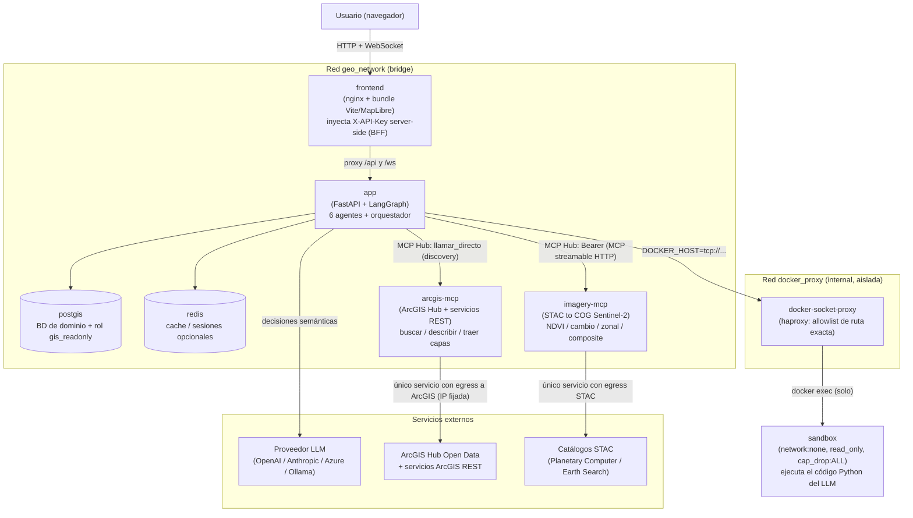
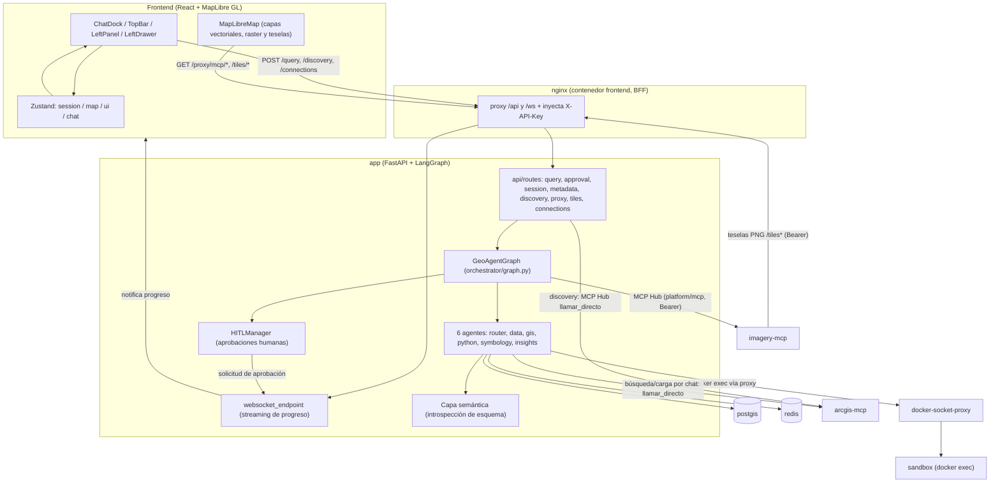
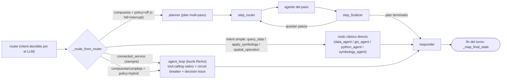
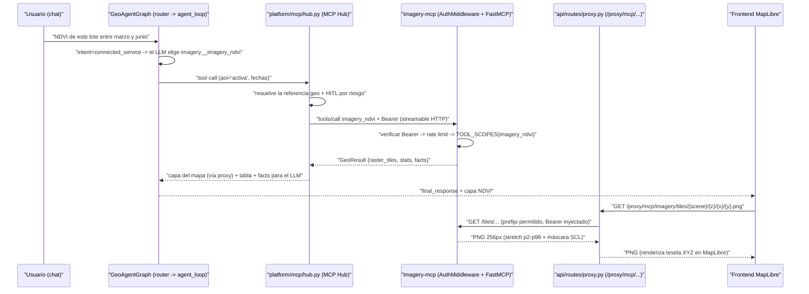
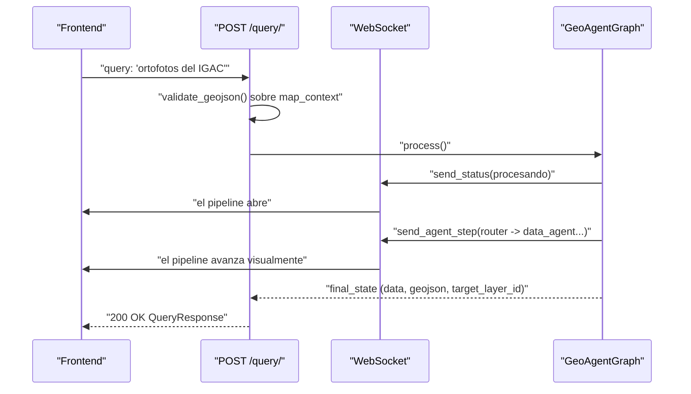
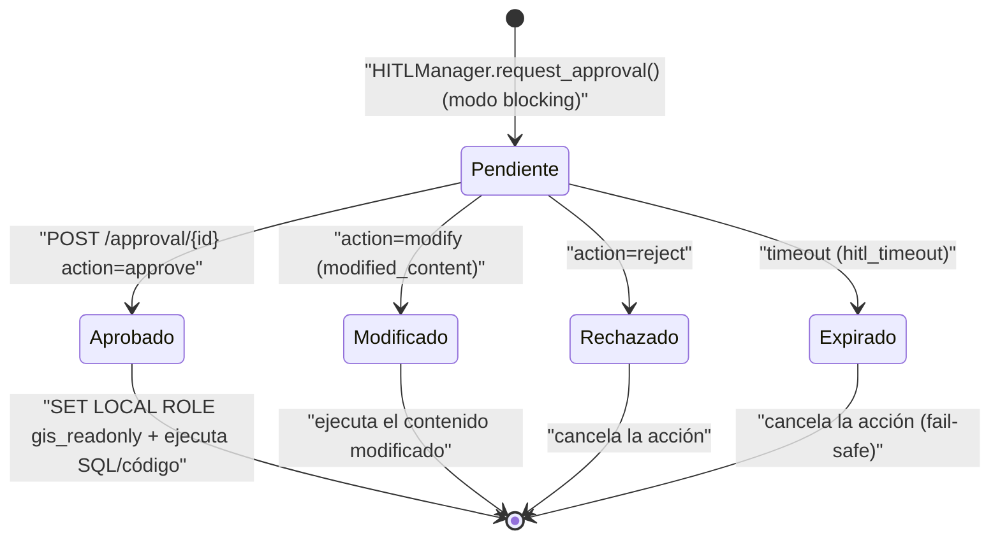

# 1. Arquitectura general

> **Estado (2026-07-26).** La arquitectura de alto nivel se mantiene estable
> (6 agentes, orquestación LangGraph, REST + WebSocket, HITL), pero el sistema
> creció en tres frentes desde la primera versión de este documento:
>
> 1. **El orquestador ya no tiene un único camino.** Conviven tres estrategias
>    (router clásico, bucle ReAct `agent_loop`, planner multi-paso), elegidas
>    en tiempo de ejecución según la política `react_policy` (por defecto
>    `"hybrid"`). Detalle en [03-orquestador](03-orquestador.md).
> 2. **La imagery satelital vive en un servicio APARTE:** `imagery-mcp`
>    (Sentinel-2 vía STAC→COG), con su propia autenticación y teselas
>    dinámicas, al que el backend habla por red interna y expone al navegador
>    a través de un **proxy**. Desde la Fase 3 el backend lo consume por un
>    **MCP Hub genérico** (§1.5): imagery es un servidor más del YAML y
>    cualquier otro MCP se enchufa sin tocar código. Detalle en [08-flujos](08-flujos.md).
> 3. **El frontend es 100% MapLibre GL** (Cesium fue retirado por completo) y
>    el motor de mapa lee/re-estila la **capa nombrada** por el usuario, no
>    solo la última cargada (FRT-04).
>
> Además, los Sprints A–F delegaron TODA decisión semántica al LLM con contexto
> real (schema + muestras), eliminando ~1350 líneas de heurísticas, templates
> SQL y mapeos hardcoded. Detalle por agente en [02-agentes](02-agentes.md).

---

## 1.1 Idea en una frase

GEO_COPILOT es un **copiloto geoespacial multiagente**: el usuario escribe en
lenguaje natural ("muéstrame los predios cerca del río", "colorea los lotes de
rojo", "NDVI de esta zona entre marzo y junio"), y un conjunto de agentes
coordinados por un LLM traduce eso a consultas PostGIS, análisis en Python,
descubrimiento de datos abiertos, simbología cartográfica o análisis de imagen
satelital — mostrando el resultado en un mapa interactivo.

El principio rector es **"agentic, no fallbacks"**: el LLM juzga e interpreta;
el código solo aporta hechos verificables (schema, estadísticas, geometrías) y
aplica guardas de seguridad. Si el LLM falla, el agente falla de forma honesta;
no hay heurísticas adivinadoras de respaldo.

---

## 1.2 Vista de contenedores (qué procesos existen)

El sistema se despliega con Docker Compose (`docker/docker-compose.yml`) como
**siete servicios** en dos redes. Esta es la topología física real:

**Tabla de servicios** (`docker/docker-compose.yml`):

| Servicio | Imagen / build | Rol | Notas de red y seguridad |
|---|---|---|---|
| **postgis** | `postgis/postgis:18-master` (pinneado por digest) | BD de dominio PostGIS | Puerto host `5433→5432` (no choca con Postgres nativo). Rol `gis_readonly` de solo-lectura. |
| **redis** | `redis:7-alpine` | Cache + backend opcional de sesiones | `SESSION_BACKEND=redis`. |
| **app** | `docker/Dockerfile` | Backend FastAPI + LangGraph + 6 agentes | Monta `src/`, `semantic_layer/`, `config/` como `:ro` (hot-reload). **Ya no monta el socket Docker crudo.** |
| **frontend** | `docker/Dockerfile.frontend` | Bundle Vite servido por nginx | nginx actúa de **BFF**: inyecta `X-API-Key` en `/api` y `/ws` server-side (el navegador nunca lleva la clave). |
| **sandbox** | `docker/Dockerfile.sandbox` | Contenedor endurecido para el código Python del LLM | `network_mode:none`, `read_only:true`, `cap_drop:ALL`, `tmpfs /tmp`, `no-new-privileges`. |
| **docker-socket-proxy** | `haproxy:3.0-alpine` + `docker/docker-socket-mediator.cfg` | Único mediador entre `app` y el daemon Docker | Red aislada `docker_proxy` (internal). **Allowlist de ruta exacta** (solo el `exec` contra `geo_copilot_sandbox`) + filtro del cuerpo; todo lo demás 403. **No** es `tecnativa/docker-socket-proxy`: ver [la allowlist del proxy](09-configuracion-y-deploy.md#la-allowlist-del-docker-socket-proxy--no-la-cambies-sin-leer-esto). |
| **imagery-mcp** | build en `services/imagery_mcp/` | Servicio MCP de imagen satelital (aparte). Es **un servidor más** del MCP Hub (`config/mcp_servers.yaml`, `id: imagery`) | **Único servicio con egress a catálogos STAC.** Auth por API keys (`IMAGERY_MCP_KEYS`). |
| **arcgis-mcp** | build en `services/arcgis_mcp/` | Servidor MCP de ArcGIS (T5.2): buscar en ArcGIS Hub, describir servicios y traer capas. Lo usa el **propio núcleo** para Discovery (`config/mcp_servers.yaml`, `id: arcgis`, `tools.agent: []`: el LLM no ve sus tools) | **Único servicio con egress a servicios ArcGIS arbitrarios**: bloquea IPs internas y fija la IP resuelta (anti DNS rebinding); `ARCGIS_ALLOWED_DOMAINS` opcional. Auth por API keys (`ARCGIS_MCP_KEYS`). `read_only`, `cap_drop:ALL`. Puerto solo en `127.0.0.1:9400` (para Claude Desktop). |
| **hello-geo** | build en `services/hello_geo/` (perfil `examples`, no arranca por defecto) | Servidor MCP de **ejemplo** sobre `packages/geo_mcp_kit` | Solo red interna. Sirve para probar cómo se enchufa un MCP. |

> **Por qué tres piezas de aislamiento (`sandbox`, `docker-socket-proxy`,
> `imagery-mcp`) en vez de un monolito:** el código que genera el LLM y el
> acceso a internet son las superficies más peligrosas. El sandbox ejecuta el
> Python sin red y sin escritura al disco; el socket-proxy da a `app` el
> mínimo privilegio para hacer `docker exec` contra el sandbox (nunca root del
> host); e `imagery-mcp` (STAC) y `arcgis-mcp` (ArcGIS) concentran el egress
> a servicios de datos externos detrás de su propia autenticación. Ver [09-configuracion-y-deploy](09-configuracion-y-deploy.md).

---

## 1.3 Vista de componentes (cómo se conecta el software)

Dentro de esos contenedores, el software se organiza en cinco capas lógicas.
Este diagrama mezcla frontend y backend para mostrar cómo viaja una petición:

### Capa 1 — UI (`frontend/src/`)

Motor de mapa **exclusivamente MapLibre GL** (`components/MapLibreMap.tsx`);
Cesium fue retirado al 100%. El shell (`App.tsx`) monta `TopBar`, `LeftPanel`
(rail de iconos), `LeftDrawer` (cajón con vistas `layers|data|database|history|tools`),
`ChatDock`, `CanvasTabs`, `ApprovalPanel` y `StatusBar`.

Estado global vía **Zustand**, cuatro stores independientes:

- `sessionStore`: `session_id`, healthcheck, conexión a portal/BD.
- `mapStore`: `layers[]` (GeoJSON vectorial), `imageryLayers[]` (raster ArcGIS),
  `tiledLayers[]` (MVT PostGIS), basemap, cámara, feature seleccionada.
- `uiStore`: drawer activo, estado del chat, panel de aprobación HITL.
- `chatStore`: mensajes, `retryInfo` (feedback de auto-corrección), historial.

Detalle en [05-frontend](05-frontend.md).

### Capa 2 — Cliente HTTP/WS y BFF (`frontend/src/services/` + nginx)

`api.ts` expone wrappers tipados (`queryApi`, `discoveryApi`, `approvalApi`,
`mcpApi`, `sessionApi`). `websocket.ts` mantiene una conexión WS por
`session_id`. En despliegue, **nginx inyecta la `X-API-Key` server-side**
(patrón BFF): el bundle del navegador nunca lleva el secreto. Detalle en
[06-conexion-back-front](06-conexion-back-front.md).

### Capa 3 — API REST + WebSocket (`src/geo_copilot/api/`)

Nueve routers (incluidos `workspace` y `connections`) montados bajo `/api/v1` en `api/app.py`, todos con
`Depends(require_api_key)` a nivel de router:

| Ruta | Para qué sirve |
|---|---|
| `POST /query/` | Punto de entrada de toda consulta en lenguaje natural. |
| `POST /approval/{id}` | Responder a una solicitud HITL (approve/reject/modify). |
| `GET/POST /session/` | Gestión de sesión y preferencias. |
| `GET /metadata/*` | Metadatos de esquema y capacidades de la plataforma. |
| `POST /discovery/search`, `/load`, `GET /regions` | Descubrimiento de datos abiertos (ArcGIS Hub). |
| `GET /proxy/imagery`, `/proxy/mcp/{server_id}/...` | **Proxy** anti-SSRF/CORS hacia ArcGIS y proxy genérico de teselas de cualquier servidor MCP (solo prefijos declarados, credencial inyectada server-side). |
| `GET /tiles/{schema}/{table}/{z}/{x}/{y}.pbf` | Teselado vectorial MVT on-the-fly desde PostGIS. |
| `GET /connections`, `GET /connections/tools`, `POST /connections/{server}/tools/{tool}/run` · `/approve` | Estado de los servidores MCP, catálogo de tools y panel transaccional (misma capacidad que usa el agente). |
| `WS /ws/{session_id}` | Canal bidireccional de progreso y aprobaciones. |

Detalle en [04-backend](04-backend.md).

### Capa 4 — Orquestador multiagente (`src/geo_copilot/orchestrator/`)

`GeoAgentGraph` (LangGraph `StateGraph[GraphState]`). `GraphState` es el
contrato compartido entre nodos (incluye `messages`, `a2a_log`, `decision_trace`
del ReAct, `data`/`visualization` del canal analítico y `target_layer_id` de
FRT-04). Ver §1.4 y [03-orquestador](03-orquestador.md).

### Capa 5 — Servicios externos y de dominio

- **PostGIS**: BD de dominio. La **capa semántica** (`semantic/introspector.py`)
  auto-descubre tablas, columnas y geometrías vía `information_schema` +
  `geometry_columns`; el YAML de `config/` pasó de fuente primaria a
  **overrides opcionales** (aliases custom, descripciones). Ver
  [04-backend](04-backend.md).
- **Redis**: sesiones persistentes multi-worker (opcional).
- **Proveedor LLM**: OpenAI / Anthropic / Azure / local (Ollama), configurable.
- **ArcGIS Hub**: descubrimiento de datos abiertos, **a través del servidor
  `arcgis-mcp`** (el núcleo ya no tiene conectores propios; Socrata y la
  descarga de archivos por URL se retiraron en T5.2). Ver
  [07-discovery](07-discovery.md).
- **Servidores MCP** (vía el MCP Hub): `imagery-mcp` (imagen satelital) y `arcgis-mcp` (discovery de ArcGIS, usado por el núcleo); cualquier otro se enchufa por YAML (§1.5).

---

## 1.4 Los tres caminos de orquestación

A diferencia de un sistema clásico de "un solo `if intent==X`", el enrutamiento
es una **decisión en tiempo de ejecución** entre tres estrategias que coexisten
en el mismo grafo. La política `react_policy` (en `core/config.py`, default
`"hybrid"`) decide cuál se usa:

- **(a) Router clásico por intent.** El `RouterAgent` clasifica el `intent` con
  el LLM (structured output) y `_route_from_router` lo manda al nodo del agente
  correspondiente. Las consultas simples toman este camino barato y predecible.
- **(b) Bucle ReAct `agent_loop` (default en consultas complejas).** Cuando la
  consulta es compuesta/compleja (`additional_operations`, `is_complex_query`,
  o `analyze` sin capa activa) y la política es `"hybrid"`, se enruta aquí: el
  LLM elige herramientas nativamente (`query_database`, `spatial_operation`,
  `analyze_layer`, `apply_symbology`, `search_external`, las tools MCP
  `<servidor>__<tool>`, `answer`, …) hasta que responde o salta el circuit breaker. **Reusa los
  mismos nodos clásicos por debajo**, así que hereda HITL y auto-corrección.
  El intent `connected_service` (pedido que resuelve una tool de un servidor
  MCP conectado) va **siempre** aquí, sea cual sea `react_policy`. El bucle
  recibe los últimos turnos de la conversación, así entiende "repite eso".
- **(c) Planner multi-paso.** Cuando `hybrid` no aplica (p.ej. `hitl_mode=interrupt`),
  el `PlannerAgent` genera un plan fijo que `step_router`/`step_finalizer`
  ejecutan paso a paso, nativamente dentro del grafo.

Los tres caminos convergen y **preservan `target_layer_id` (FRT-04) y el canal
analítico** (`data`/`visualization`) — cualquier cambio de contrato debe tocar
los tres o diverge.

> **Por qué LangGraph.** Modela el flujo como un grafo de estado explícito:
> cada nodo es `(state) → partial_state`, las transiciones son funciones
> `_route_from_X(state) → next_node`, y el estado es un `TypedDict` con campos
> bien definidos (sin "magia compartida"). Esto facilita debugging, testing y
> añadir agentes o caminos nuevos sin reescribir la coordinación.

---

## 1.5 El MCP Hub: servicios enchufables (imagery-mcp es uno más)

Desde la Fase 3 el núcleo **no tiene código propio de imagen satelital**. En su
lugar hay un **MCP Hub genérico** (`src/geo_copilot/platform/mcp/`) que conecta
los servidores MCP declarados en `config/mcp_servers.yaml` (ruta configurable
con `MCP_SERVERS_PATH`). Enchufar un servicio nuevo es **editar el YAML, no
tocar código**. Guía paso a paso: [12-como-enchufar-un-mcp](12-como-enchufar-un-mcp.md).

| Pieza | Qué hace |
|---|---|
| `config.py` | Lee el YAML: `id`, `url`, `auth` (`bearer` con `secret_ref: env:VAR`, o `none`), `conformance` (G0/G1/G2), `trust` (`trusted`/`untrusted`, por defecto `untrusted`), `tools{allow,deny,agent}` (`agent` = qué tools ve el LLM; `[]` = ninguna, el servidor lo usa solo el núcleo), `policy` (riesgo por defecto, HITL por riesgo, `timeout_s`, `max_result_mb`), `tiles{prefixes}`, `description`, `enabled`. |
| `connection.py` | Cliente MCP genérico (streamable HTTP) con allowlist, timeout, tamaño máximo de respuesta y circuit breaker. |
| `hub.py` | Cada tool permitida se vuelve una capacidad `mcp.<servidor>.<tool>`, que el LLM ve como `<servidor>__<tool>`. Descripciones marcadas como texto externo **no confiable**; *pinning* por hash (anti rug pull); argumentos geo; materializa los `GeoResult`; HITL por riesgo. `llamar_directo(servidor, tool, args)`: el **propio núcleo** usa un servidor como backend (p. ej. Discovery sobre `arcgis`), con la misma allowlist, pinning, timeout y tope de tamaño. |
| `busqueda.py` | Si hay más de `MCP_TOOLS_UMBRAL` (25) tools MCP, el LLM ve las del núcleo + `find_tools(query)`, que busca (BM25) y activa las relevantes para ese turno. |

Lo que el hub hace por el agente (el LLM decide, el código pone hechos):

- **Argumentos geo por referencia.** Si una tool declara en `_meta.geo` que un
  argumento es una geometría/bbox, el LLM no escribe coordenadas: pasa una
  referencia (`activa`, `ds_…`, el id de una capa del mapa o `viewport`) y el
  hub inyecta la geometría real.
- **Resultados `GeoResult`.** `feature_collection` → dataset del workspace;
  `raster_tiles` → capa del mapa vía el proxy genérico; `stats`/`table` →
  tabla. Los `facts` van al LLM para que narre.
- **Pinning.** La descripción + esquema de cada tool se fija por hash (en
  Redis). Si el servidor la cambia, la tool queda **deshabilitada** hasta que un
  admin la re-apruebe con `POST /api/v1/connections/{server}/tools/{tool}/approve`.
- **Defensa contra inyección.** Tras la salida de un servidor `untrusted`,
  llamar a una tool de **otro** servidor en el mismo turno exige aprobación humana.

`imagery-mcp` (`services/imagery_mcp/`) es simplemente el servidor `id: imagery`
del YAML (G2, `trusted`, teselas `/tiles/`, `/tiles-diff/`, `/tiles-rgb/`). Su
aislamiento se mantiene: es el único proceso con egress a internet (catálogos
STAC) y tiene su propio auth, rate-limit y scopes. Sus **cinco tools** sobre
Sentinel-2 L2A (STAC→COG) devuelven `GeoResult` (`imagery_mcp/georesult.py`):

| Tool | Scope requerido | Qué produce |
|---|---|---|
| `imagery_search_scenes` | `imagery:read` | Escenas disponibles para un AOI/fecha. |
| `imagery_ndvi` | `imagery:compute` | NDVI + estadísticas + teselas dinámicas. |
| `imagery_change` | `imagery:compute` | Diferencia NDVI entre dos fechas (rampa divergente). |
| `imagery_zonal_stats` | `imagery:compute` | NDVI/estadística por feature de una capa. |
| `imagery_composite` | `imagery:compute` | Imagen en color (RGB: true_color / false_color / agriculture / swir). |

La autenticación (`auth.py`) mapea cada tool a su scope en `TOOL_SCOPES`;
**toda tool nueva que no se añada ahí queda denegada fail-closed (403).** Las
teselas dinámicas (`tiles.py`, `TilePool`) hacen stretch p2-p98, máscara de
nubes SCL, caché en memoria + disco y prewarm. Hay un servidor de ejemplo,
`services/hello_geo`, y un kit compartido para escribir servidores,
`packages/geo_mcp_kit`.

**El backend nunca expone la credencial de un MCP al navegador.** El frontend
consume las teselas vía el **proxy genérico** `GET /api/v1/proxy/mcp/{server_id}/{path}`,
que solo deja pasar los prefijos declarados en `tiles.prefixes` e inyecta la
credencial server-side:

La misma capacidad alimenta el chat agéntico y el panel manual
(`McpToolsPanel` → `POST /api/v1/connections/{server}/tools/{tool}/run`), de
modo que producen resultados idénticos. Detalle en [08-flujos](08-flujos.md).

---

## 1.6 Streaming en tiempo real y HITL

Mientras el grafo ejecuta cada nodo, el orquestador emite eventos por WebSocket
(`send_status`, `send_result`, `send_agent_step`, `PLAN_CREATED`,
`STEP_STARTED/COMPLETED`, `RETRY_STARTED/CORRECTION/SUCCESS`) que el frontend
renderiza como un **pipeline visual** en cada consulta:

Cuando el grafo necesita ejecutar una **acción sensible** (SQL, código Python,
llamada externa), el flujo se **pausa** para aprobación humana. Hay dos
mecanismos, uno en producción:

- **`blocking`** (producción, `security/hitl.py`): la aprobación llega por
  WebSocket; el SQL generado por el LLM se ejecuta bajo el rol Postgres
  `gis_readonly` (solo-lectura del dominio).
- **`interrupt`** (spike diferido, `orchestrator/hitl_interrupt.py`): usa el
  `interrupt()`/checkpointer de LangGraph; documentado como no listo para el
  cutover completo.

Detalle en [04-backend](04-backend.md).

---

## 1.7 Seguridad transversal (resumen)

| Guarda | Dónde | Qué protege |
|---|---|---|
| API key (`X-API-Key` / `?token=`) | `api/auth.py` | Auth single-tenant, fail-closed si mal configurada. |
| Token en WebSocket | `api/websocket.py` | Valida origin+token antes de `accept()`. |
| `validate_geojson` | rutas `query` y WS | Tope de features en cualquier GeoJSON externo (anti-DoS). |
| Guardas SSRF (`URLValidator`) | `core/security/`, `proxy.py`, `discovery.py` | Bloquea IPs privadas/metadata y esquemas no-http(s). |
| Sandbox endurecido | contenedor `sandbox` | Código del LLM sin red, sin escritura, sin capabilities. |
| docker-socket-proxy | red `docker_proxy` | `app` solo puede hacer `docker exec` (nunca root del host). |
| Rol `gis_readonly` | `agents/gis_agent/` + `init-db/` | El SQL del LLM se ejecuta en solo-lectura. |
| `TOOL_SCOPES` fail-closed | `imagery_mcp/auth.py` | Toda tool MCP nueva requiere scope explícito o da 403. |

---

## Qué cambió vs. la versión anterior de este documento

- **Motor de mapa:** Cesium retirado al 100% → **solo MapLibre GL**. La capa
  objetivo se resuelve por **nombre** (`target_layer_id`, FRT-04), no por
  posición.
- **Orquestación:** de un único camino a **tres estrategias** (`react_policy`,
  default `hybrid`) que coexisten en el grafo compilado.
- **Imagery:** de inexistente/embebido a **microservicio `imagery-mcp` aparte**
  con auth/scopes propios, teselas dinámicas y **proxy** de la app. En la
  Fase 3 se retiró el código propio de imagery del núcleo (cliente, nodo,
  rutas y proxies específicos): ahora entra por el **MCP Hub** genérico.
- **Discovery de ArcGIS (T5.2):** los conectores del núcleo (`connectors/`,
  `external_data_manager`, `extent_utils`, Socrata, descarga de archivos) se
  borraron; buscar en el Hub, describir servicios y traer capas lo hace el
  servidor **`arcgis-mcp`**, llamado por el núcleo con `llamar_directo`.
- **Capa semántica:** la introspección de esquema PostGIS es ahora la fuente
  primaria; el `entities.yaml` pasó a **overrides opcionales**.
- **Despliegue:** de 3 servicios a **7** (se sumaron `sandbox`,
  `docker-socket-proxy` e `imagery-mcp`) con dos redes y mínimos privilegios.
- **Agentes:** cada uno delega TODA decisión semántica al LLM; ~1350 líneas de
  heurísticas/templates/fallbacks eliminadas.

## Próximos documentos

- [Los 6 agentes en detalle](02-agentes.md)
- [El orquestador LangGraph (tres caminos)](03-orquestador.md)
- [El backend: API, HITL, capa semántica](04-backend.md)
- [El frontend MapLibre](05-frontend.md)
- [Conexión back ↔ front (BFF, WS, proxy)](06-conexion-back-front.md)
- [Discovery de datos abiertos](07-discovery.md)
- [Flujos end-to-end paso a paso (incluye imagery)](08-flujos.md)
- [Configuración y despliegue](09-configuracion-y-deploy.md)
