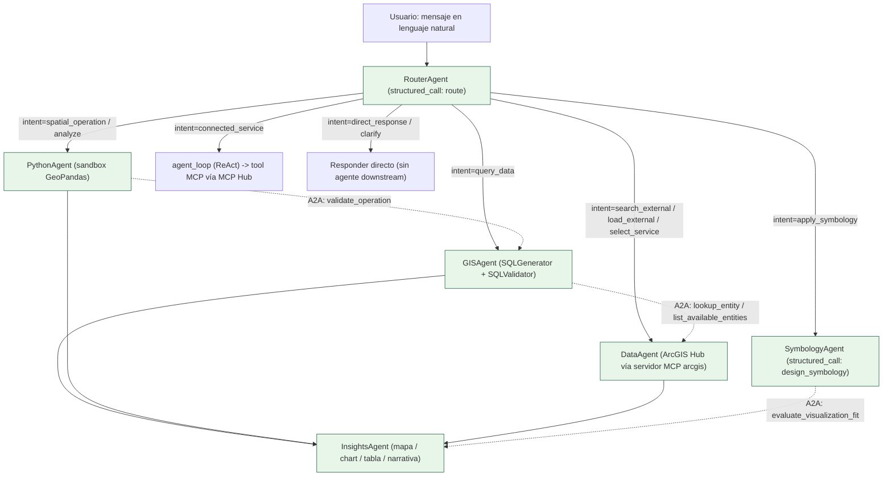
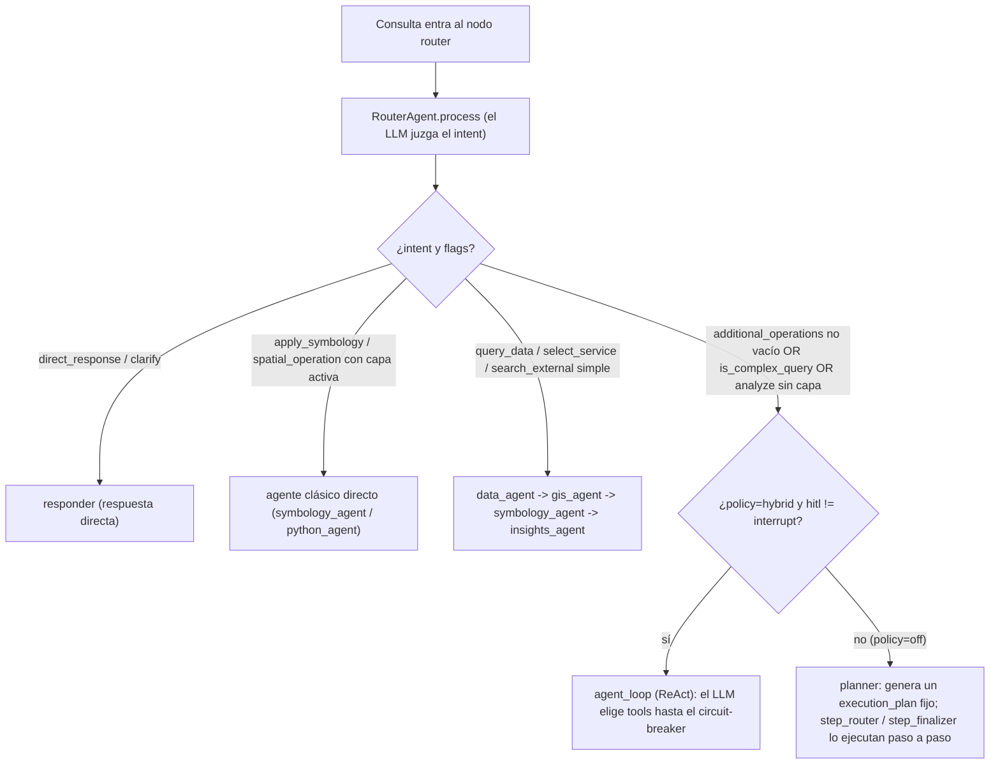
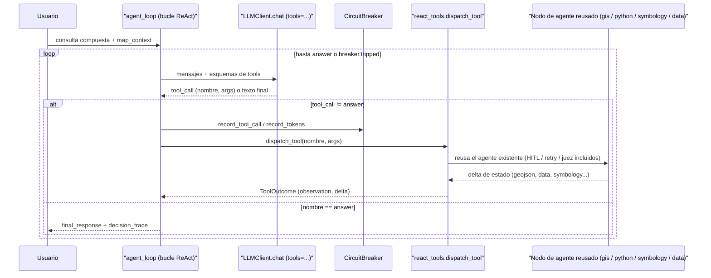

# 2. Los 6 agentes (y la capa que elige herramientas)

> **Principio vigente:** cada agente delega TODA decisión semántica al LLM,
> viendo el contexto real (schema de la BD, samples, la query del usuario) y
> validando la salida contra lo que existe de verdad. Las heurísticas
> paralelas (listas de keywords como `["nombre","name","id"]`, templates de
> SQL hardcoded, mapeos fijos `analysis_type → chart_type`, umbrales mágicos
> como `std>0` o `numeric_ratio>0.8`) fueron eliminadas — en total ~1350
> líneas de "adivinadores". Lo que antes adivinaba, hoy se le pide al LLM o se
> falla honestamente. (Nota de diseño registrada en la memoria de Claude Code
> del proyecto, `memory/agentic_no_fallbacks.md` — fuera del repo, en el perfil
> de usuario, sin enlace navegable desde estos docs.)

GEO_COPILOT tiene **6 agentes** especializados. Pero hay una idea clave que
este documento quiere dejar clara: **quién decide qué agente corre no es un
`if` fijo, sino una capa de orquestación**. En las consultas simples un nodo
*router* mapea el intent al agente correcto; en las consultas compuestas o
complejas entra el **bucle ReAct (`agent_loop`)**, donde el LLM **elige
herramientas dinámicamente** — y esas herramientas reusan por debajo los
mismos 6 agentes. Es decir: los agentes son las "manos" que ejecutan; la capa
ReAct es el "cerebro" que decide en qué orden usarlas.

Los 6 agentes:

| Agente | Rol de una frase | Decisión que delega al LLM |
|---|---|---|
| **RouterAgent** | Clasifica el intent de la consulta | Qué quiere el usuario (11 intents) |
| **DataAgent** | Descubre / integra datos internos y externos | Qué fuente y cómo buscarla |
| **GISAgent** | NL → SQL PostGIS, valida y ejecuta | Cómo escribir la consulta SQL |
| **PythonAgent** | Sandbox GeoPandas + análisis/ML (`analyze`) | Qué código Python resuelve la tarea |
| **SymbologyAgent** | Diseña la simbología del mapa | Tipo, método, campo, paleta |
| **InsightsAgent** | Ensambla mapa + charts + tabla + narrativa | Qué visualizaciones tienen sentido |

Además hay una **séptima ruta que no es un agente clásico**: el intent
`connected_service` manda la consulta al bucle ReAct (`agent_loop`), donde el
LLM elige una **tool de un servidor MCP conectado** por el MCP Hub (p. ej.
`imagery__imagery_ndvi` del servicio `imagery-mcp`, imágenes Sentinel-2). Se
describe al final de este documento.

## 2.0 Diagrama de roles + interacción A2A

Cada agente cumple una responsabilidad; además se consultan entre sí por
canales rápidos y deterministas (**A2A — agent-to-agent**, vía `AgentHub`)
sin pasar por el grafo completo.



Las **flechas punteadas** son consultas A2A (sin pasar por el grafo): p.ej.
antes de aplicar un `heatmap`, `SymbologyAgent` le pregunta a `InsightsAgent`
si esa visualización encaja con los datos; y `GISAgent` le pregunta a
`DataAgent` por el nombre exacto de una entidad para no alucinar tablas.

## 2.0.1 Principio aplicado: agentic real, sin fallbacks adivinadores

> **Si el LLM puede tomar una decisión semántica viendo el contexto, la toma
> el LLM.** Las heurísticas paralelas (lista de keywords, threshold mágico,
> primer-campo-que-matchea) son fuente de bugs porque responden con confianza
> mientras adivinan. Eliminadas.

Excepciones legítimas (son técnicas, no adivinan):

- Validación de schema/enum del output del LLM (anti-alucinación).
- Sentinels reales de PostgreSQL/PostGIS (`srid=0`, tipo `GEOMETRY`).
- Defaults dictados por estándar (GeoJSON sin CRS = EPSG:4326 por RFC 7946).
- Cálculos matemáticos (breaks de Jenks, desviación estándar, transformación
  de coordenadas con pyproj).

## 2.0.2 Base común: `BaseAgent` y `AgentResponse`

Todos los agentes viven en `src/geo_copilot/agents/<nombre>_agent/` con su
propio paquete (`agent.py` + módulos auxiliares: `prompts.py`, `styles.py`,
`sql_generator.py`, `sandbox.py`, `chart_generator.py`, etc.) y heredan de
`BaseAgent` (`agents/base.py`):

```python
class BaseAgent(ABC):
    def __init__(self, name, description, on_approval_needed=None): ...

    @abstractmethod
    async def process(self, query, context=None) -> AgentResponse: ...

    @abstractmethod
    def get_capabilities(self) -> dict: ...

    async def request_approval(self, approval_data) -> bool: ...  # HITL desacoplado
```

```python
class AgentResponse(BaseModel):   # pydantic
    success: bool
    message: str                  # legible para el usuario o log
    data: Any = None              # payload estructurado
    requires_hitl: bool = False
    hitl_context: dict | None = None
```

`request_approval()` delega en un `ApprovalCallback` **inyectable**: así el
HITL (aprobación humana) queda desacoplado del agente concreto — el agente no
sabe si detrás hay un WebSocket, un checkpoint de LangGraph o un auto-approve
de tests.

El nodo del grafo correspondiente (en `orchestrator/nodes/<nombre>.py`) es un
*thin delegator* que llama a `agent.process()` y traduce la respuesta al
estado compartido `GraphState`.

## 2.0.3 Cómo se elige qué agente corre (la capa de orquestación)

Antes de que un agente ejecute, el orquestador decide **por dónde** ir. Hay
tres caminos que coexisten en el mismo grafo compilado, gobernados por
`settings.react_policy` (**default `"hybrid"`**). Detalle completo en
[03-orquestador](03-orquestador.md); resumen:



**El bucle ReAct como capa que ELIGE herramientas.** En política `hybrid`
(default, validada por benchmark 2026-07-19: 93.33% tanto en `hybrid` como en
`off`), las consultas **compuestas/complejas** entran a `agent_loop`. Ahí el
LLM no recibe un intent fijo: recibe un catálogo de **tools** y elige
nativamente cuál llamar (`query_database`, `spatial_operation`,
`analyze_layer`, `apply_symbology`, `search_external`,
`select_service`, `load_external`, `answer`, más las tools MCP
`<servidor>__<tool>` del hub). El bucle recibe también los últimos turnos de
la conversación. Cada `tool_call` se despacha con
`react_tools.dispatch_tool()`, que **reusa los mismos nodos clásicos** (gis,
python, symbology, data) — así el bucle hereda gratis el HITL, la
auto-corrección y el juez de resultados vacíos. Un `CircuitBreaker`
(`react_max_tool_calls`, default 8) acota el bucle y cierra con un mensaje
honesto si se pasa. Todo queda auditado en `decision_trace`.

> **Precisión sobre el disparador.** La puerta de entrada a
> `agent_loop`/`planner` en `orchestrator/graph.py` es simplemente
> `additional_operations` **no vacío** (≥1), junto con `is_complex_query` o
> `analyze` sin capa activa — no exige 2+ operaciones. El umbral **≥2** sí
> existe en el código, pero en otro punto (`orchestrator/nodes/router.py`):
> solo fuerza `is_complex_query=True` cuando el LLM marcó la query como simple
> pese a haber detectado 2+ operaciones. No es, por tanto, la condición de
> enrutamiento hacia el bucle.



## 2.1 RouterAgent

**Archivo:** `agents/router_agent/agent.py` + `router_agent/prompts.py`
(prompt versionado por separado, ~337 líneas).

**Rol:** primera línea de análisis y **único punto de decisión de intent en el
camino clásico**. Arma contexto rico (historial, servicios encontrados, capa
activa con `feature_count`/`geometry_type`, `map_context` del frontend,
capacidades de plataforma: `sandbox_available`, `connected_services` —el
resumen "SERVICIOS MCP CONECTADOS" del hub, incluidas las tools
deshabilitadas y por qué—, `session_region`) y llama al LLM con **structured output forzado**
(`core/structured_output.structured_call`, función `route`) — no hay "responde
solo JSON" ni brace-slicing. El LLM devuelve `intent` directamente.

**Los 11 intents** (whitelist `valid_intents`, en sync con el enum del schema):

`direct_response · query_data · follow_up · search_external ·
select_service · load_external · spatial_operation · analyze ·
apply_symbology · clarify · connected_service`

**Detalles vigentes:**

- El schema del tool-call declara `intent` (enum), `reasoning`, `response`,
  `entities`, `selected_service_number`, `external_url`, `is_multi_step`,
  `additional_operations`. El código valida el intent contra la whitelist y
  falla honesto (`ValueError`) si no calza — **sin heurística de keywords de
  respaldo**.
- **`clarify` (anti-pereza):** cuando la ambigüedad es real, el Router
  PREGUNTA (la pregunta va en `response`) y el turno termina limpio, en vez de
  adivinar.
- **Smart Router:** si el usuario ya tiene una capa cargada y solo quiere
  ajustarla (`apply_symbology`, `spatial_operation`), no re-consulta datos —
  evita el roundtrip por data/gis.
- **FRT-04 (capa objetivo por nombre):** el Router lee `target_layer_id` del
  resultado del LLM para que "colorea LOS LOTES" opere sobre la capa
  **nombrada**, no la activa. El id se valida contra `map_layers` (si el LLM
  alucina un id inexistente, se ignora). *Nota técnica:* `target_layer_id` no
  está declarado explícitamente en el JSON-schema de parámetros
  (`additionalProperties: False`); funciona porque la mayoría de proveedores
  de function-calling no valida estrictamente el schema del lado del cliente —
  a revisar si se migra de proveedor.

**Decisión clave:** el Router NO ejecuta nada — solo enruta. 1 llamada LLM por
turno.

## 2.2 DataAgent

**Archivo:** `agents/data_agent/agent.py` + `discovery.py` +
`servicio_arcgis.py` + `hub_items.py` + `catalogo_regiones.py`.

**Rol:** centraliza todo lo relacionado a **dónde están los datos**, interno y
externo:

- **Catálogo interno** (semantic layer auto-hidratado desde la BD).
- **Discovery en ArcGIS Hub** (`discovery.py`): el LLM construye el plan
  completo de búsqueda y el núcleo ordena los resultados con el catálogo de la
  región (`hub_items.py`, `catalogo_regiones.py`). Ver [07-discovery](07-discovery.md).
- **ArcGIS (búsqueda, metadatos y capas):** desde T5.2 el núcleo **no tiene
  conectores propios**. Todo va por el **servidor MCP `arcgis`**
  (`services/arcgis_mcp/`) a través de la fachada `servicio_arcgis.py`
  (`buscar_en_hub`, `describir`, `consultar_capa`), que llama
  `McpHub.llamar_directo("arcgis", ...)`. El servidor hace la paginación
  estable, la reproyección a EPSG:4326 y la conversión esriJSON → GeoJSON, y
  devuelve hechos como `total_en_servicio` y `completo`.
- **Socrata y archivos descargables (SHP/GeoJSON/GPKG/KML por URL):**
  **retirados en T5.2** (eran código muerto en producción). Los formatos de
  archivo volverán con el servidor de DuckDB/archivos (T5.6).

`process()` interpreta la query con el LLM (aquí todavía con **JSON libre** vía
`parse_json_from_llm`, no migrado a `structured_call`) y despacha según el
`intent`: `search_internal` (`search_internal_catalog`), `search_external`
(`search_open_data` → `DiscoveryAgent`), `profile` o `validate`. La **carga**
de una capa externa (tras elegir una tarjeta o dar una URL) la hace el nodo
`orchestrator/nodes/data_agent.py`, también vía `servicio_arcgis`.

**Seguridad y HITL:** la elección de servicio pasa por HITL
(`request_approval`) si `settings.hitl_enabled`. Las URLs externas se validan
en el núcleo (`URLValidator` en `/discovery/load` y control de procedencia en
el nodo `data_agent`) y de nuevo en el servidor MCP, que bloquea IPs internas y
fija la IP resuelta (anti DNS rebinding). Si el servidor no responde, el error
se dice (`ArcGISNoDisponible`), no se convierte en "no hay resultados".

**Superficies A2A (sin LLM, rápidas y deterministas)** que otros agentes
consultan vía `AgentHub`:

- `list_available_entities` — inventario de entidades del catálogo.
- `lookup_entity` — match en cascada: exacto → case-insensitive → nombre de
  tabla → fuzzy (`difflib`). Es lo que consulta `GISAgent` para no alucinar
  tablas.

**Aislamiento por sesión:** el `session_id` vive en un **`ContextVar`**
(`_session_id_ctx`), no en un atributo de instancia — evita una race condition
cuando dos sesiones llaman a `process()` concurrentemente.

**Piezas de datos externos** (la antigua carpeta `tools/connectors/` se borró en T5.2):

| Archivo | Maneja |
|---|---|
| `agents/data_agent/servicio_arcgis.py` | Fachada al servidor MCP `arcgis`: `buscar_en_hub`, `describir`, `consultar_capa` (error explícito `ArcGISNoDisponible`) |
| `agents/data_agent/hub_items.py` | `HubItem` + orden para el usuario (`rank_results`, `count_place_matches`, `bbox_intersecta`) |
| `agents/data_agent/catalogo_regiones.py` | Catálogo multi-región de entidades/publicadores/zonas (YAML-driven) |
| `agents/data_agent/tools/external_apis.py` | `search_open_data_portals`: puente del chat al `DiscoveryAgent` |
| `services/arcgis_mcp/arcgis_mcp/` | Servidor MCP: `arcgis_search_items` (Hub), `arcgis_describe_service`, `arcgis_query_features` (where/bbox/campos empujados al servicio, paginación por OID) y guarda SSRF (`red.py`) |

## 2.3 GISAgent

**Archivo:** `agents/gis_agent/agent.py` + `sql_generator.py` +
`sql_validator.py` + `sandbox.py`.

**Rol:** traduce lenguaje natural a **SQL PostGIS**, lo valida, lo ejecuta bajo
guardas de seguridad y devuelve los resultados como GeoJSON + tabla.

**Flujo real:**

1. **Triage liviano** (`_analyze_query`, LLM): decide solo `can_process` y
   extrae entidades. Ya NO clasifica por `analysis_type` para elegir templates
   — esos templates y sus 4 helpers `_get_*_field` fueron eliminados.
2. **`SQLGenerator.generate()`**: el LLM ve el **schema completo** (semantic
   layer auto-hidratado de la BD) + **hints A2A del DataAgent** (para no
   inventar tablas) y construye SQL libre — cualquier consulta PostGIS, no 4
   patrones fijos. Filtra por el área visible del mapa **solo si el usuario lo
   pide** ("en lo que estoy viendo"), no por defecto.
3. **`SQLValidator`**: detecta y bloquea DML/DDL peligroso
   (DROP/DELETE/UPDATE/ALTER/TRUNCATE). Esto es seguridad, no heurística —
   se mantiene.
4. **`_execute_sql`** con red de guardas de seguridad, todas en el **único
   punto de ejecución vivo**:
   - transacción **READ ONLY** + `statement_timeout`,
   - denylist del validador aplicada aquí,
   - **cap duro de `LIMIT`** (envuelve la query si no trae un `LIMIT` externo
     capeable),
   - bajada opcional al rol Postgres **`gis_readonly`** (SEC-02): si
     `pg_has_role(current_user, 'gis_readonly', 'MEMBER')`, hace
     `SET LOCAL ROLE gis_readonly` antes de correr el SQL aprobado (chequeo
     cacheado).
5. Si el SQL falla, un **corrector LLM** ve el error y propone corrección.

**A2A:** `preview_count` (conteo sin geometría, barato, para HITL/Planner).

**La geometría no se simplifica** al extraer el resultado: es el dato con el que
se cruza y se mide. Las capas grandes se dibujan por teselas MVT desde el
workspace (F2). (Hasta F4 existía una simplificación automática por encima de
40 000 vértices que deformaba los datos hasta ~7 m.)

**HITL:** siempre pide aprobación antes de ejecutar SQL generado por el LLM.

## 2.4 PythonAgent

**Archivo:** `agents/python_agent/agent.py` + `gis_agent/sandbox.py` +
`python_agent/{prompts.py, code_corrector.py, data_profile.py}`.

**Rol:** motor de **operaciones espaciales in-memory** (buffer, intersect,
clip, dissolve, convex hull…) **y** del intent **`analyze`** (estadística/ML).
El LLM genera código Python contra un GeoDataFrame `gdf` (y opcionalmente
`gdf2` para cruces cross-source), se aprueba por HITL y se ejecuta en
`PythonSandbox`.

**Dos familias de tareas:**

1. **Transformaciones geométricas** → producen una capa para el mapa
   (`result` = GeoDataFrame).
2. **Análisis y estadística** (`analyze`) → producen `table`/`stats`/`chart`,
   no necesariamente geometría.

**Librerías permitidas** (`PythonSandbox.ALLOWED_MODULES`, `sandbox.py:99-131`).
El allowlist valida por **módulo base**, así que los submódulos entran salvo los
que estén en `FORBIDDEN_SUBMODULES`:

| Familia | Módulos |
|---|---|
| Geoespacial | `geopandas`, `shapely` (+`.geometry`, `.ops`), `pyproj`, `fiona` |
| Datos | `pandas`, `numpy` |
| Estadística / ML | `scipy` (+`.stats`, `.spatial`, `.cluster`), `sklearn`, `statsmodels` |
| **Análisis espacial avanzado (PySAL)** | `esda` (Moran's I, LISA), `libpysal` (pesos KNN/Queen/Rook), `spreg` (regresión espacial OLS/lag/error), `pointpats` (vecino más cercano, Ripley's K), `networkx` (grafos/redes) |
| Utilidades | `json`, `math`, `datetime`, `statistics`, `random`, `heapq`, `bisect`, `collections`, `itertools`, `functools` |
| Visualización | `matplotlib` (+`.pyplot`), `folium`, `plotly` (+`.express`, `.graph_objects`) |

> ⚠️ **El allowlist del AST y lo que hay instalado en la imagen NO coinciden.**
> `docker/Dockerfile.sandbox:31-45` instala numpy, pandas, shapely, pyproj,
> geopandas, scipy, scikit-learn, statsmodels, esda, libpysal, spreg, pointpats
> y networkx — **no** matplotlib, folium, plotly ni fiona. Con
> `SANDBOX_BACKEND=docker` (el default de hoy) esos cuatro pasan el filtro pero
> **fallan al importar en tiempo de ejecución**. No es un agujero de seguridad;
> es una capacidad que el prompt puede prometer y la imagen no cumple. Los
> gráficos no se rasterizan en el servidor de todas formas: `chart` es una
> **especificación de datos** que dibuja el frontend.

> **`operator` NO está permitido** (SBX-01). Se retiró porque
> `operator.attrgetter('__class__.__base__')` y
> `operator.methodcaller('__subclasses__')` reciben los atributos como *strings*
> que el filtro AST nunca inspecciona — un `getattr` indirecto que evade el
> denylist entero. El análisis geoespacial no lo necesita.

**Techo de cruce entre fuentes: exactamente dos capas.** El scaffolding inyecta
`gdf` y, como mucho, un `gdf2` (`agents/python_agent/agent.py:873-879`;
`orchestrator/nodes/python_agent.py:76-106` elige *una* capa secundaria). Tres o
más capas en una sola operación **no** se pueden: hay que encadenar pasos. Al
planner y al router se les pasa la lista de capas ya cargadas con la regla de
que **no vuelvan a consultarlas** si ya están en el mapa
(`orchestrator/planner.py:449,462`).

**Lo que el sandbox no puede hacer**, por diseño y no por accidente: red,
escritura en disco (salvo `/tmp`), deserialización de datos remotos, cargar
librerías nativas arbitrarias, imágenes de gráfico renderizadas en el servidor,
y nada de deep learning o GPU. Los datos **siempre** entran inyectados como
`gdf`/`gdf2`: no hay ninguna ruta legítima por la que el código del LLM abra un
archivo o una URL.

**El sandbox como motor analítico.** El código puede definir `result`
(geometría, **opcional**), `table` (registros), `stats` (métricas) y `chart`
(`{chart_type, x, y, data, title}`) — todas opcionales e independientes. El
agente y `nodes/python_agent.py` propagan estas salidas por el canal
`data`+`visualization` que el frontend renderiza sin código nuevo.

**Post-validación del GDF (scaffolding inyectado en el sandbox):**

- si se define `result`, debe ser `gpd.GeoDataFrame` (no DataFrame ni lista);
- `result.crs is not None`;
- `result.geometry.is_valid.all()` — si no, auto-repara con `make_valid()`
  antes de fallar;
- `len(result) == 0` → GeoJSON vacío con `_warning="result_empty"` (honestidad).

**Auto-verificación A4:** un juez LLM (`_judge_output_responds`,
`structured_call`) chequea si la salida realmente responde la pregunta; si no,
dispara **un** reintento dirigido vía `CodeCorrector`.

**A2A:** `validate_operation` (reglas deterministas de viabilidad de una op
sobre geometría/params, sin LLM).

**Seguridad:** el filtro AST rechaza I/O/red/deserialización, pero la
contención real es el **contenedor endurecido** (`network:none`,
`cap_drop:ALL`, `read_only`, non-root) al que `app` llega vía `docker exec`
mediado por `docker-socket-proxy`. El AST es defensa en profundidad, no la
barrera absoluta. Ver [09-configuracion-y-deploy](09-configuracion-y-deploy.md).

**Qué rechaza el filtro AST**, concretamente (`sandbox.py:136-181, 362-411`):

| Categoría | Bloqueado |
|---|---|
| **Nombres** (`FORBIDDEN_NAMES`) | `exec`, `eval`, `compile`, `__import__`, `open`, `file`, `input`, `globals`, `locals`, `vars`, `os`, `sys`, `subprocess`, `shutil`, `ctypes`, `socket`, `requests`, `urllib`, `http`, `getattr`, `setattr`, `delattr`, `__builtins__`, `__loader__`, `__spec__` |
| **Submódulos** (`FORBIDDEN_SUBMODULES`) — aunque su base esté permitida | `ctypeslib` y `ctypes` (reexponen `CDLL('libc.so.6')['system']`), `f2py` y `distutils` (compilan código), `datasets` y `examples` (descargan por red: `sklearn.datasets`, `libpysal.examples`) |
| **Métodos nativos** | `CDLL`, `cdll`, `WinDLL`, `windll`, `PyDLL`, `LoadLibrary` |
| **Deserialización remota / egreso** | `read_pickle`, `read_parquet`, `read_orc`, `read_feather`, `urlretrieve`, `urlopen`, `fetch_openml`, `get_rdataset`, `DataSource` |
| **Lectura por URL o archivo** (R3.4) | `read_csv`, `read_json`, `read_html`, `read_excel`, `read_xml`, `read_fwf`, `read_table`, `read_file` — no hay uso legítimo: los datos entran inyectados |
| **`getattr` indirecto y traversal de tipos** (SBX-01/04) | `attrgetter`, `methodcaller`, `mro` |
| **Atributos** | `__base__`, `__subclasshook__`, `__init_subclass__`, `__class_getitem__`, `__reduce_ex__`, `__getattr__`/`__setattr__`/`__delattr__`, `__builtins__` como atributo; y una regla `visit_Subscript` que bloquea `x["__import__"]` |

> El propio código lo dice y conviene repetirlo: **esto no es la barrera**.
> `pandas`, `numpy` y `sklearn` tienen I/O de red y deserialización por diseño,
> y el filtro se evade (verificado, con `json.__builtins__`). Lo que contiene un
> RCE es el contenedor. Por eso `sandbox_backend` tiene default **`docker`** y
> `enforce_sandbox_backend` rehúsa `subprocess` fuera de desarrollo.

## 2.5 SymbologyAgent

**Archivo:** `agents/symbology_agent/agent.py` + `styles.py`.

**Rol:** dado un GeoJSON + la query del usuario, decide **CÓMO pintarlo**.

El LLM diseña el plan visual completo end-to-end vía `structured_call` (función
`design_symbology`), viendo schema + estadísticas + samples + la query:

| Decisión | Opciones |
|---|---|
| **`symbology_type`** | `single_symbol`, `unique_values`, `graduated_colors`, `graduated_symbols`, `heatmap`, `cluster` |
| **`classification_method`** | `natural_breaks` (Jenks), `quantile`, `equal_interval`, `std_deviation`, `unique_values` |
| **`color_scheme`** | paletas secuenciales/divergentes/cualitativas (Blues, Viridis, RdYlGn, Set2, …) |
| **`classification_field`** | campo del schema según la semántica de la query |
| **`label_field`** | campo legible (no UUID) |
| **`num_classes`** | típicamente 3–7 |
| **`manual_class_breaks` / `explicit_user_request`** | respeta instrucciones literales del usuario ("todo en rojo") sin degradarlas |

**Qué hace el código (solo lo determinista):** tipo de geometría primaria,
estadísticas por campo (homogeneidad **estricta**, no umbral `>0.8`), cálculo
de *breaks* (Jenks por programación dinámica Fisher con sub-sampling para
>1000 valores; quantile; equal-interval; std-dev), paletas por convención
cartográfica, y validación anti-alucinación (campos y enums contra lo real).

**A2A + honestidad:** consulta a `InsightsAgent.evaluate_visualization_fit`
para no aplicar `heatmap`/`cluster` que no encajan con los datos; si degrada,
lo declara explícitamente al usuario (`[A2A] InsightsAgent corrigió...`), igual
que si el LLM falla (`[DEGRADED]`) — **nunca fallback silencioso**.

**Render en el frontend:** MapLibre aplica la clasificación **por feature**
con expresiones data-driven (`lib/maplibreSymbology.ts`) usando los `class_breaks`
del backend (intervalos semiabiertos, tamaño discreto por breakpoint). Ver
[05-frontend](05-frontend.md).

**Output `SymbologyConfig` (abreviado):**

```python
{
  "layer_name": "...", "geometry_type": "Polygon",
  "symbology_type": "graduated_colors",
  "fill": {...}, "stroke": {...}, "marker": {...}, "label": {...},
  "classification_field": "poblacion",
  "classification_method": "natural_breaks",
  "color_scheme": "Blues", "num_classes": 5,
  "class_breaks": [{"min_value":..., "max_value":..., "label":..., "color":..., "count":...}, ...],
  "symbol_size_min": 4, "symbol_size_max": 32,     # graduated_symbols
  "heatmap_radius": 25, "heatmap_intensity_field": None,
  "legend": {...},
  "reasoning": "El usuario quiere mostrar barrios por población...",
}
```

## 2.6 InsightsAgent

**Archivo:** `agents/insights_agent/agent.py` + `chart_generator.py` +
`map_generator.py` + `narrative_generator.py` + `table_formatter.py` +
`html_report.py`.

**Rol:** etapa final. Ensambla **mapa + gráficos + tabla + narrativa** desde
los resultados de análisis (`analysis_result` en el contexto), delegando en
sub-generadores especializados.

El LLM diseña qué visualizaciones tienen sentido
(`_llm_design_visualizations`) viendo la query real + `analysis_type` +
features + stats:

```json
{
  "map_type": "point_map | choropleth | heatmap | cluster",
  "map_value_field": "...", "map_color_field": "...", "popup_fields": [...],
  "charts": [
    {"chart_type": "bar | pie | line | histogram | scatter",
     "x_key": "...", "y_key": "...", "value_field": "...",
     "title": "...", "horizontal": false, "sort_by": "-X", "limit": 15}
  ]
}
```

El `chart_generator` emite el formato que consume `Chart.tsx`
(`{chart_type, x_key, y_key, data:[{record}]}`). Las heurísticas
`_find_*_field` (que tomaban el primer campo que matcheaba) fueron eliminadas;
solo quedan `_first_numeric_field`/`_first_string_field` como último recurso
para narrativas cuando no hay design del LLM.

**A2A:** `evaluate_visualization_fit` (consumido por SymbologyAgent) y
`summarize_data_shape` (plantilla determinista, sin LLM, para follow-ups
baratos).

## 2.7 Séptima ruta: servicios MCP conectados (no un agente clásico)

Desde la Fase 3 no hay un nodo ni un cliente propios de imagery (se retiraron
`nodes/imagery.py`, `core/imagery_client.py` y la tool `imagery_analysis`).
En su lugar, el **MCP Hub** (`src/geo_copilot/platform/mcp/`) convierte cada
tool permitida de cada servidor de `config/mcp_servers.yaml` en una capacidad
`mcp.<servidor>.<tool>`, que el LLM ve como `<servidor>__<tool>`.

- El **Router** ve el resumen "SERVICIOS MCP CONECTADOS" y, si una de esas
  tools resuelve el pedido, devuelve `connected_service`. Esa ruta va
  **siempre** a `agent_loop`, con cualquier `react_policy`.
- En el bucle, el LLM elige la tool y sus argumentos leyendo la descripción y
  el esquema **del propio servidor** (marcados como texto externo no
  confiable). Los argumentos geo se pasan por **referencia** (`activa`,
  `ds_…`, id de una capa del mapa o `viewport`) y el hub inyecta la geometría.
- El resultado (`GeoResult`) se materializa: `feature_collection` → dataset
  del workspace, `raster_tiles` → capa del mapa vía el proxy
  `/api/v1/proxy/mcp/{server_id}/…`, `stats`/`table` → tabla; los `facts` van
  al LLM para narrar.
- HITL según el riesgo de la tool y la política del servidor; tras la salida
  de un servidor `untrusted`, usar otro servidor en el mismo turno pide
  aprobación humana. Con más de 25 tools MCP, el LLM las busca con `find_tools`.

`imagery-mcp` es hoy el servidor principal (`id: imagery`). Sus cinco tools,
con **auth por scopes** (`TOOL_SCOPES` en
`services/imagery_mcp/imagery_mcp/auth.py` — toda tool nueva que no se agregue
ahí queda denegada fail-closed con 403):

- `imagery_search_scenes` — escenas disponibles.
- `imagery_ndvi` — índice de vegetación.
- `imagery_change` — cambio entre dos fechas.
- `imagery_zonal_stats` — estadística por feature de la capa.
- `imagery_composite` — **imagen en color** (composite RGB:
  `true_color`/`false_color`/`agriculture`/`swir`).

Las teselas dinámicas (stretch p2–p98, máscara de nubes SCL, caché en disco,
prewarm) las sirve `imagery-mcp`; el frontend las consume vía el **proxy
genérico de la app** (que inyecta el Bearer server-side), nunca directo al MCP.
Detalle en [08-flujos](08-flujos.md); cómo enchufar otro servidor en
[12-como-enchufar-un-mcp](12-como-enchufar-un-mcp.md).

## 2.8 Patrón transversal

Todos los agentes comparten cuatro convenciones:

1. **Auto-inicialización del LLM:** cada agente hace
   `LLMClient.from_settings(settings)` si el constructor recibe
   `llm_client=None`. Para tests offline, pasar `llm_client=False` fuerza modo
   sin LLM (que degrada honestamente: `single_symbol`, "no puedo procesar",
   etc., nunca adivina).
2. **Las decisiones semánticas van al LLM**, casi siempre ya migradas a
   `structured_call` (Router, Symbology, el juez de PythonAgent). **DataAgent y
   el triage de GISAgent** todavía usan `parse_json_from_llm` con JSON libre —
   deuda de migración conocida.
3. **Métodos A2A adicionales** (sin LLM, deterministas) para que los agentes se
   consulten entre sí vía `AgentHub` sin pagar el costo del grafo completo
   (`lookup_entity`, `validate_operation`, `evaluate_visualization_fit`,
   `preview_count`, `summarize_data_shape`).
4. **HITL** (aprobación humana) sobre todo lo que toca BD / código / red,
   cuando `settings.hitl_enabled`, vía el `ApprovalCallback` inyectable.

## 2.9 Ejemplo end-to-end: FRT-04 + guardas de seguridad del GISAgent

Dos turnos consecutivos muestran cómo el Router enruta sin tocar la BD (solo
re-estilo) y cómo el GISAgent ejecuta SQL bajo aprobación y rol de solo-lectura:

```mermaid
sequenceDiagram
    participant U as Usuario
    participant Router as RouterAgent
    participant GIS as GISAgent
    participant SQLGen as SQLGenerator
    participant HITL as HITLManager
    participant DB as "PostGIS (rol gis_readonly)"

    U->>Router: "colorea LOS LOTES de rojo"
    Router->>Router: "structured_call(route): intent=apply_symbology + target_layer_id"
    Note over Router: valida el intent contra la whitelist; sin heurísticas de keywords
    Router-->>U: enruta a SymbologyAgent (no toca la BD)

    U->>Router: "muéstrame los predios cerca del río"
    Router->>Router: intent=query_data
    Router->>GIS: process(query, context)
    GIS->>SQLGen: "generate(query, entities) [ve schema + hints A2A de DataAgent]"
    SQLGen-->>GIS: SQL PostGIS
    GIS->>HITL: request_approval(sql_execution)
    HITL-->>GIS: approved
    GIS->>DB: "SET LOCAL statement_timeout; SET LOCAL ROLE gis_readonly; SELECT (READ ONLY, LIMIT capeado)"
    DB-->>GIS: filas + geometría
    GIS-->>U: GeoJSON + tabla
```

## Siguiente: [03-orquestador](03-orquestador.md)
