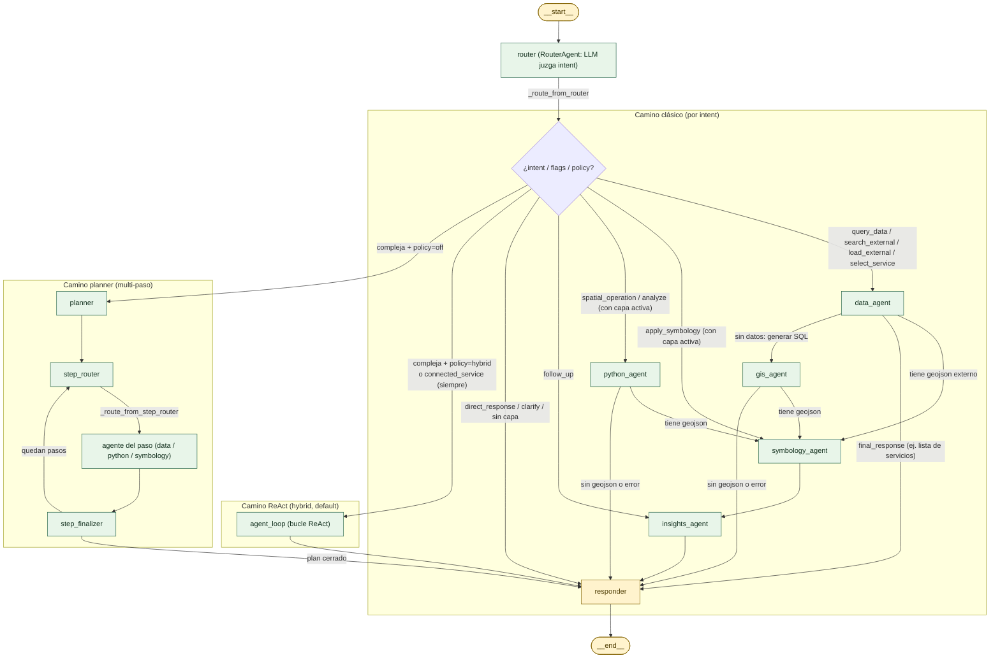
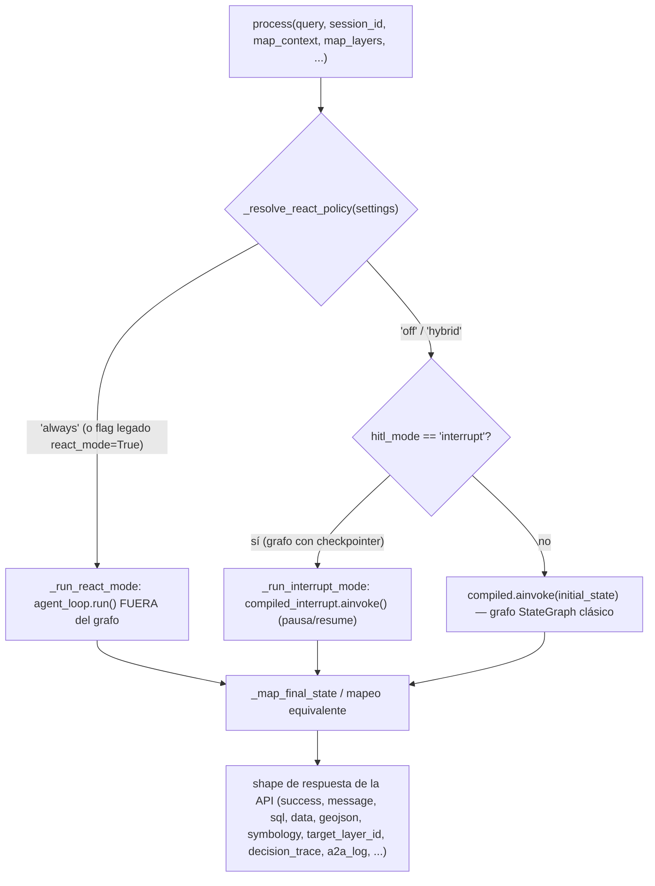
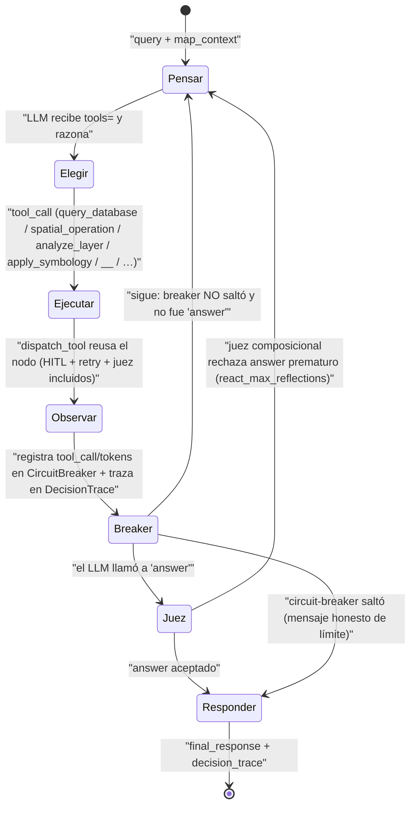
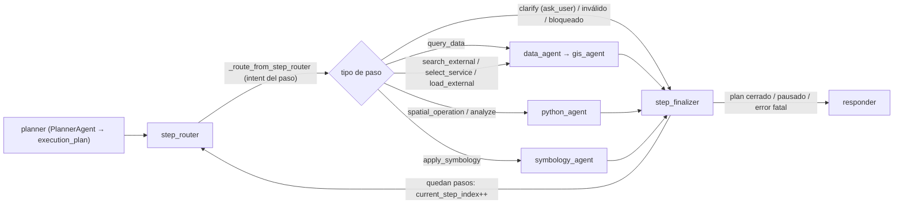
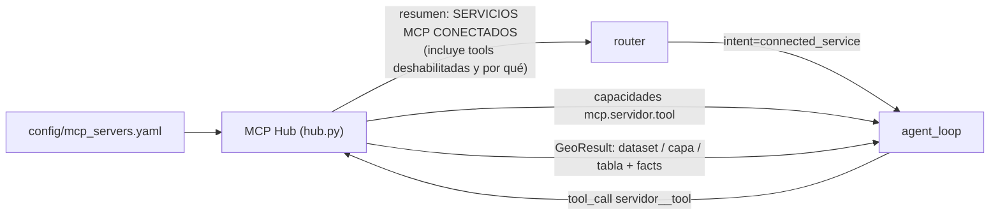

# 3. Orquestador (LangGraph)

> **Estado actual (2026-07-26).** El orquestador ya no es un único camino
> `Router→Data→GIS/Python→Symbology→Insights→Responder`. Hoy conviven **tres
> estrategias de orquestación** dentro del mismo grafo compilado, elegidas en
> tiempo de ejecución:
>
> 1. **Router clásico por intent** — el camino cableado de siempre.
> 2. **Bucle ReAct `agent_loop`** — tool-calling nativo, el LLM elige y encadena
>    herramientas dinámicamente (con *circuit breaker* y traza de decisiones).
> 3. **Planner multi-paso** — descompone la consulta en un plan de pasos que se
>    ejecutan dentro del grafo (`step_router` ↔ `step_finalizer`).
>
> La política que decide **router clásico vs. ReAct** es `react_policy`
> (`core/config.py`), con **default `"hybrid"`**: las consultas *compuestas /
> complejas* van al bucle ReAct; las *simples* siguen el router clásico. El
> antiguo `plan_executor` (for-loop Python fuera de LangGraph) fue **eliminado**
> y reemplazado por los nodos nativos `step_router` / `step_finalizer` (ORC-5).

El orquestador vive en `src/geo_copilot/orchestrator/` y centraliza **cómo se
conectan los 6 agentes**. Usa [LangGraph](https://langchain-ai.github.io/langgraph/)
— una librería para modelar flujos de agentes como un **grafo dirigido de
estados** (`StateGraph`), donde cada nodo lee y escribe un "pizarrón compartido"
(`GraphState`) y las transiciones deciden a qué nodo pasar según ese estado.

Los 6 agentes se documentan en detalle en [02-agentes](02-agentes.md); aquí nos
centramos en **cómo se orquestan**.

---

## Los tres caminos, de un vistazo

| Camino | Nodo(s) | Cuándo se usa | Qué lo caracteriza |
|--------|---------|---------------|--------------------|
| **Router clásico** | `router` → agente(s) directos | Consultas **simples** (`react_policy=off` o la rama simple de `hybrid`) | Un `intent` → un nodo. Rápido y predecible. |
| **Bucle ReAct** | `agent_loop` | Consultas **compuestas/complejas** con `react_policy="hybrid"` (default), o **todo** con `"always"` | El LLM recibe `tools=` y **elige** la secuencia de herramientas. Acotado por *circuit breaker*. |
| **Planner multi-paso** | `planner` → `step_router` ↔ `step_finalizer` | Consultas complejas cuando **no** aplica hybrid (p. ej. `react_policy=off`, o `hitl_mode="interrupt"`) | Genera un `execution_plan` fijo y lo ejecuta paso a paso dentro del grafo. |

> **Idea clave:** la decisión "router-clásico vs. ReAct" ya **no** es un flag
> global fijo, sino una decisión **por consulta** que toma `_route_from_router`
> mirando la política y las señales del router (`is_complex_query`,
> `additional_operations`). Solo las consultas que lo necesitan pagan el costo
> del bucle ReAct.

---

## El grafo (StateGraph)

Este es el grafo compilado (`GeoAgentGraph._build_graph()` en
`orchestrator/graph.py`). El punto de entrada es `router`; todos los caminos
convergen en `responder → END`.



> En el planner, los agentes de paso (`data_agent`, `gis_agent`, `python_agent`,
> `symbology_agent`, `insights_agent`) son **los mismos** nodos
> del camino clásico; simplemente, cuando hay un plan en curso, su ruteo termina
> en `step_finalizer` en vez de en `responder`. No se duplica lógica.

---

## Cómo `process()` elige el modo

`GeoAgentGraph.process()` es el punto de entrada público. **Antes** de tocar el
grafo, decide con qué mecanismo ejecutar el turno:



- **`_resolve_react_policy(settings)`** normaliza a `"off" | "hybrid" | "always"`.
  El flag booleano legado `react_mode=True` equivale a `"always"` y tiene
  **precedencia** (compatibilidad con despliegues previos); un valor desconocido
  degrada a `"off"` (nunca una sorpresa).
- **`"always"`** → `_run_react_mode()` corre el bucle `agent_loop` **fuera** del
  grafo compilado y mapea su salida al mismo contrato de respuesta.
- **`hitl_mode="interrupt"`** (experimental) → `_run_interrupt_mode()` usa un
  segundo grafo compilado **con checkpointer** para pausar (`interrupt()`) y
  reanudar (`Command(resume=...)`). El ReAct in-graph (hybrid) **se autodesactiva**
  en este modo, porque reanudar re-ejecutaría el razonamiento del bucle.
- **Caso normal (`"off"` o `"hybrid"` sin interrupt)** → `self.compiled.ainvoke(...)`
  y luego `_map_final_state(...)`.

> **Contrato único de salida.** `_map_final_state` y `_run_react_mode` son las
> **dos** únicas fuentes del "shape" de respuesta, deliberadamente espejadas para
> que la API no note por qué camino pasó la consulta. **Ambas** propagan
> `target_layer_id` (FRT-04) y el **canal analítico** (`data`/`visualization` del
> sandbox), y **ambas** consideran fallo un `decision_trace[-1].kind == "error"`
> (el bucle ReAct cerró por *circuit breaker* o error del LLM). Cualquier cambio
> de contrato debe tocar los dos puntos (y `step_finalizer` para el planner) o
> los caminos divergen.

---

## El estado (`GraphState`)

Definido en `orchestrator/graph.py` como `TypedDict`. Es el "pizarrón compartido"
que todos los nodos leen y escriben. Un nodo solo escribe los campos que produce;
LangGraph hace el *merge* del `dict` devuelto.

> **Trampa importante de LangGraph:** solo se conservan en el merge las claves
> **declaradas** en `GraphState`. Varios canales tuvieron que declararse
> explícitamente porque, si no, LangGraph los **descarta** y nunca llegan al
> cliente. Por eso están en el estado: `decision_trace` (traza del ReAct),
> `data` / `visualization` (canal analítico del sandbox), `empty_result_verdict`
> (juez de resultados vacíos) y `target_layer_id` (FRT-04).

Algunos campos usan **reducers** (`Annotated[..., add]`) para **acumularse**
entre nodos en vez de sobrescribirse.

```python
class GraphState(TypedDict):
    # ── Entrada / contexto ──
    query: str
    original_query: str | None      # B4: copia preservada (el multi-paso pisa `query` por step)
    session_id: str
    map_context: dict | None        # snapshot del mapa/UI que envía el frontend
    session_region: str | None      # override de región (discovery multi-región)
    conversation_history: list[dict]
    previous_sql: str | None
    previous_results: list[dict] | None
    previous_geojson: dict | None   # capa del turno anterior (para follow-ups)

    # ── Acumulados (reducer `add`) ──
    messages: Annotated[list[AgentMessage], add]
    a2a_log: Annotated[list[dict], add]   # telemetría cross-agent (A2A)

    # ── Producido por el router ──
    intent: str | None
    entities: list[str]
    is_complex_query: bool
    # FRT-04: capas del mapa por id y capa OBJETIVO elegida por nombre
    map_layers: dict[str, dict] | None    # {layer_id: {"data": geojson, "name": str}}
    target_layer_id: str | None           # validado contra map_layers

    # ── Datos externos / discovery ──
    external_url: str | None
    external_geojson: dict | None
    external_source_name: str | None
    has_external_data: bool
    external_imagery: dict | None         # MapServer/ImageServer o teselas XYZ de un MCP (vía /proxy/mcp/...)
    found_services: list[dict] | None     # para selección por número
    new_search_executed: bool
    active_data_source: str               # "internal" | "external" | "none"

    # ── Producido por GIS / Python ──
    sql: str | None
    raw_data: list[dict] | None
    geojson: dict | None
    python_code: str | None
    empty_result_verdict: dict | None     # 0-por-bug vs 0-por-realidad
    # Canal analítico (intent 'analyze'): tabla/estadística/gráfico del sandbox
    data: dict | None
    visualization: dict | None

    # ── Producido por Symbology / Insights ──
    symbology: dict | None
    layer_name: str | None

    # ── ReAct ──
    decision_trace: list | None           # traza de decisiones del bucle agent_loop

    # ── Plan multi-paso ──
    execution_plan: list[dict] | None
    current_step_index: int
    step_results: list[dict] | None
    pending_operations: list[dict] | None
    plan_paused: bool
    plan_partial_failure: bool

    # ── HITL / autocorrección / cancelación ──
    requires_hitl: bool
    hitl_approved: bool
    retry_count: int
    max_retries: int
    last_error: str | None
    error_context: dict | None
    cancelled: bool

    # ── Final ──
    final_response: str | None
    final_data: dict | None
    error: str | None
```

---

## Nodos

Cada nodo del grafo es un *thin wrapper* (`_xxx_node`) en `graph.py` que delega en
`orchestrator/nodes/<nombre>.py::run(graph, state)` — el cuerpo real vive ahí
(extraído en "Fase 6 #6"):

```python
# Ejemplo del wrapper en graph.py
async def _router_node(self, state: GraphState) -> dict:
    from geo_copilot.orchestrator.nodes import router
    return await router.run(self, state)
```

| Nodo | Archivo (`nodes/…`) | Qué hace |
|------|---------------------|----------|
| `router` | `router.py` | Llama `RouterAgent.process()`; guarda `intent`, `entities`, `is_complex_query`, `additional_operations`, `target_layer_id` (FRT-04, validado contra `map_layers`) |
| `planner` | `planner.py` | Solo si la consulta es compleja y **no** aplica hybrid. Genera `execution_plan` |
| `step_router` | `step_router.py` | **Entrada** del bucle multi-paso: lee el paso actual, traduce `action_type → intent`, resuelve `select_service` por número, aísla datos externos en pasos `query_database` |
| `step_finalizer` | `step_finalizer.py` | **Cierre** del paso: registra `StepResult`, detecta terminación, restaura datos aislados, incrementa `current_step_index` |
| `agent_loop` | `agent_loop.py` | **Bucle ReAct**: el LLM elige herramientas con tool-calling nativo (incluidas las tools MCP del hub) hasta `answer` o *circuit breaker*. Recibe los últimos turnos de la conversación |
| `data_agent` | `data_agent.py` | Descubrimiento / carga externa / lista de servicios |
| `gis_agent` | `gis_agent.py` | NL→SQL→ejecutar→GeoJSON, con bucle de autocorrección |
| `python_agent` | `python_agent.py` | Genera código GeoPandas y lo ejecuta en el sandbox (también intent `analyze`) |
| `symbology_agent` | `symbology.py` | Simbología data-driven para la capa |
| `insights_agent` | `insights.py` | Narrativa + tipo de visualización |
| `responder` | `responder.py` | Arma `final_data` que la API serializa al cliente |

---

## Transiciones (conditional edges) — el router clásico

`graph.py` define funciones `_route_from_<nodo>(state) → str` que devuelven la
KEY del siguiente nodo. La más importante es `_route_from_router`, que **contiene
la decisión de los tres caminos**:

```python
def _route_from_router(state):
    intent = state.get("intent", "")
    settings = get_settings()

    # Hybrid activo solo si la política es 'hybrid' Y no estamos en HITL interrupt
    _hybrid = (
        _resolve_react_policy(settings) == "hybrid"
        and getattr(settings, "hitl_mode", "blocking") != "interrupt"
    )

    # Respuesta directa / pregunta aclaratoria → responder
    if state.get("final_response") and intent in ("direct_response", "clarify"):
        return "responder"

    # F3: una tool de un servidor MCP conectado → SIEMPRE ReAct (cualquier policy)
    if intent == "connected_service":    return "agent_loop"

    # COMPLEJA / multi-operación → ReAct (hybrid) o Planner (off)
    if additional_operations and settings.enable_planning:
        return "agent_loop" if _hybrid else "planner"
    if state.get("is_complex_query") and settings.enable_planning:
        return "agent_loop" if _hybrid else "planner"

    # Simples: un intent → un nodo
    if intent == "select_service":       return "data_agent"
    if intent == "apply_symbology":
        return "symbology_agent" if has_active_layer else "responder"
    if intent == "spatial_operation":
        return "python_agent" if has_active_layer else "responder"
    if intent == "analyze":
        if has_active_layer:  return "python_agent"
        return "agent_loop" if _hybrid else "data_agent"   # sin capa: traer + analizar
    if intent == "follow_up":            return "insights_agent"
    if intent == "query_data":           return "data_agent"
    if intent in ("search_external", "load_external"):  return "data_agent"
    return "responder"
```

Y los ruteos de encadenamiento del camino clásico:

```python
def _route_from_data_agent(state):
    if state.get("error"):          return _finalizer_or_responder(state)
    if state.get("geojson"):        return "symbology_agent"   # datos externos ya con geojson
    if state.get("final_response"): return "responder"         # ej. lista de servicios
    return "gis_agent"                                         # tiene que generar SQL

def _route_from_gis_agent(state):
    if state.get("error") or not state.get("geojson"):  return "responder"
    return "symbology_agent"
```

> **Nota sobre `has_active_layer`:** el "Smart Router" detecta **cualquier** capa
> activa (interna, externa o `previous_geojson` heredada), de modo que
> `apply_symbology` / `spatial_operation` operan sobre lo que ya está en el mapa
> sin re-consultar la BD.

---

## Camino (b): el bucle ReAct (`agent_loop`)

Cuando `_route_from_router` decide `agent_loop` (política `hybrid` + consulta
compleja, o `always` para todo el turno), el nodo `nodes/agent_loop.py::run()`
implementa el ciclo ReAct real. El LLM recibe formalmente el catálogo de
herramientas (`tools=`) y **elige nativamente** cuál invocar:

`query_database`, `spatial_operation`, `analyze_layer`,
`apply_symbology`, `search_external`, `select_service`, `load_external`, `answer`,
más **las tools de los servidores MCP conectados** (`<servidor>__<tool>`, p. ej.
`imagery__imagery_ndvi`; ver la sección *MCP Hub* más abajo). El bucle recibe
también los últimos turnos de la conversación, para entender "repítelo" o
"ahora con otra fecha".

**Desde F1 del plan de plataforma, cada herramienta es una *capacidad*
registrada** (`platform/capabilities.py`; las del núcleo en
`orchestrator/capabilities_core.py`). Del registro salen el schema que ve el LLM,
la línea de la lista de herramientas del prompt, el filtro por disponibilidad
(p. ej. una tool MCP solo si su servidor responde y la tool está aprobada) y el paso que se anuncia
al chip de agentes. `orchestrator/tool_schemas.py` quedó como fachada con la
misma API. Añadir una herramienta es **una** entrada `Capability(...)` — antes
eran ~13 sitios.

Cada `tool_call` se despacha con `react_tools.dispatch_tool()`, que busca la
capacidad en el registro y llama a su ejecutor. Los ejecutores `core.*` **reusan
los mismos nodos clásicos** (`data_agent`, `gis_agent`, `python_agent`,
`symbology_agent`) por debajo — así heredan **gratis** el HITL,
la autocorrección y el juez de resultados vacíos, sin duplicar lógica.

Tres detalles que cambian lo que el LLM puede decir bien:

- **La observación de un análisis lleva los datos** (estadísticas o primeras
  filas, acotado): el LLM del bucle es quien redacta la respuesta final, y sin
  los números respondía "las estadísticas están listas".
- **El prompt trae la fecha de hoy** (regla 6): sin ella, al ampliar un rango de
  imagery lo hacía hacia la época de su entrenamiento.
- **Progreso en vivo**: cada herramienta se anuncia como paso de agente por el
  `EventSink` (`platform/events.py`). El núcleo no importa la API: la API instala
  al arrancar el sink que reenvía por WebSocket (test de arquitectura lo exige).

**Router y planner** siguen como camino heredado: el router como atajo para
consultas simples de una intención, el planner solo con `react_policy=off` o
HITL `interrupt`. Las capacidades nuevas (MCP incluidas) entran solo por ReAct.



**Guardas del bucle:**

- **`CircuitBreaker`** (`orchestrator/circuit_breaker.py`): acota por
  `react_max_tool_calls` (default **8**) y `react_token_budget` (0 = sin límite de
  tokens). Al saltar, cierra el turno con un mensaje honesto de límite (nunca un
  bucle infinito).
- **`DecisionTrace`** (`core/agent_audit.py`): audita cada paso (traza sanitizada)
  y la deja en `decision_trace` — es la que la API expone como `reasoning_trace`.
- **Juez composicional** (`react_max_reflections`, default **1**): cuando el LLM
  quiere `answer`, un juez opcional verifica que la respuesta cubra la consulta;
  si no, lo empuja a seguir iterando (acotado).

El nodo `agent_loop` **siempre** converge a `responder` (edge fijo).

```mermaid
sequenceDiagram
    participant U as "Usuario"
    participant AL as "agent_loop.run"
    participant LLM as "LLMClient.chat (tools=)"
    participant CB as "CircuitBreaker"
    participant RT as "react_tools.dispatch_tool"
    participant N as "Nodo reusado (gis / python / symbology / data) o MCP Hub"

    U->>AL: "query + map_context"
    loop "hasta answer o breaker.tripped"
        AL->>LLM: "messages + tool_schemas"
        LLM-->>AL: "tool_call (nombre, args) o texto final"
        alt "tool_call != answer"
            AL->>CB: "record_tool_call / record_tokens"
            AL->>RT: "dispatch_tool(name, args)"
            RT->>N: "reusa nodo existente (HITL/retry/juez incluidos)"
            N-->>RT: "delta de estado (geojson, data, symbology, target_layer_id...)"
            RT-->>AL: "ToolOutcome(observation, delta)"
            AL->>AL: "working.update(delta); trace.record_result"
        else "name == answer"
            AL->>AL: "juez composicional (opcional, react_max_reflections)"
            AL-->>U: "final_response + decision_trace"
        end
    end
    AL-->>U: "breaker.tripped sin answer → mensaje honesto de límite"
```

---

## Camino (c): planner multi-paso (dentro del grafo)

Para consultas como *"Carga ortofotos de Mosquera **y** dibuja un buffer de 500 m
alrededor del predio X"* cuando **no** aplica hybrid (p. ej. `react_policy=off` o
`hitl_mode="interrupt"`), el router marca `is_complex_query=True` y enruta al
**Planner**.

`nodes/planner.py::run()` llama a `PlannerAgent.process()` y genera un
`execution_plan`: una lista de pasos, cada uno con `action_type`, `query_fragment`
y `description`.

```python
@dataclass
class PlanStep:
    step_id: str
    description: str
    query_fragment: str = ""      # instrucción autónoma que se ejecuta
    action_type: str = ""         # "query_database" | "search_external" |
                                  # "select_service" | "spatial_operation" |
                                  # "analyze" | "symbology" | "apply_symbology" | "ask_user"
```

**El bucle multi-paso vive nativamente en el grafo** (ORC-5): ya **no** es un
for-loop Python fuera de LangGraph (`PlanExecutor` viejo). Dos nodos lo mueven:

- **`step_router`** (entrada del loop): lee `execution_plan[current_step_index]`,
  traduce `action_type → intent` (mapa `_ACTION_TO_INTENT`), resuelve
  `select_service` por número contra `found_services`, detecta pasos **bloqueados**
  por dependencias (`plan_deps.blocked_dependencies`), aísla los datos externos en
  pasos `query_database` (los guarda en `_saved_*` para restaurarlos luego), y
  limpia el output heredado de pasos que generan datos frescos. Después, el ruteo
  condicional (`_route_from_step_router`) dispatchea al agente del paso.
- **`step_finalizer`** (cierre del loop): construye un `StepResult`, detecta casos
  terminales (cancelado, `pending_selection`, `ask_user`/clarify que **pausa** el
  plan, error fatal, plan completo), **restaura** los datos externos aislados
  (ORQ-11) y decide volver a `step_router` (loop) o salir a `responder`.



> **Invariante de terminación (F3.1):** *todo* camino que vuelve a `step_router`
> **debe** incrementar `current_step_index`. Los caminos que no lo incrementan
> (`pending_selection`, *early-exit*) enrutan siempre a un nodo terminal
> (`responder`). Así el índice crece estrictamente y el bucle termina en
> ≤ `len(plan)` vueltas — si se refactoriza, hay que preservar esta invariante o
> el grafo puede colgar.

Cuando el plan termina, el `responder` ve `plan_partial_failure` / `step_results`
y arma un mensaje que dice claramente qué pasó (X/N pasos exitosos), sin fingir
éxito.

---

## Servicios MCP conectados (MCP Hub)

Desde la Fase 3, las herramientas de servicios externos no se programan una a
una en el núcleo: el **MCP Hub** (`src/geo_copilot/platform/mcp/hub.py`) lee
`config/mcp_servers.yaml` y registra cada tool permitida como una capacidad
`mcp.<servidor>.<tool>` (el LLM la ve como `<servidor>__<tool>`).



- **Router:** ve el resumen del hub y devuelve `connected_service` cuando una
  tool de un servicio listado resuelve el pedido. `_route_from_router` lo manda
  a `agent_loop` con **cualquier** `react_policy`.
- **Argumentos geo por referencia** (`_meta.geo`): el LLM pasa `activa`,
  `ds_…`, el id de una capa del mapa o `viewport`; el hub pone la geometría real
  (usando `resolver_capa`, ver abajo).
- **HITL por riesgo** según la `policy` del servidor; tras la salida de un
  servidor `untrusted`, llamar a **otro** servidor en el mismo turno exige
  aprobación humana (defensa contra inyección de prompt).
- **Pinning:** si cambia la descripción o el esquema de una tool, queda
  deshabilitada hasta que un admin la re-apruebe.
- **Escala:** con más de `mcp_tools_umbral` (25) tools MCP, el LLM ve las del
  núcleo + `find_tools(query)` (`busqueda.py`, BM25), que activa las relevantes
  para el turno.

Detalle de backend en [04-backend](04-backend.md); guía para añadir un servidor
en [12-como-enchufar-un-mcp](12-como-enchufar-un-mcp.md).

---

## FRT-04: la capa objetivo por nombre (`target_layer_id`)

Antes, *"colorea **los lotes** de rojo"* siempre operaba sobre "la última capa
añadida". Ahora opera sobre **la capa que el usuario nombró**, aunque no sea la
activa. El mecanismo atraviesa los tres caminos:

1. El frontend adjunta en `map_context` un catálogo de capas por id, que
   `query.py` normaliza a `map_layers: {id → {data, name}}` (ver
   [04-backend](04-backend.md)).
2. El LLM (router clásico o tool ReAct) **emite** `target_layer_id`.
3. El código lo **valida** contra `map_layers`; si el LLM alucina un id
   inexistente, se ignora y se cae a la capa activa.
4. `_map_final_state` **y** `_run_react_mode` propagan `target_layer_id` en la
   respuesta; la API prioriza ese id sobre la capa activa.
5. El cliente re-estila **esa** capa (`pickRestyleTarget`, ver
   [05-frontend](05-frontend.md)).

> Mergeado a `main` (commit `f2a6f5c`). Un bug real de este flujo (la API dejaba
> caer `target_layer_id` en el camino ReAct) fue cazado por el E2E de
> integración de nivel 3, no a simple vista — de ahí que el contrato de salida
> esté espejado y probado en los tres caminos.

### Sobre qué capa se actúa: una sola regla

`orchestrator/layer_resolution.py::resolver_capa` decide para simbología,
python_agent y los argumentos geo del MCP Hub (antes cada uno tenía su versión y no coincidían):

1. la capa **objetivo** nombrada (`target_layer_id`, validada contra `map_layers`);
2. los datos **del turno** de la BD (`geojson`);
3. los datos **externos** (`external_geojson`, incluida la capa activa del mapa);
4. la capa **previa** (`previous_geojson`, solo si tiene features);
5. (solo si el llamador lo pide, p. ej. un AOI) la **zona visible** del mapa.

Con una capa activa en el mapa y una consulta nueva en el mismo turno, lo recién
traído manda para los tres nodos. En F2 los slots de GeoJSON se sustituyen por
datasets del workspace; la regla queda.

---

## Autocorrección

Los agentes que ejecutan acciones falibles (SQL en `gis_agent`, código en el
sandbox de `python_agent`) integran **reintentos dirigidos**. La abstracción
común vive en `orchestrator/retry.py` (`RetryExecutor`): envuelve un intento
falible con un *callback* de corrección y otro de notificación por WebSocket.

```python
result = await RetryExecutor(max_attempts=3).run(
    attempt=do_step,           # async (idx) -> AttemptOutcome(success, payload, error, no_retry)
    correct=apply_correction,  # async (error, idx) -> bool  (ej. SQLCorrector ve el error y produce SQL nuevo)
    on_retry=notify_retry,     # async (next, max, error) -> None  (send_retry_started por WS)
)
```

- `no_retry=True` corta sin reintentar (p. ej. un plan pausado esperando
  selección del usuario).
- Cada intento se cuenta para que el frontend muestre "Auto-corregido (N
  correcciones)".
- Sin estado global ni acoplamiento al grafo: toda la I/O específica vive en los
  *callbacks*.

Como el bucle ReAct **reusa** estos mismos nodos vía `dispatch_tool`, la
autocorrección funciona idéntica venga la acción del router clásico, del planner
o del ReAct.

---

## HITL (Human-in-the-loop)

Las acciones sensibles (SQL generado por el LLM, ejecución de código, llamadas
externas) requieren **aprobación humana**. Hay dos mecanismos, seleccionados por
`settings.hitl_mode`:

- **`"blocking"` (producción, default):** `security/hitl.py::HITLManager` crea un
  `HITLRequest`, espera con `asyncio.Event` hasta que llegue la decisión
  (`POST /approval/{id}`) o expire el timeout. Antes de ejecutar el SQL aprobado,
  `gis_agent` baja al rol Postgres de solo-lectura `gis_readonly`.
- **`"interrupt"` (experimental/diferido):** `orchestrator/hitl_interrupt.py` usa
  `langgraph.interrupt()` + checkpointer; `process()` corre por
  `_run_interrupt_mode` y, si un nodo pausó, devuelve `waiting_approval`. El
  cutover completo está **diferido** (el docstring documenta por qué: `MemorySaver`
  no da durabilidad real, hay 9 sitios de HITL a migrar, y reanudar re-ejecutaría
  el nodo `gis_agent` regenerando un SQL distinto del aprobado).

El detalle completo del ciclo de aprobación y la seguridad asociada está en
[04-backend](04-backend.md).

---

## Comunicación entre agentes (A2A) y memoria

- **`AgentHub`** (`orchestrator/agent_hub.py`): registro donde cada agente publica
  capacidades **deterministas** (sin LLM) que otros agentes pueden invocar
  *mid-execution* sin pasar por el grafo completo — p. ej. `DataAgent.lookup_entity`,
  `InsightsAgent.evaluate_visualization_fit`. Cada llamada cross-agent queda en
  `a2a_log` (reducer `add`), que el `responder` expone para depuración ("corregí
  'constsrucciones' → 'construcciones' antes de generar SQL").
- **`EntityMemory`** (`orchestrator/entity_memory.py`): memoria de resolución de
  entidades por sesión (reutiliza resoluciones exactas, re-verifica las *fuzzy*);
  persiste a disco si `agent_state_dir` está configurado.
- **`AgentMetrics`** (`core/agent_metrics.py`): métricas de largo plazo
  *cost-aware* (F6) — el bucle ReAct registra tokens/éxito/herramientas por turno
  y realimenta un *hint* de costo.

---

## Sesiones (`orchestrator/sessions/`)

El orquestador soporta dos backends de sesión:

- **`InMemorySessionStore`** (`memory.py`): `dict` en proceso. Default; apto para
  dev y tests.
- **`RedisSessionStore`** (`redis_store.py`): TTL nativo de Redis, sobrevive
  reinicios, multi-worker.

Configurable vía `settings.session_backend = "memory" | "redis"`. Cada sesión
guarda el `ConversationContext` (mensajes user/assistant, estado de análisis,
preferencias) y variables ad-hoc (`found_services`, `external_geojson`,
`pending_operations`, …) que el grafo lee al inicio de cada consulta.

El **`ConversationManager`** (`orchestrator/conversation.py`) es la capa por
encima del store: `get_or_create_session`, `add_user_message` /
`add_assistant_message`, `get_variable` / `set_variable`, y el tracking de
`active_data_source` (INTERNAL / EXTERNAL / NONE) para no confundir follow-ups
("filtra ese resultado").

---

## Parámetros de configuración relevantes

Todos en `core/config.py` (ver también [09-configuracion-y-deploy](09-configuracion-y-deploy.md)):

| Parámetro | Default | Efecto |
|-----------|---------|--------|
| `react_policy` | `"hybrid"` | `"off"` = router clásico siempre · `"hybrid"` = complejas → ReAct · `"always"` = todo ReAct |
| `react_mode` | `False` | Flag legado; `True` equivale a `react_policy="always"` (precedencia) |
| `react_max_tool_calls` | `8` | Circuit breaker del bucle ReAct (máx. tool-calls por turno) |
| `react_token_budget` | `0` | Presupuesto de tokens del turno ReAct (0 = sin límite) |
| `react_max_reflections` | `1` | Máx. re-trabajos por el juez composicional (0 = off) |
| `hitl_mode` | `"blocking"` | Mecanismo HITL: `"blocking"` (producción) o `"interrupt"` (spike) |
| `enable_planning` | `True` | Habilita la descomposición multi-paso |
| `max_plan_steps` | `5` | Máx. de pasos en un plan (también dimensiona el `recursion_limit`) |
| `mcp_servers_path` | `config/mcp_servers.yaml` | Servidores MCP que conecta el hub (archivo ausente = sin servidores) |
| `mcp_tools_umbral` | `25` | Por encima de este nº de tools MCP, el LLM las busca con `find_tools` en vez de verlas todas |
| `mcp_refresh_s` | `60` | Cada cuántos segundos se revalida el catálogo de tools de los servidores MCP |

> **Rollback rápido:** `react_policy="hybrid"` fue la decisión del 2026-07-19 tras
> un benchmark de 32 tareas con LLM real (off 93.33 % == hybrid 93.33 %; latencia
> mediana 6.8 s vs 6.4 s). Para volver al camino clásico basta exportar
> `REACT_POLICY=off` (sin redeploy de código).

---

## Logs visuales en consola

Cuando `debug_console_output=True`, cada nodo imprime un banner al entrar, lo que
facilita seguir el flujo en logs sin un dashboard de observabilidad:

```
============================================================
🤖 [StepRouter] Step 2/3: buffer de 500m alrededor del predio X
   → action_type=spatial_operation
============================================================
```

En paralelo, `_emit_agent` / `send_agent_step` alimentan el chip de pipeline
(`AgentsPipe`) del frontend por WebSocket, para que el usuario vea el progreso en
vivo de cada consulta (también las single-step).

---

## Qué cambió vs. un sistema clásico de un solo camino

- **Tres estrategias coexistiendo** en el mismo grafo compilado, elegidas por
  `react_policy` en *runtime* — ya no un único `if intent==X` fijo.
- **Bucle ReAct** con tool-calling **nativo** (el LLM recibe `tools=` y elige) que
  **reusa** los nodos clásicos vía `dispatch_tool` (hereda HITL/retry/juez).
- **Multi-paso nativo en el grafo** (`step_router`/`step_finalizer`, ORC-5) — el
  viejo for-loop Python (`PlanExecutor`) fue eliminado; ahora la telemetría WS y
  el retry son uniformes.
- **FRT-04**: el objetivo de re-estilo se resuelve por **nombre**
  (`target_layer_id`), no por "la última capa añadida".
- **Canal analítico** (`data`/`visualization` del sandbox) y **traza de decisiones**
  cableados en los tres caminos simultáneamente.
- **Servicios MCP enchufables** vía el MCP Hub (imagery-mcp es uno más), no
  dentro del monolito: el nodo `imagery_agent` y la tool `imagery_analysis`
  fueron retirados en la Fase 3.

---

## Siguiente: [04-backend](04-backend.md)
