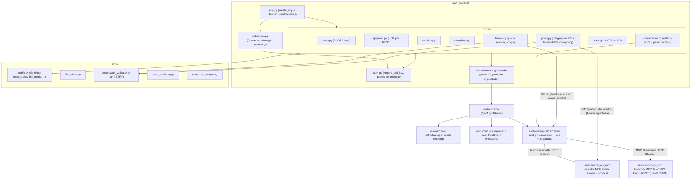
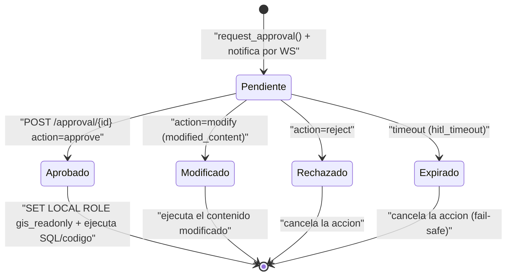
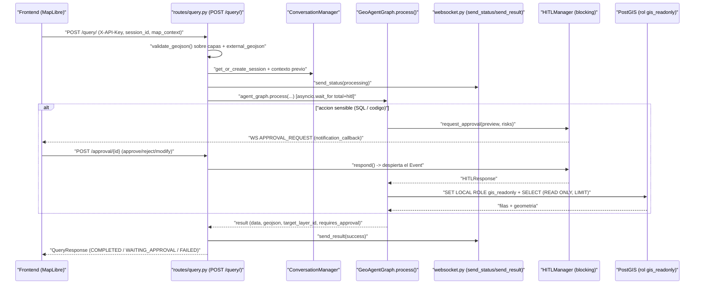
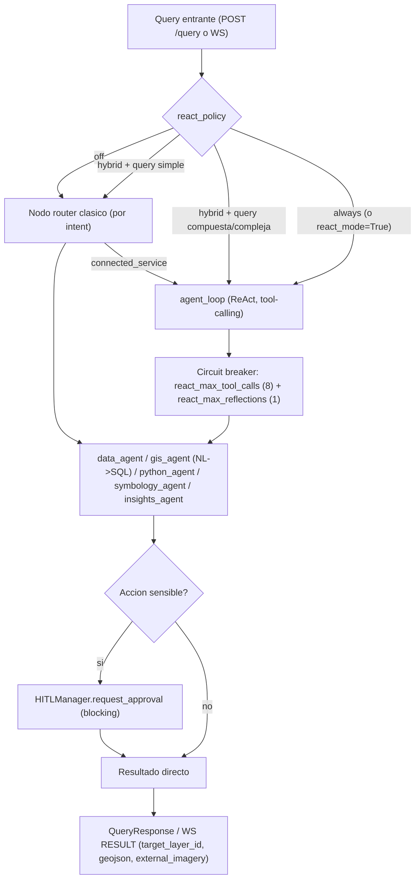
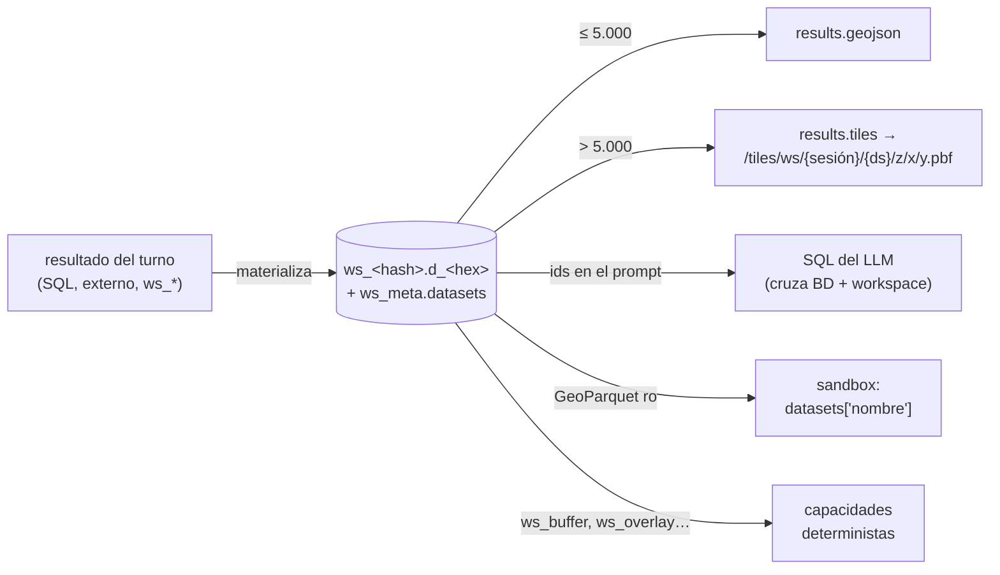

# 4. Backend (módulos)

Este documento describe los **módulos del backend** de GEO_COPILOT: la superficie
REST + WebSocket, la configuración central (`react_policy`, `hitl_mode`, API key,
servidores MCP), la seguridad (auth, `gis_readonly`, validación de GeoJSON, guardas
SSRF), la capa semántica, el **MCP Hub** y el proxy de teselas de los servidores MCP.

Los agentes están en el [doc 02](02-agentes.md) y el orquestador LangGraph en el
[doc 03](03-orquestador.md). Aquí nos enfocamos en lo que rodea a ambos: la puerta
de entrada HTTP, la config que decide cómo se comporta el sistema, y las capas de
seguridad y de datos.

Estructura general del paquete `src/geo_copilot/`:

```
src/geo_copilot/
├── agents/             ← los 6 agentes (ver doc 02)
├── orchestrator/       ← LangGraph: grafo, nodos, planner, sesiones (ver doc 03)
├── api/                ← FastAPI: routes, WebSocket, auth, dependencies
├── core/               ← Config, LLM client, seguridad, formatters
├── platform/           ← Capacidades, workspace y el MCP Hub (platform/mcp/)
├── security/           ← HITLManager (aprobaciones humanas, modo blocking)
└── semantic/           ← Capa semántica: introspección de PostGIS + overrides YAML
```

Además, hay **servicios aparte** fuera de `src/`: `services/imagery_mcp/` —
un microservicio MCP (STAC→COG Sentinel-2) con su propia autenticación—,
`services/arcgis_mcp/` —el servidor MCP de ArcGIS (Hub + servicios REST) sobre el
que corre Discovery desde T5.2— y el servidor de ejemplo `services/hello_geo/`
(todos sobre el kit `packages/geo_mcp_kit`). El backend los consume por red a
través del **MCP Hub genérico** (nunca los importa como librería ni tiene código
propio de imagery ni conectores de ArcGIS). Ver
[doc 01 §1.5](01-arquitectura.md) y §4.5 más abajo.

### Mapa de módulos del backend



---

## 4.1 API (`api/`)

### `app.py` — punto de entrada FastAPI

`create_app()` construye la aplicación y su `lifespan` (startup/shutdown):

- **Guardas de arranque** (antes de servir tráfico): `enforce_production_auth`
  aborta el proceso si el entorno no es de desarrollo y no hay una API key válida
  configurada (nada de dejar la superficie protegida abierta por olvido);
  `enforce_production_debug` aborta si `debug=True` fuera de dev (para no filtrar
  trazas ni nombres de tablas PostGIS en las respuestas de error).
- **Lifespan**: al startup inicializa el estado global (`AppState`: pool de BD,
  LLM client, orquestador, capa semántica, HITL manager, session store). Al
  shutdown cierra los pools.
- **Middlewares**:
  - **CORS**: orígenes configurables. Si CORS está en modo wildcard (`*`), las
    credenciales se **desactivan** automáticamente (nunca `credentials=True` con
    wildcard). En condiciones normales usa la allowlist de `settings.cors_origins`.
  - **SlowAPI rate limiter** (`settings.rate_limit_requests` por minuto por IP).
  - **Request-ID**: cada request recibe/propaga un `X-Request-ID` (toma el del
    cliente si viene, si no genera uno) que aparece en logs y en la respuesta —
    correlación end-to-end.
- **Exception handler global**: convierte cualquier excepción no manejada a
  `HTTP 500` con `sanitize_error_for_client()` (oculta stack traces, paths
  internos, estructura de la BD).
- **Health check** `GET /health`: reporta el estado de los componentes (API,
  capa semántica, LLM, orquestador, BD). Devuelve **200** si BD y LLM (los dos
  críticos) están arriba, o **503 degraded** si falta alguno.

Los routers se montan bajo el prefijo `/api/v1`, y el WebSocket aparte en
`/ws/{session_id}`. **Cada router declara `dependencies=[Depends(require_api_key)]`
a nivel de `APIRouter`** — la auth es uniforme, no endpoint por endpoint.

### `routes/` — los endpoints REST

| Router | Endpoint | Qué hace |
|--------|----------|---------|
| `query.py` | `POST /api/v1/query/` | **Punto de entrada síncrono principal**. Recibe `{query, session_id, map_context}`, ejecuta el grafo y devuelve resultados, geojson, visualization, `target_layer_id`. Streamea progreso por WebSocket. |
| `query.py` | `GET /api/v1/query/{query_id}` | **501 Not Implemented** — el tracking asíncrono por `query_id` no existe todavía; el código lo declara honestamente en vez de simular éxito. |
| `query.py` | `POST /api/v1/query/{query_id}/cancel` | **501 Not Implemented** (antes mentía con 200). La cancelación real va por WebSocket. |
| `approval.py` | `GET /api/v1/approval/pending?session_id=` | Lista solicitudes HITL pendientes de la sesión. |
| `approval.py` | `GET /api/v1/approval/{approval_id}?session_id=` | Detalle de una solicitud HITL. |
| `approval.py` | `POST /api/v1/approval/{approval_id}` | Responde una solicitud HITL (`approve` / `reject` / `modify`). |
| `approval.py` | `GET /api/v1/approval/history/{session_id}` | Historial de aprobaciones de la sesión. |
| `session.py` | `POST /api/v1/session/` | Crea sesión nueva. |
| `session.py` | `GET /api/v1/session/` | Lista sesiones activas. |
| `session.py` | `GET /api/v1/session/{id}` | Obtiene contexto + estado. |
| `session.py` | `PATCH /api/v1/session/{id}/preferences` | Actualiza preferencias del usuario. |
| `session.py` | `DELETE /api/v1/session/{id}` | Elimina la sesión. |
| `session.py` | `POST /api/v1/session/{id}/reset` | Reinicia el historial. |
| `session.py` | `GET /api/v1/session/{id}/history` | Mensajes de la sesión. |
| `metadata.py` | `GET /api/v1/metadata/entities` | Lista entidades (introspección de la BD). |
| `metadata.py` | `GET /api/v1/metadata/entities/{name}` | Detalle de columnas de una entidad. |
| `metadata.py` | `GET /api/v1/metadata/categories` | Esquemas / categorías. |
| `metadata.py` | `GET /api/v1/metadata/search?q=` | Búsqueda difusa de tablas/columnas. |
| `metadata.py` | `GET /api/v1/metadata/tables` | Árbol completo: schemas → tablas → columnas. |
| `discovery.py` | `POST /api/v1/discovery/search` | Busca datasets en ArcGIS Hub a través del servidor MCP `arcgis` (ver [doc 07](07-discovery.md)). **503** si el servidor no responde. |
| `discovery.py` | `POST /api/v1/discovery/load` | Carga el dataset seleccionado (geojson + simbología + `total_available`, o imagery descriptor), también vía el servidor MCP. **502** si el servidor falla. |
| `discovery.py` | `GET /api/v1/discovery/regions` | Lista las regiones del catálogo (Colombia, Global). |
| `discovery.py` | `GET /api/v1/discovery/health` | Smoke test. |
| `proxy.py` | `GET /api/v1/proxy/imagery` | Proxy anti-SSRF/CORS de teselas **ArcGIS** (`exportImage`/`export`) — valida el host contra la allowlist. |
| `proxy.py` | `GET /api/v1/proxy/imagery-identify` | Identify de imagery ArcGIS (mismo guard SSRF, devuelve JSON). |
| `proxy.py` | `GET /api/v1/proxy/mcp/{server_id}/{path}` | Proxy **genérico** de teselas de cualquier servidor MCP registrado: solo deja pasar los prefijos de `tiles.prefixes` del YAML e inyecta su credencial server-side (p. ej. `/proxy/mcp/imagery/tiles/...`). |
| `tiles.py` | `GET /api/v1/tiles/{schema}/{table}/{z}/{x}/{y}.pbf` | Teselado vectorial MVT on-the-fly con `ST_AsMVT` directo contra PostGIS. |
| `connections.py` | `GET /api/v1/connections` | Estado de cada servidor MCP y sus tools (habilitadas o no, y por qué). |
| `connections.py` | `GET /api/v1/connections/tools` | Tools habilitadas con su `input_schema` (el panel arma el formulario con él). |
| `connections.py` | `POST /api/v1/connections/{server}/tools/{tool}/run` | Panel transaccional: ejecuta la **misma** capacidad que usa el agente; responde con la forma de `results` de `/query`. Las tools de riesgo `write` dan 403 (se piden por el chat, con HITL). |
| `connections.py` | `POST /api/v1/connections/{server}/tools/{tool}/approve` | Re-aprueba una tool deshabilitada por *pinning* (su descripción o esquema cambió). |

#### `query.py` — el flujo de una consulta

`POST /query/` es donde entra casi todo. En orden:

1. **Sesión**: crea o recupera la sesión (`ConversationManager.get_or_create_session`).
2. **Contexto previo + validación**: reconstruye `previous_sql`, `previous_results`,
   `previous_geojson`, `found_services`, `external_geojson`, y **valida cualquier
   GeoJSON externo con `validate_geojson()`** (tope `settings.max_geojson_features`)
   antes de inyectarlo al grafo — barrera anti-DoS por payload gigante.
3. **FRT-04 (capa por nombre)**: si `map_context` trae capas con `data`, cada una se
   valida igual, y se arma `map_layers: dict[id → {data, name}]`. Esto permite que el
   backend razone sobre **cualquier capa nombrada** ("colorea los lotes"), no solo la
   activa. En la sesión se persiste una versión "ligera" (solo metadatos, sin geojson)
   para no inflar el estado.
4. **Ejecución con timeout desacoplado**: llama a `agent_graph.process(...)` envuelto
   en `asyncio.wait_for(timeout=compute_process_timeout(settings))`. Esta función
   separa el reloj de **cómputo** (`total_execution_timeout`, 120s) del reloj de
   **espera humana** (`hitl_timeout`): si HITL está habilitado, el timeout total es la
   **suma**, para que una aprobación lenta no cancele la request antes de que el humano
   responda.
5. **Respuesta**: traduce el resultado del grafo a `QueryResponse`, decide el `status`
   (`COMPLETED` / `FAILED` / `WAITING_APPROVAL`) y arma `results.target_layer_id`
   priorizando el id que resolvió el LLM/tool sobre la capa activa reportada por el
   mapa (mecanismo FRT-04).
6. **Progreso por WS**: notifica `send_status` / `send_result` para que el chip de
   pipeline del frontend abra y cierre.
7. **Workspace (F2)**: el GeoJSON del turno se **materializa** como dataset del
   workspace de la sesión y su `LayerRef` sale en `results.layer_ref` (si una
   capacidad `ws_*` ya lo creó, llega en `result_layer_ref` y no se duplica; un
   re-estilo que devuelve la misma capa reutiliza su dataset). Por encima de
   `WORKSPACE_INLINE_MAX_FEATURES` la capa no viaja inline: `results.tiles` trae
   la URL de teselas MVT. Ver [§4.8](#48-workspace-espacial-fase-2).

Y a la entrada, una capa del mapa que trae `dataset_id` (sin `data`) se **lee del
workspace de la sesión**: el navegador ya no reenvía la geometría en cada turno.
La sesión recuerda la capa anterior por `last_dataset_id`, no copiando el GeoJSON.

### `websocket.py` — canal en tiempo real

`ConnectionManager` (singleton) mantiene **dos** mapas por sesión:
`active_connections: {session_id → WebSocket}` y
`active_tasks: {session_id → asyncio.Task}`. Este segundo mapa es lo que permite que
`handle_cancel` **cancele de verdad** la tarea en curso (antes solo mandaba una
notificación sin parar nada — bug corregido en Fase 6).

El endpoint `websocket_endpoint`:

- Valida **origin + token con `validate_websocket_auth` ANTES de `accept()`**; si
  falla cierra con código **4403** (para que el cliente distinga el rechazo de auth).
- **No crea sesiones** (desde F0 del plan de plataforma, cierre del IDOR #14): la
  sesión la crea solo `POST /session/`. Antes de aceptar, rechaza con **4400** un
  `session_id` con formato inválido, con **4404** una sesión inexistente y con
  **4409** una sesión que ya tiene una conexión viva (antes `connect()` la
  sustituía en silencio). El frontend, si el backend perdió la sesión (reinicio
  con sesiones en memoria), crea otra y se reconecta con ella.
- Valida cada mensaje entrante con Pydantic (`extra="ignore"`), aplica timeout de
  recepción (`websocket_receive_timeout`, con ping keep-alive) y tope de tamaño de
  mensaje (`websocket_max_message_size`).
- `handle_query` valida el `external_geojson` igual que el REST (paridad anti-DoS).

Eventos de **servidor → cliente** (alimentan el "pipeline" visual):

```python
await send_status(session_id, "processing")
await send_agent_step(session_id, agent="data_agent", description="Buscando en Hub…", status="started")
await send_result(session_id, payload)                # STEP_STARTED / STEP_COMPLETED, RETRY_*,
await send_approval_request(session_id, approval_data) # PLAN_CREATED, EXECUTION_CANCELLED, ...

# No hay helper `send_error()`: los errores se emiten directo con send_message + WSMessageType.ERROR:
await connection_manager.send_message(
    session_id,
    WSMessage(type=WSMessageType.ERROR, data={"error": sanitize_error_for_client(exc)}),
)
```

Mensajes de **cliente → servidor** (modelos Pydantic):

```python
WSQueryMessage     # ejecuta una query, igual que POST /query pero por WS
WSApprovalMessage  # responde a una solicitud HITL
WSCancelMessage    # cancela la query en curso (cancela la asyncio.Task real)
WSPingMessage      # keepalive
```

### `auth.py`

Auth **single-tenant** por API key:

- **REST**: header `X-API-Key: <value>`.
- **WebSocket**: query param `?token=<value>` **o** header `x-api-key` — esto último
  para soportar un BFF (nginx) que inyecta la clave server-side, de modo que el bundle
  del navegador nunca la lleva.

`_configured_key()` distingue **tres** estados, no dos:

| Estado de `api_key` | Comportamiento |
|---------------------|----------------|
| `None` | Auth **deshabilitada** (solo dev). |
| No vacía | Auth **activa** con esa key. |
| Vacía `""` | Mal configurada → **fail-closed** (ninguna petición pasa; antes saltaba la auth en silencio). |

La comparación usa `hmac.compare_digest` (constant-time, no filtra la longitud por
timing). El 401 usa un cuerpo genérico (no revela si el header faltaba o era erróneo).

**Tenancy**: la API es single-tenant — una instalación comparte una sola `API_KEY` y
las sesiones se identifican por `session_id`, sin `user_id` autenticado. Los guards
actuales validan formato, existencia de sesión y **pertenencia de aprobaciones a la
misma sesión** (mitigación de IDOR, ver §4.3), pero no implementan ownership
multi-tenant real. Para aislar usuarios entre sí habría que introducir auth por
usuario (p.ej. JWT), persistir `owner_user_id` por sesión y filtrar todos los
endpoints por ese owner.

### `dependencies.py`

Estado global compartido (inicializado en el lifespan): `db_pool`, `llm_client`,
`orchestrator`, `semantic_layer`, HITL manager, session store. Expone `Depends(...)`
para inyectarlos en los routers, y un `reset_app_state()` para el aislamiento de tests.

---

## 4.2 Core (`core/`)

### `config.py` — el cerebro de configuración

`Settings` (Pydantic `BaseSettings`) reúne **todos** los toggles del sistema y carga
`.env` automáticamente. `get_settings()` es `@lru_cache` (singleton). Los campos que
más definen el comportamiento:

| Grupo | Campo | Default | Qué controla |
|-------|-------|---------|--------------|
| Orquestación | `react_policy` | **`"hybrid"`** | `"off"` = siempre router clásico; `"hybrid"` = las queries compuestas/complejas van a `agent_loop` (ReAct), las simples al router; `"always"` = todo ReAct. |
| Orquestación | `react_mode` | `False` | Flag legado; `True` equivale a `react_policy="always"` y tiene **precedencia**. |
| Orquestación | `react_max_tool_calls` | `8` | Circuit-breaker del bucle ReAct (máx. tool-calls por turno). |
| Orquestación | `react_max_reflections` | `1` | Reflexiones composicionales antes de aceptar un `answer`. |
| HITL | `hitl_mode` | `"blocking"` | Mecanismo de aprobación: `"blocking"` (producción) o `"interrupt"` (spike LangGraph, ver §4.3). |
| HITL | `hitl_enabled` / `hitl_timeout` | `True` | Si las acciones sensibles requieren aprobación, y cuánto se espera. |
| Timeouts | `total_execution_timeout` | `120` s | Reloj de cómputo (se suma al `hitl_timeout` para la ventana total). |
| Sandbox | `sandbox_backend` | **`"docker"`** | Cómo se ejecuta el código del LLM. El default se invirtió a `docker` en **R0.5** (`core/config.py:168`); `"subprocess"` es **solo desarrollo** y `enforce_sandbox_backend` lo rehúsa fuera de él. |
| MCP | `mcp_servers_path` | `config/mcp_servers.yaml` | YAML con los servidores MCP que conecta el hub (archivo ausente = sin servidores). Las credenciales van por referencia (`env:VAR`). |
| MCP | `mcp_tools_umbral` / `mcp_refresh_s` | `25` / `60` s | Por encima del umbral el LLM busca tools con `find_tools`; cada cuánto se revalida el catálogo. |
| Sesiones | `session_backend` | `memory` / `redis` | Dónde viven las sesiones. |
| Seguridad | `api_key` (`SecretStr \| None`) | `None` | La clave de auth (ver §4.1). |
| Seguridad | `allowed_domains` | — | Allowlist anti-SSRF usada por el proxy de imagery ArcGIS. (El servidor MCP `arcgis` tiene la suya: `ARCGIS_ALLOWED_DOMAINS`, opcional.) |
| Datos | `max_geojson_features` | — | Tope de features de cualquier GeoJSON externo (anti-DoS). |

### `llm_client.py`

`BaseLLMClient` abstracto con `chat()` / `stream()` e implementaciones por proveedor
(OpenAI, Anthropic, Azure, local). `LLMClient.from_settings()` selecciona el correcto
según `settings.llm_provider`. `core/structured_output.py` ofrece `structured_call`
(function-calling forzado) que usan router, symbology y el juez del python_agent.

### `platform/mcp/` — el MCP Hub

Reemplaza al antiguo `core/imagery_client.py` (retirado en la Fase 3). Cuatro
módulos:

- `config.py`: carga `config/mcp_servers.yaml` (`MCP_SERVERS_PATH`). Por
  servidor: `id`, `url`, `auth` (`bearer` con `secret_ref: env:VAR`, o `none`),
  `conformance` (G0/G1/G2), `trust` (`untrusted` por defecto), `tools{allow,deny,agent}` (`agent`: qué
  tools ve el LLM; `[]` = ninguna, como el servidor `arcgis`, que solo usa el núcleo),
  `policy` (`default_risk`, `hitl` por riesgo `read/compute/write/external_egress`,
  `timeout_s`, `max_result_mb`), `tiles{prefixes}`, `description`, `enabled`.
- `connection.py`: cliente MCP genérico sobre **streamable HTTP**, con allowlist
  de tools, timeout, tamaño máximo de respuesta y circuit breaker.
- `hub.py`: registra cada tool permitida como capacidad `mcp.<servidor>.<tool>`
  (nombre para el LLM `<servidor>__<tool>`, descripción marcada como texto externo
  no confiable), fija descripción + esquema por hash en Redis (*pinning*, anti rug
  pull), resuelve los argumentos geo (`_meta.geo`) a partir de una referencia de
  capa, aplica HITL por riesgo, exige aprobación humana para saltar a otro
  servidor tras la salida de uno `untrusted`, y materializa los `GeoResult`
  (dataset del workspace, capa de teselas, tabla). También genera el resumen
  "SERVICIOS MCP CONECTADOS" que ve el router. `llamar_directo(servidor, tool, args)`
  es la puerta para que el **propio núcleo** use un servidor como backend (T5.2:
  Discovery sobre `arcgis`, vía `agents/data_agent/servicio_arcgis.py`): aplica la
  misma allowlist, pinning, timeout y tope de tamaño, y devuelve el
  `structuredContent` (un error de la tool se lanza como `McpError`).
- `busqueda.py`: por encima de `MCP_TOOLS_UMBRAL` (25) tools, expone
  `find_tools(query)` (BM25) para que el LLM active solo las relevantes.

`api/dependencies.py` crea el hub al arrancar y lo revalida cada
`mcp_refresh_s` segundos.

### `security/url_validator.py` — guarda anti-SSRF

`URLValidator.validate_url(url, allowed_domains=None, allow_any_port=False)`:

1. Solo esquemas HTTP/HTTPS.
2. Bloquea IPs privadas (loopback, RFC1918, link-local, multicast, metadata).
3. Si `allowed_domains` está set, valida que el host esté en la lista.
4. Restringe puertos al set `SAFE_PORTS = {80, 443, 8080, 8443, 6443}` salvo `allow_any_port=True`.

Lo usan `discovery.load()` (guard antes de cargar un servicio ArcGIS), el proxy de
imagery ArcGIS (`proxy.py`, con IP-pinning para no revalidar tras un DNS rebinding).
Las peticiones a servicios ArcGIS de Discovery las hace el servidor MCP `arcgis`, que
aplica su propia guarda (`services/arcgis_mcp/arcgis_mcp/red.py`: bloquea redes
internas y puertos raros y fija la IP resuelta).

### Otros módulos de `core/`

- `error_sanitizer.py`: lo que llega al cliente sale de una **lista cerrada**
  (`ERROR_MESSAGES`: tabla o columna inexistente, base de datos, tiempo agotado,
  sandbox, URL no permitida, servicio externo, LLM, rechazada, genérico).
  `describe_error` traduce un error crudo a su categoría y es lo que usan los
  canales técnicos (auto-corrección, traza de razonamiento, reintentos por WS);
  `sanitize_error_message` deja pasar el error final del responder solo si tiene
  forma de frase natural y ningún marcador interno. (La excepción del endpoint
  WS sigue mapeándose por tipo con `api/websocket.sanitize_error_for_client`.)
- `formatters.py`, `constants.py`, `colors.py`, `spatial.py`: helpers compartidos
  (formateo de prompts, CRS por defecto `EPSG:4326`, límites, esquemas de color).
- `agent_audit.py` (`DecisionTrace`), `agent_metrics.py`, `composition_judge.py`:
  telemetría y juicio del bucle ReAct.

---

## 4.3 Security (`security/hitl.py`) — Human-in-the-Loop

`HITLManager` (el mecanismo de **producción**, modo `blocking`) orquesta las
aprobaciones humanas para acciones sensibles: ejecutar SQL, correr código,
importar datos o llamar APIs externas.

```python
class HITLActionType(Enum):
    DATA_IMPORT = "data_import"
    SQL_EXECUTION = "sql_execution"
    CODE_EXECUTION = "code_execution"
    RECOMMENDATION = "recommendation"
    EXTERNAL_API = "external_api"
    PLAN_APPROVAL = "plan_approval"

class HITLStatus(Enum):
    PENDING = "pending"; APPROVED = "approved"; REJECTED = "rejected"
    MODIFIED = "modified"; EXPIRED = "expired"

# Resumen simplificado (Pydantic BaseModel, no dataclass) — campos principales:
class HITLRequest(BaseModel):
    id: str
    action_type: HITLActionType
    title: str
    description: str
    details: dict
    risks: list[str]
    preview: str | None            # ej. el SQL a ejecutar
    created_at: datetime           # tz-aware
    expires_at: datetime | None
    metadata: dict
    session_id: str | None         # sesión a notificar (ownership / IDOR)
```

> El `timeout` NO vive por-request: es un atributo de `HITLManager`
> (default `settings.hitl_timeout`), no un campo de `HITLRequest`.

Flujo cuando un agente llama `request_approval()`:

1. Crea la `HITLRequest` y la guarda en `_pending_requests`.
2. Notifica al frontend vía `notification_callback` (que dispara
   `send_approval_request()` por WS).
3. La tarea del agente queda **bloqueada en un `asyncio.wait_for` sobre un
   `asyncio.Event`** hasta que llegue la respuesta o venza el timeout.
4. El usuario aprueba / rechaza / modifica desde la UI → `POST /approval/{id}` (mismo
   proceso) llama `respond()`, que resuelve el Event.
5. La tarea continúa: si fue aprobada ejecuta la acción; si fue modificada ejecuta el
   contenido modificado; si venció el timeout se cancela (fail-safe).

Detalles de robustez: cap FIFO `_MAX_RESPONSES=256` en `_responses` para no crecer sin
límite; `_responses` **no** se popea al despertar el `wait_for` (evita una race que
perdía el `modified_content`).

**Ownership / IDOR (SEC-3)**: la solicitud HITL queda **ligada a `session_id`** — solo
esa sesión puede aprobarla. Los endpoints de `approval.py` exigen `session_id` como
ownership check y devuelven **404** (no 403, para no confirmar existencia a terceros)
o 403 si el `session_id` del body no coincide con el de la `HITLRequest`. Antes,
cualquiera con la API key podía aprobar el HITL de otra sesión.

### El otro mecanismo: `interrupt` (spike diferido)

`orchestrator/hitl_interrupt.py` usa `langgraph.types.interrupt()` + checkpointer
(`MemorySaver` / Postgres). Es un **spike explícitamente diferido**: su propio
docstring documenta por qué el cutover completo NO ha ocurrido —
(1) el mecanismo `blocking` ya funciona; (2) `MemorySaver` no da durabilidad real
entre reinicios; (3) hay 9 sitios de HITL que migrar; (4) `interrupt()` re-ejecuta el
nodo desde el principio al reanudar, y `gis_agent` genera el SQL **antes** del HITL —
reanudar regeneraría un SQL distinto del aprobado. `request_hitl_decision()` es el
gateway que elige uno u otro según `settings.hitl_mode`.

### `gis_readonly` — rol de solo-lectura para el SQL del LLM

Antes de ejecutar SQL generado por el LLM (y ya aprobado), `gis_agent` chequea
`pg_has_role(current_user, 'gis_readonly', 'MEMBER')` (una sola vez, cacheado). Si el
rol existe y hay membresía, hace `SET LOCAL ROLE gis_readonly` (rol Postgres con
`SELECT` solo sobre los esquemas del dominio) dentro de una transacción **READ ONLY**
con `statement_timeout` y `LIMIT` capeado. Doble cinturón: el rol limita permisos y la
transacción rechaza escritura.

### Ciclo de vida de una solicitud HITL



---

## 4.4 Semantic (`semantic/`)

La capa semántica traduce "conceptos de negocio" a esquemas físicos de PostGIS, y su
fuente de verdad es la **introspección real de la base de datos**, no un YAML estático.

`SchemaIntrospector` (`introspector.py`) consulta `information_schema` +
`geometry_columns` + `pg_catalog` **directamente contra la BD conectada**, respetando
los GRANTs de la sesión (solo ve lo que el usuario puede ver) y excluyendo esquemas
internos (`pg_catalog`, `topology`, `tiger`, etc.). Produce `IntrospectedTable` /
`IntrospectedColumn` con detección real de geometría (columna, tipo, SRID).

`to_entity()` convierte una tabla introspeccionada en un `Entity` del semantic layer,
generando aliases desde el nombre de tabla. **El YAML de configuración pasó de ser
fuente primaria a ser overrides opcionales** (aliases custom, descripciones humanas);
solo actúa como fallback si no hay BD conectada.

```yaml
# Ejemplo de override YAML (opcional): humaniza una entidad introspeccionada
entities:
  parcela:
    aliases: [predio, lote, terreno]
    description: "Parcela catastral urbana"
    fields:
      valor_cat: {sensitive: true}   # marca de sensibilidad no derivable del esquema
```

API que consumen los agentes (sobre todo `gis_agent` para no alucinar tablas):
`get_entity(name)`, `get_entity_by_alias(alias)`, `find_entity(keyword)` (fuzzy),
`get_entities_for_context()` (descripción rica para meter en prompts) y
`get_relationships_for_entity(name)`.

> ⚠️ **Las claves foráneas NO se introspeccionan.** El introspector lee tablas,
> columnas, tipos y geometría (columna, tipo, SRID), pero **no** consulta
> `key_column_usage` ni `referential_constraints`: en todo el repositorio no hay
> una sola consulta de constraints. Las relaciones entre entidades las **infiere
> el LLM** por semántica de nombres (`lotes.barrio_id` → `barrios.id`), y sale
> bien mientras los nombres sean legibles. **Con nombres crípticos —`t_042.cod_x`—
> el join se inventa o no aparece.** Si tu esquema es así, declara las relaciones
> a mano en el YAML de overrides; es exactamente para lo que sirve.

### Topes de tamaño del camino de datos

Están repartidos por el backend; esta es la lista completa, porque en conjunto
son el techo real de lo que se puede analizar:

| Límite | Valor | Configurable | Dónde |
|---|---|---|---|
| Features de cualquier GeoJSON externo | **10.000** | `MAX_GEOJSON_FEATURES` | `core/config.py:458-463`, aplicado en `api/routes/query.py:88-104`. Una capa del workspace más grande **no se hidrata** (se trabaja en SQL / `ws_*` / `datasets[...]`) |
| Features por capa traída de ArcGIS | **10.000** | ❌ fijo en el servidor MCP | `services/arcgis_mcp/arcgis_mcp/rest.py` (`MAX_ELEMENTOS`); el chat pide hasta 10.000 y los hechos (`total_en_servicio`, `completo`) dicen si vino todo |
| Features inline en la respuesta | **5.000** | `WORKSPACE_INLINE_MAX_FEATURES` | por encima, `results.tiles` (MVT del workspace) |
| Workspace: por dataset / por sesión / nº datasets / TTL | **500k / 2M / 200 / 24 h** | `WorkspaceLimits` | `platform/workspace/store.py` |
| Filas por consulta SQL | **1.000** | `SQL_RESULT_LIMIT` | `core/constants.py:16`, `core/config.py:93-98` |
| Features por carga de Discovery | **2.000** (máx. 10.000) | por request | `api/routes/discovery.py:121` |
| Features por tesela vectorial (MVT) | **20.000** | ❌ fijo en código | `api/routes/tiles.py:56` |
| Longitud del texto de la consulta | **2.000** caracteres | ❌ | `api/models.py:83` |
| Mensaje de WebSocket | **1 MB** | `WEBSOCKET_MAX_MESSAGE_SIZE` | ver [09](09-configuracion-y-deploy.md) |

**Cómo se traduce esto a una tabla grande.** Con cientos de miles de registros
(el caso de prueba son ~933k lotes) la tabla **se tesela** para verla en el mapa
—por ahí pasan los 20.000 features/tesela— pero para **analizarla** hay que
filtrarla antes por zona o por atributo: el análisis in-memory trabaja sobre las
features cargadas, no sobre la tabla entera. Y las teselas MVT **no** entran al
análisis in-memory: son una capa de render.

**Qué se puede hacer con cada fuente**, que no es lo mismo que poder cargarla:

| Fuente | Cómo entra | Sirve para |
|---|---|---|
| PostGIS interna | `query_data` → SQL → GeoJSON | consulta, agregación, JOIN, operaciones espaciales `ST_*`, análisis in-memory |
| ArcGIS FeatureServer | Discovery → servidor MCP `arcgis` → GeoJSON | render **y** análisis in-memory |
| ArcGIS ImageServer / MapServer | descrito por el servidor MCP; teselas por el proxy del backend | **solo visualización** — no hay análisis vectorial |
| Teselas MVT | `api/routes/tiles.py` | **solo render** — no entran al sandbox |

> **Hoy no entran archivos.** Ni subida (`UploadFile`/`multipart`) ni descarga
> por URL: los conectores de archivos (SHP/GeoJSON/GPKG/KML) y de Socrata se
> borraron del núcleo en T5.2 (eran código muerto en producción). Los formatos de
> archivo volverán con el servidor de DuckDB/archivos (T5.6). Los ajustes
> `MAX_EXTERNAL_FEATURES` y `MAX_EXTERNAL_FILE_SIZE_MB` siguen en `core/config.py`
> pero ya no los consume ningún conector.

---

## 4.5 Servicios MCP: cómo se conecta el backend (imagery incluido)

El análisis de imagery **no vive en el backend**: es un microservicio aparte
(`services/imagery_mcp/`, ver [doc 01](01-arquitectura.md)) que el backend ve como
**un servidor más** del MCP Hub (`id: imagery` en `config/mcp_servers.yaml`). Lo
mismo vale para cualquier otro servidor MCP. Dos caminos, ambos **sin exponer
nunca la credencial al navegador**:

1. **Cómputo (MCP streamable HTTP)**: la capacidad `mcp.<servidor>.<tool>` del
   hub (la que el LLM llama como `<servidor>__<tool>` desde `agent_loop`) resuelve
   los argumentos geo (una referencia `activa` / `ds_…` / id de capa / `viewport`
   → geometría real), pide aprobación si la política lo exige y llama al servidor
   con su Bearer. El panel `POST /api/v1/connections/{server}/tools/{tool}/run`
   ejecuta la **misma** capacidad, así el chat y el formulario producen resultados
   idénticos. Las tools devuelven `GeoResult` (en imagery: `imagery_mcp/georesult.py`).
2. **Teselas (HTTP plano vía proxy)**: el frontend nunca habla directo con el MCP.
   Pide las teselas al proxy genérico `/api/v1/proxy/mcp/{server_id}/{path}`, que
   solo acepta los prefijos declarados (para imagery: `/tiles/`, `/tiles-diff/`,
   `/tiles-rgb/`), valida ruta y query, e **inyecta el Bearer server-side**.

Del lado del servicio imagery, `imagery_mcp/auth.py` define `TOOL_SCOPES` — un
diccionario tool→scope que aplica el `AuthMiddleware`: **toda tool nueva que no se
agregue ahí queda denegada fail-closed (403)**. Es la regla de oro al ampliar
imagery. Para enchufar un servidor nuevo, ver
[12-como-enchufar-un-mcp](12-como-enchufar-un-mcp.md).



---

## 4.6 Cómo la config decide el camino de una consulta

`react_policy` es el toggle que más cambia el comportamiento del backend en runtime:
no hay un único `if intent==X`, sino **tres estrategias** que conviven (detalle
completo en el [doc 03](03-orquestador.md)).



> Nota: en `hitl_mode="interrupt"` el ReAct in-graph (hybrid) **se autodesactiva** —
> el resume re-ejecutaría el razonamiento, así que ese modo cae al planner clásico.

---

## 4.7 Qué cambió recientemente vs. un backend "clásico"

- **Tres caminos de orquestación** decididos por `react_policy` (default `hybrid`), no
  un router fijo por intent.
- **FRT-04**: el target de re-estilo se resuelve **por nombre** (`target_layer_id`
  validado contra `map_layers`), no "la última capa añadida".
- **Timeouts desacoplados** cómputo vs. HITL (antes un timeout único capaba en silencio
  la ventana de aprobación).
- **IDOR cerrado** en los endpoints de aprobación (antes cualquiera con la API key
  aprobaba el HITL de otra sesión).
- **Cancelación real** vía `asyncio.Task` registrada por sesión (antes era un no-op).
- **Auth fail-closed** con tres estados (key `None` / válida / vacía) y guardas de
  arranque que abortan el proceso en producción sin key o con `debug=True`.
- **MCP Hub genérico** (Fase 3): imagery es un servidor MCP más del YAML; se
  retiraron `imagery_client.py`, el nodo `imagery`, `routes/imagery.py` y los proxies
  `ndvi/rgb` específicos. Teselas por `/proxy/mcp/...` con Bearer inyectado
  server-side (la credencial nunca llega al navegador).
- **Sesiones persistidas** con `save_session` cada vez que se modifican (con backend Redis, antes la mutación se perdía).
- **Introspección de esquema** reemplaza al YAML como fuente primaria; el YAML queda
  como overrides opcionales.

## 4.8 Workspace espacial (Fase 2)

Antes de F2 cada resultado vivía como GeoJSON en memoria: en el estado del grafo,
en la sesión (Redis) y en el navegador, que lo reenviaba entero en cada turno.
Dos capas como mucho (`gdf`/`gdf2`), 10.000 features, y nada cruzable en SQL.

Ahora **todo resultado geográfico es un dataset** en PostGIS, dentro del
**workspace de la sesión**: un esquema `ws_<sha256(session_id)[:16]>` con una
tabla `d_<hex>` por dataset (EPSG:4326, índice GiST) y una fila en el catálogo
`ws_meta.datasets`. El `LayerRef` (contrato de F1) describe cada uno.



| Pieza | Dónde | Qué hace |
|---|---|---|
| `DatasetStore` | `platform/workspace/store.py` | ingesta (`ingest_features` / `ingest_table` / `ingest_remote`), catálogo, `to_geojson`, `tile` (MVT), `export_geoparquet`, `crear_desde_sql`, cuotas, purga por TTL (cada hora). |
| Roles | `docker/init-db/06_workspace.sql` | `geo_workspace` (NOLOGIN) crea y escribe los `ws_*`; la app es NOINHERIT y lo asume con `SET LOCAL ROLE` solo para escribir; lee como `gis_readonly`. |
| SQL cruzado | `platform/workspace/context.py` + nodo SQL | el prompt del generador SQL recibe los datasets **de esa sesión** (nombre calificado, campos); una `ContextVar` los suma a la allowlist del validador AST. Otra sesión no los ve aunque adivine el esquema. La introspección del dominio excluye `ws_*`. |
| Teselas | `api/routes/tiles.py` | `/tiles/ws/{session_id}/{dataset_id}/…`: resuelve el dataset solo en el workspace de esa sesión (mismo 404 si no existe o es ajeno; caché `private`). La ruta genérica ya no sirve `ws_*`/`ws_meta`. |
| Sandbox | `agents/python_agent/agent.py` + runner | el código del LLM ve `datasets["nombre"]`; solo se exportan las claves literales que usa; el runner (confianza) carga el GeoParquet del volumen `ws_exports` (ro en el sandbox). |
| Capacidades `ws_*` | `platform/workspace/ops.py` + `orchestrator/capabilities_espaciales.py` | `ws_measure`, `ws_buffer`, `ws_overlay`, `ws_spatial_join`, `ws_aggregate_by_zone`, `ws_spatial_autocorrelation` (Moran/LISA/Gi*). Calculan en PostGIS con `geography` (metros exactos a cualquier latitud); cada resultado es un dataset nuevo con procedencia y cifras para narrar. |

**Qué NO hace todavía (T2.0b)**: los nodos del grafo siguen recibiendo copias
GeoJSON (`geojson`, `external_geojson`, `previous_geojson`) hidratadas del
workspace; retirarlas y operar siempre sobre `LayerRef` es el paso siguiente. Y
el SQL del dominio sigue con `LIMIT 1000` (`SQL_RESULT_LIMIT`): las capas grandes
entran hoy por fuentes externas (tope 100.000).

**Validador SQL: SRID mezclado.** Además de las unidades, el validador AST
deduce el SRID de cada lado de un predicado espacial (`ST_Intersects`,
`ST_Within`, `ST_DWithin`…) y rechaza si difieren: con SRID distintos PostGIS
**no da error**, el prefiltro por bbox compara grados con metros y el conteo
sale 0 (hallazgo H14 de la validación de F2).

---

## Siguiente: [05-frontend](05-frontend.md)
