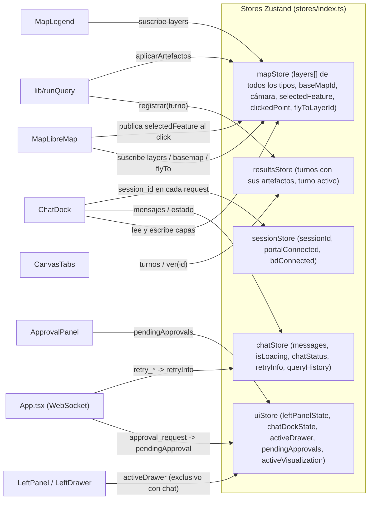
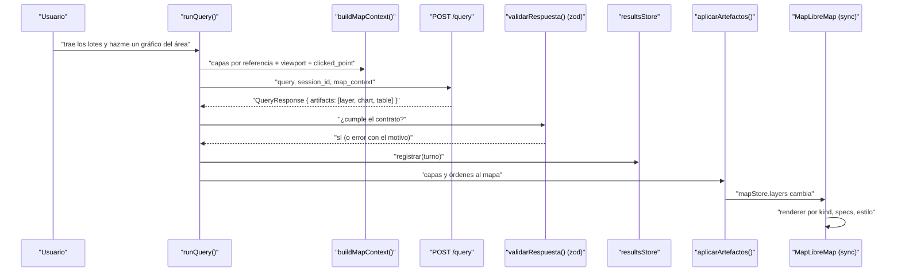
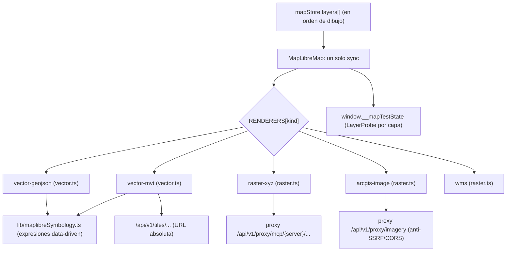
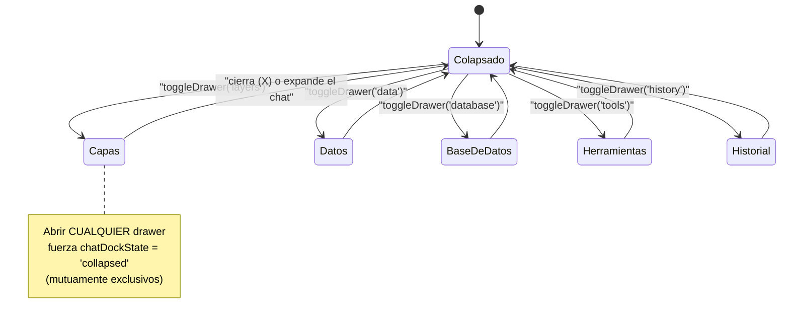

# 5. Frontend (React + MapLibre)

> **F4 — frontend genérico (2026-09-25).** Lo que cambió respecto del estado anterior:
> - **Un solo contrato tipado.** `/query` devuelve `artifacts[]` (capa, tabla,
>   gráfico, estadísticas, informe, servicios, orden al mapa). Los tipos TS se
>   **generan** de los JSON Schema del backend (`npm run gen:contracts`) y la
>   respuesta se valida con zod en `runQuery` (`validarRespuesta`): una respuesta
>   fuera de contrato se rechaza con el motivo, no se pinta a medias.
> - **Una lista de capas para todos los tipos** (`mapStore.layers`, con `kind`) y un
>   **registro de renderers** (`lib/renderers/`): vector GeoJSON, vector MVT, raster
>   XYZ, ArcGIS image y WMS. Un tipo nuevo = un archivo + su test. Orden y opacidad
>   son comunes: un raster NDVI puede ir encima de los lotes.
> - **Panel de Resultados acoplado** con historial por turno (`resultsStore`): capa,
>   tabla y gráfico se ven a la vez, con el mapa a la izquierda.
> - **`map_context` por referencias**: las capas viajan con su `dataset_id`, URL o
>   procedencia (incluidas raster y MVT), el «aquí» (`clicked_point`) y la
>   visualización activa, en < 5 KB.
> - **Panel de Conexiones**: estado, nivel, tools, riesgo, re-aprobación y «Probar».
>
> **Estado anterior (2026-07-26):**
> - **Motor de mapa único: MapLibre GL.** Cesium fue retirado al 100% — no
>   queda ni un import ni un componente vivo del visor anterior en `src/`. El
>   código conserva algunos comentarios de paridad ("el motor anterior") solo
>   como documentación de *por qué* ciertas expresiones de simbología replican
>   una semántica exacta; no es código ejecutable.
> - **MapLibre es un visor 2D.** El texto viejo hablaba de un "visor 3D"; era
>   herencia de Cesium. Hoy todo el renderizado es 2D data-driven.
> - **FRT-04 (capa objetivo por nombre):** "colorea LOS LOTES" ya no opera
>   siempre sobre la última capa añadida, sino sobre la capa que el usuario
>   nombra. El backend resuelve `target_layer_id` y el cliente re-estila
>   exactamente esa capa (`pickRestyleTarget`).
> - **Tres tipos de capa** en `mapStore`: vectoriales GeoJSON (`layers`),
>   raster ArcGIS (`imageryLayers`) y teseladas MVT de PostGIS (`tiledLayers`).
> - **Teselas MCP vía proxy:** las teselas de un servidor MCP (p. ej. NDVI /
>   cambio / color de `imagery-mcp`) se consumen como plantillas XYZ a través
>   del proxy genérico del backend `/api/v1/proxy/mcp/{server}/…`, nunca
>   directo al servicio MCP (el `X-API-Key` lo inyecta nginx server-side).
> - **Panel genérico de herramientas MCP** (`McpToolsPanel`): un servidor
>   enchufado por YAML aparece en el panel sin tocar el frontend.
> - **Oráculo de test `window.__mapTestState`** con detalle **por capa**
>   (`layers[]` con `id/name/featureCount/color/rendererKind`), diseñado para
>   que un test E2E afirme *qué capa concreta* cambió sin depender de nombres
>   generados por el LLM.

Stack: **React 18 + TypeScript + Vite + Tailwind + Zustand + MapLibre GL + Recharts**.

Estructura general:

```
frontend/src/
├── components/         ← UI (MapLibre, chat, paneles, drawers)
├── stores/             ← estado global (Zustand): session / map / ui / chat
├── services/           ← cliente HTTP (api.ts) + WebSocket (websocket.ts)
├── lib/                ← lógica pura de mapa (simbología, imagery, tiles, oráculo)
├── utils/              ← mapContext, zoomIntent, formatters, logger
├── types/              ← interfaces TypeScript
├── hooks/              ← hooks compartidos
├── config/             ← API_BASE, WS_URL, defaults
└── styles/index.css    ← Tailwind + CSS custom
```

Una idea clave para leer este capítulo: **el mapa no se maneja con React**. Los
componentes React (`ChatDock`, drawers, paneles) mutan los *stores* de Zustand,
y `MapLibreMap.tsx` es un componente "sync" que reconcilia esos stores contra el
mapa real vía *refs*. React describe *qué* capas deben existir; MapLibreMap se
encarga de *cómo* aparecen en el lienzo WebGL.

## 5.1 Layout general (árbol de componentes)

El shell lo monta `App.tsx`. La barra superior (`TopBar`), un rail de iconos a
la izquierda (`LeftPanel`), un cajón condicional (`LeftDrawer`), el chat
(`ChatDock`), el mapa envuelto en pestañas (`CanvasTabs` → `MapLibreMap`) y una
barra de estado (`StatusBar`). El panel de aprobación HITL (`ApprovalPanel`) y
el de ajustes (`TweaksPanel`) son *overlays* condicionales.

```mermaid
flowchart TB
    APP["App.tsx (shell)"]

    APP --> TB["TopBar (logo, health BD/semantic/portal, sesión)"]
    APP --> LP["LeftPanel (rail de iconos)"]
    APP --> WSPACE
    APP --> SB["StatusBar (footer de estado)"]
    APP --> TW["TweaksPanel (overlay de ajustes)"]

    subgraph WSPACE ["workspace"]
        LD["LeftDrawer (cajón conmutable: capas / datos / BD / historial / herramientas)"]
        CD["ChatDock (chat, historial, servicios)"]
        CT["CanvasTabs (Mapa / Resultados / SQL)"]
        AP["ApprovalPanel (modal HITL, condicional)"]
    end

    CT --> MLM["MapLibreMap (motor 2D, sync de capas)"]
    CT --> MBC["MapBasemapControl (selector de basemap)"]
    CT --> ML["MapLegend (leyenda flotante)"]
    CT --> AG["AgentsPipe (pipeline de agentes por WS)"]
    CT --> FP["FeaturePopup (popup de feature al click)"]
    CT --> PR["PanelResultados (artefactos del turno + historial)"]

    LD --> DDP["DataDiscoveryPanel (ArcGIS Hub)"]
    LD --> DSP["DatabaseSchemaPanel (schema de la BD)"]
    LD --> ITP["McpToolsPanel (Herramientas · Servicios conectados)"]
    LD --> CNP["ConnectionsPanel (Conexiones · Servidores MCP)"]
```



`App.tsx` también envuelve `ChatDock` y `MapLibreMap` en `ErrorBoundary`
granulares: un error en el mapa o en el chat ya no blanquea toda la app (antes
había un único boundary raíz que sí lo hacía).

## 5.2 Componentes principales

| Componente | Archivo | Qué hace |
|------------|---------|----------|
| **MapLibreMap** | `components/MapLibreMap.tsx` | Motor de mapa 2D. Un solo `sync` sobre *refs*: para cada capa de `mapStore.layers` pide sus specs al renderer de su `kind` (`lib/renderers`) y los aplica en el orden de la lista. Aísla errores **por capa**. Publica el oráculo `window.__mapTestState` en cada sync. Marca el «aquí» (`punto-marcado`) al hacer click. |
| **MapBasemapControl** | `MapBasemapControl.tsx` | Selector de mapa base (OSM, ArcGIS satélite/calles/topo/oscuro, Carto…) — escribe `mapStore.baseMapId`. |
| **MapLegend** | `MapLegend.tsx` | Leyenda flotante, función pura de `mapStore.layers`: swatches por `class_breaks` o un swatch único para `single_symbol`; se auto-oculta si ninguna capa visible tiene algo que leyendar. |
| **FeaturePopup** | `FeaturePopup.tsx` | Popup fijo en pantalla con las properties de la feature clickeada (`selectedFeature`). |
| **ChatDock** | `ChatDock.tsx` | Chat: mensajes, resumen del turno («capa · tabla · gráfico»), tarjetas de servicios. La consulta la hace `lib/runQuery.ts` (único cliente de `/query`, también para «Refrescar»). |
| **DataDiscoveryPanel** | `DataDiscoveryPanel.tsx` | Búsqueda en ArcGIS Hub con debounce + anti-race; filtros por tipo de servicio, zona y "solo oficiales"; carga por objeto item (no por índice). |
| **DatabaseSchemaPanel** | `DatabaseSchemaPanel.tsx` | Explorador del schema real de la BD conectada (tablas / columnas / geometrías). Distinto de Discovery (BD interna vs catálogo externo). |
| **McpToolsPanel** | `McpToolsPanel.tsx` (+ `mcpTools.helpers.ts`) | Drawer "Herramientas · Servicios conectados": lista las tools de `GET /connections/tools` y **genera el formulario desde su `input_schema`**; ejecuta con `POST /connections/{server}/tools/{tool}/run`, la misma capacidad que usa el agente. Pinta el resultado como capa, teselas raster o tabla. |
| **LeftPanel** | `LeftPanel.tsx` | Rail de iconos que conmuta el `activeDrawer` del `uiStore`. |
| **LeftDrawer** | `LeftDrawer.tsx` | Cajón izquierdo de 5 vistas (`layers`/`data`/`database`/`history`/`tools`); delega a su panel salvo `LayersDrawer`/`HistoryDrawer` que están inline. |
| **ApprovalPanel** | `ApprovalPanel.tsx` | Modal HITL: título, descripción, riesgos, preview (SQL/código), botones Aprobar/Rechazar/Modificar. |
| **AgentsPipe** | `AgentsPipe.tsx` | Pipeline visual de etapas del backend, alimentado en vivo por WebSocket (router → data → gis → symbology → insights, retries, pasos de plan). |
| **CanvasTabs** | `CanvasTabs.tsx` | Pestañas Mapa / Resultados / SQL. «Resultados» abre el **panel acoplado** a la derecha (el mapa sigue visible y encuadra en el hueco libre): muestra TODOS los artefactos del turno (tabla, gráfico, estadísticas, informe como texto plano) y un selector de **historial** para volver a turnos anteriores (con su SQL). |
| **ConnectionsPanel** | `ConnectionsPanel.tsx` (+ `connections.helpers.ts`) | Servidores MCP: estado, nivel (G0–G2), versión, tools con su riesgo y etiquetas; re-aprobar una tool deshabilitada por cambio de hash; «Probar» abre su formulario en el panel de Herramientas. |
| **GeoDataTable** | `GeoDataTable.tsx` | Tabla paginada de features (sin la geometría). |
| **Chart** | `Chart.tsx` | Wrapper sobre Recharts (bar/line/pie/scatter). Exige `x_key`/`y_key` explícitos; si faltan, muestra warning. Solo convierte a número las medidas (Y; X también en dispersión): la categoría X queda como texto (un código `004503009001` conserva sus ceros). |
| **TopBar** | `TopBar.tsx` | Header con logo, chips de salud (BD / semantic / portal), info de sesión. |
| **StatusBar** | `StatusBar.tsx` | Footer con estado actual. |
| **TweaksPanel** | `TweaksPanel.tsx` | Panel de ajustes globales. |
| **ErrorBoundary** | `ErrorBoundary.tsx` | Límite de error reutilizable (usado granular por zona). |

## 5.3 Stores (Zustand) y sus relaciones

Cuatro slices independientes, re-exportados desde `stores/index.ts`. Cada uno
cubre un dominio y expone selectores (`useLayers()`, `useActiveDrawer()`, …). No
hay un store "raíz": los componentes se suscriben a los slices que necesitan.



### `mapStore` (`stores/mapStore.ts`)

Núcleo del mapa: **una sola lista de capas** para todos los tipos, en orden de
dibujo (índice 0 = abajo). Lo que distingue un tipo de otro es `kind`, y cada
`kind` tiene su renderer (§5.5).

```typescript
type RendererKind = 'vector-geojson' | 'vector-mvt' | 'raster-xyz' | 'arcgis-image' | 'wms';

interface MapLayer {
  id: string; name: string; kind: RendererKind;
  data: GeoJSONFeatureCollection;   // vectorial inline; vacío en MVT y raster
  visible: boolean; color: string; featureCount: number; addedAt: Date;
  symbology?: LayerSymbology;
  datasetId?: string;               // dataset del workspace que la respalda
  tiles?: LayerTiles;               // MVT: plantilla, source-layer, campos, bbox
  url?: string; wmsLayers?: string; // raster: XYZ, ArcGIS o WMS
  extent?: Extent | null; legend?: RasterLegend | null;
  opacity?: number;                 // común a todos los tipos
  labelField?: string | null;
  origen?: OrigenCapa | null;       // tool + argumentos: viaja en el map_context
}
```

Acciones: `addLayer` (vectorial/MVT), `addRasterLayer`, `removeLayer`,
`moveLayer` (subir/bajar/arrastrar entre tipos), `setLayerOpacity`,
`setLayerStyle`, `setLayerLabelField`, `flyToLayer`, `clearAllLayers`. Las capas
raster se guardan en `sessionStorage` y **sobreviven a recargar**, igual que las del
workspace (`lib/workspaceRestore.ts`).

### `resultsStore` (`stores/resultsStore.ts`)

Un `Turno` por respuesta con resultados: `{id (query_id), consulta, en, artefactos,
sql, mensaje}`, hasta 30. `ver(id)` cambia el turno que muestra el panel (el SQL
también es el de ese turno). Un turno de solo texto no entra al historial: taparía
el resultado anterior con un panel vacío.

### `uiStore` (`stores/uiStore.ts`)

Estado de paneles y del cajón izquierdo. Política explícita: **el cajón y el
chat expandido son mutuamente exclusivos** — abrir cualquier drawer colapsa el
chat, y expandir el chat cierra el drawer, para no asfixiar al mapa.

```typescript
type ChatDockState = 'collapsed' | 'medium' | 'expanded';
type DrawerId = 'layers' | 'data' | 'database' | 'history' | 'tools' | null;

interface UIState {
  leftPanelState: 'collapsed' | 'expanded';
  chatDockState: ChatDockState;
  activeDrawer: DrawerId;
  showTweaks: boolean;
  showApprovalPanel: boolean;
  pendingApprovals: ApprovalStatus[];  // dedup por approval_id
  activeVisualization: QueryResponse | null;
  setActiveDrawer(d): void;            // abrir drawer ⇒ chatDockState='collapsed'
  toggleDrawer(d): void;
  addPendingApproval(a): void;         // ignora reenvíos con el mismo id
  // …
}
```

### `chatStore` (`stores/chatStore.ts`)

```typescript
type ChatStatus = 'ready' | 'searching' | 'error';

interface RetryInfo {                  // feedback de auto-corrección por WS
  show: boolean; agent: string;
  status: 'retrying' | 'correcting' | 'success' | 'failed';
  attempt: number; maxAttempts: number;
  error?: string; action?: string; message?: string;
}

interface ChatState {
  messages: ChatMessage[];
  isLoading: boolean;
  chatStatus: ChatStatus;
  retryInfo: RetryInfo | null;
  queryHistory: { query: string; timestamp: Date; success: boolean }[];  // últimos 20
  // addMessage / updateMessage / setLoading / setChatStatus / setRetryInfo …
}
```

`App.tsx` traduce eventos WebSocket (`retry_started`/`retry_correction`/
`retry_success`/`retry_failed`) a `retryInfo`, con auto-ocultado temporizado
tras éxito/fallo.

### `sessionStore` (`stores/sessionStore.ts`)

`sessionId`, `portalConnected`, `bdConnected`, historial de sesiones. `App.tsx`
lo puebla al arranque: crea sesión, chequea `healthApi.check()` (semantic layer)
y `metadataApi.listEntities()` (BD conectada). El `sessionId` viaja en cada
request y abre la conexión WebSocket.

## 5.4 Flujo de una consulta de chat

`lib/runQuery.ts` es el único cliente de `/query` (lo usan el chat y «Refrescar»,
con un solo `AbortController` para «Detener»):

1. **Atajo client-side:** `isClientSideZoomIntent` (`utils/zoomIntent.ts`)
   intercepta "acércate"/"haz zoom" puros y hace `flyToLayer` sin ir al backend.
   *(Deuda conocida: es una decisión por palabras clave; con las órdenes al mapa
   de FH.1 la tomará el agente.)*
2. **Snapshot del mapa:** `buildMapContext()` (§6.4 del capítulo siguiente).
3. **Envío:** `queryApi.process({ query, session_id, map_context }, signal)`.
4. **Frontera tipada:** `validarRespuesta()` (zod sobre el schema generado). Fuera
   de contrato → mensaje de error con el motivo; el mapa no se toca.
5. **Resultados:** `resultsStore.registrar(turno)` (panel + historial) y
   `aplicarArtefactos()` (`lib/aplicarArtefactos.ts`):
   - `layer` → la añade al store con el `kind` que dicta su `storage`
     (inline, teselas MVT, raster XYZ, ArcGIS, WMS);
   - `layer` con `replaces` (re-estilo, FRT-04) → sustituye **en su sitio**: mismo
     nombre, mismo lugar en el orden (`pickRestyleTarget`);
   - `map_command` `set_style` → re-estila la capa que ya está, sin añadir otra;
   - tabla, gráfico, estadísticas e informe → solo al panel.
6. `requires_approval` abre `ApprovalPanel` (HITL).



## 5.5 Renderizado de capas: un registro de renderers

`lib/renderers/` traduce cada capa del store a specs de MapLibre con funciones
**puras** (se prueban en vitest sin WebGL). Cada renderer declara además su
leyenda, su fila en el panel de capas, su extensión y cuántas features tiene en
memoria. `MapLibreMap` tiene un **solo `sync`** que aplica esos specs a cualquier
tipo, en el orden de `mapStore.layers`.



Para añadir un tipo de capa: un archivo en `lib/renderers/`, su test y una entrada
en `index.ts`. Sin tocar `MapLibreMap`.

Detalles:

- **Orden común entre tipos.** Un raster entra debajo de los vectores; subirlo
  (flecha o arrastrar la fila) lo dibuja encima **en el mapa**, no solo en la lista.
  El E2E compara el índice real en `map.getStyle().layers`.
- **Opacidad común:** el slider de cualquier capa escribe su `*-opacity`
  (`raster-opacity`, `fill-opacity`…).
- **Simbología data-driven** (`lib/maplibreSymbology.ts`): `['match', …]` para
  `unique_values` y `['case', …]` de intervalos semiabiertos para
  `graduated_colors`/`graduated_symbols`. Cluster/heatmap degradan a centroides.
- **Picking:** `queryRenderedFeatures` para vectores (→ `FeaturePopup`);
  `identifyImageryAt` para rasters. El click también fija el «aquí»
  (`clickedPoint`), que viaja en el `map_context`.
- **`transformRequest`** adjunta `X-API-Key` **solo** al proxy del backend
  (`/api/v1/proxy/`); en producción la inyecta nginx.

### Selección compartida (FH.2)

Clic selecciona, Shift+clic suma o quita, y la **caja** o el **lazo** (barra
`SeleccionBar`, de un solo uso; Shift al soltar suma) seleccionan lo que tocan.
Esc o la ✕ del chip «N seleccionados» la quitan. Todo pasa por el reducer
(`select`/`clear_selection`, con autor y Ctrl+Z), igual que las órdenes `select`
del agente.

- **Identidad de un elemento** = `['id']` en MapLibre: el `id` de la Feature si lo
  trae (el `fid` del workspace: GeoJSON de un dataset y teselas MVT); si no, su
  índice (`generateId`). Es la misma regla que el backend
  (`platform/seleccion.py::identidad`); nunca la posición cuando hay id.
- **Resaltado:** cada capa vectorial tiene siempre `*-sel-fill|line|circle`
  (`renderers/vector.ts`) y la selección solo cambia su **filtro**
  (`lib/seleccion.ts::filtroSeleccion`): no se reconstruye la capa.
- **Selección grande** (por condición del agente sobre teselas): viaja como
  **predicado** (`where`), nunca como geometrías ni miles de ids.
- MapLibre trae `boxZoom` con Shift+arrastre: está **desactivado** porque Shift es
  de la selección.

### Dibujos (FH.3)

Barra `DibujoBar`: punto, línea, polígono, rectángulo y círculo (terra-draw,
`lib/dibujo.ts`). Cada figura es de un solo uso: al terminarla se guarda con
`POST /workspace/{sid}/sketches` («Área N», «Línea N», «Punto N») y entra al mapa
como una capa MÁS por el reducer (`add_layer` con `args.dibujo`), con
`origen.capability = user.sketch`. terra-draw solo vive mientras se dibuja o se
editan vértices; sus capas (`td-*`) van siempre encima.

- **Renombrar:** doble clic en el nombre (panel de capas) → `PATCH …/datasets/{ds}
  {name}` + `rename_layer`.
- **Editar vértices** (solo dibujos): ✎ en el panel → la capa se oculta y sus
  features pasan a terra-draw; Enter guarda por fid (`PATCH … {geojson}`) +
  `edit_geometry`; Esc cancela.
- Nombre y vértices viven en el workspace: **no** se deshacen con Ctrl+Z (movería
  el mapa sin mover el dataset que ve el agente). Quitar el dibujo sí se deshace.
- Un dibujo nuevo no encuadra el mapa; los clics del dibujo no marcan un «aquí».

### Menciones y alcance del mensaje (FH.4)

En el chat, `@` abre una lista (`lib/menciones.ts`, `components/Alcance.tsx`) con la
selección, las capas (los dibujos marcados) y los campos (`@Lotes.area_m2`); ↑↓ se mueve,
Enter/Tab elige, Esc cierra. Lo elegido queda como chip sobre el cuadro de texto y viaja
en `map_context.menciones` como referencia (`{tipo, layer_id, texto, campo?}`), no como
texto a interpretar. Si hay selección, un chip «N seleccionados de X» muestra que el
agente la usará; quitarlo manda ESE mensaje sin ella (`seleccion_excluida`) y el mapa la
conserva.

### Filtros y tabla vinculada (FH.5)

**Filtro de capa** (`MapLayer.filtro`: condiciones que se cumplen todas): chips en el
panel de capas (`FiltroCapa`), editables a mano y proponibles por el agente
(`set_filter`); van por el reducer (autor, Ctrl+Z). Se aplica capa de estilo a capa de
estilo (`filtroDeCapa` + el filtro propio de cada una; no en la fuente, para no mover
los ids de la selección); cluster y heatmap filtran los datos antes de agregar.

**Tabla de la capa** (`TablaCapa`, botón ▦ en el panel de capas → panel de Resultados):
muestra lo que muestra la capa (su filtro); clic en fila = seleccionar (origen «tabla»),
Ctrl/⇧ suma; ⌖ encuadra; «solo seleccionados»; Σ = estadística del campo. Capa pequeña:
en memoria; capa grande (teselas): `GET /workspace/{sid}/datasets/{ds}/filas` y
`…/estadistica`, paginadas y con el mismo filtro.

### Simbología a mano y leyenda viva (FH.6)

🎨 en el panel de capas abre `EditorEstilo`: tipo, campo, método, clases, rampa (las del
agente, `GET /workspace/rampas`) o color. Cada cambio se calcula en el backend con el
mismo código del agente (`POST /workspace/{sid}/estilo`) y se aplica con `set_style`
(autor «usuario», Ctrl+Z). Lo tocado queda en `symbology.pinned` (chips 📌, se sueltan con
✕); un restyle del agente conserva un fijado solo si su valor no cambió
(`operaciones.ts::conFijados`). `MapLegend` usa `lib/leyenda.ts::leyendaDe` para todos los
tipos (clases, color único, calor, cluster, raster con rampa).

### Respuestas ancladas al mapa y «cómo se hizo» (FH.7)

`TextoRespuesta` pinta el mensaje del agente con sus enlaces `[[layer:<capa>|texto]]`,
`[[layer:<capa>?<campo>=<valor>|…]]` o `[[layer:<capa>#<id>|…]]` (`lib/referencias.ts`:
`activa` = la capa que dejó esa respuesta —`ChatMessage.capas`—, `ds_…` por dataset, id o
nombre). Ratón encima → `setResaltado` (transitorio: se suma al filtro de resaltado, no pasa por
el reducer ni va al agente); clic → `select` (origen `link`) + `zoom_to`, autor usuario. Lo que
no resuelve (capa quitada, elemento filtrado fuera) queda como texto con el motivo.
📜 en el panel de capas abre `ComoSeHizo`: la cadena de procedencia de la capa hasta sus
fuentes (`GET /workspace/{sid}/datasets/{ds}/procedencia`): operación, argumentos (las entradas
por su nombre), SQL, código, versión de la fuente y ediciones posteriores.

### Acciones contextuales y sugerencias (FH.8)

Clic derecho sobre un elemento (queda seleccionado) o ⚡ en una capa abre `MenuContextual`
(`lib/menuContextual.ts`): las capacidades de `GET /acciones?geometria=…` —núcleo o MCP, según lo
que cada una declara en `geo_inputs`— con su formulario generado del `input_schema` (los campos
de `McpToolsPanel`), lo señalado ya puesto (`MenuContextual.helpers.valorObjetivo`: `seleccion`
o el `ds_…`; el GeoJSON si la capa solo vive en el navegador). Ejecuta `POST
/acciones/{tool}/run` y `lib/resultadoHerramienta.aplicarResultado` añade la capa (la misma que
usa el panel de herramientas). Bajo la última respuesta, `suggestions` como chips: clic = enviar.

### El agente pide algo en el mapa (FH.9)

Una orden `request_input` de la respuesta no es una operación: `aplicarArtefactos` la deja en
`lib/pedidoMapa.ts` y `PedidoMapaBar` la muestra sobre el mapa (la pregunta y cómo responder).
La respuesta —el clic (`pick_point`), el dibujo guardado (`draw_area`, la herramienta ya
abierta), la capa elegida (`pick_layer`) o la selección con «Listo» (`pick_features`)— llama a
`lib/responderPedido.responder`, que reenvía la consulta ORIGINAL con
`map_context.respuesta_mapa` y una etiqueta en el chat («📍 Punto marcado en el mapa»). Cancelar
también se envía (el agente no lo vuelve a pedir); escribir otra cosa deja el pedido.

### Herramientas SIG estándar (FH.10)

- **Identificar** (`lib/identificar.ts`): un clic → todas las capas en el punto (popup con secciones).
- **Medir** (📏 / ▢ en la barra de dibujo): terra-draw traza, `POST /workspace/{sid}/medir` mide
  (geodésico en PostGIS); no crea capa.
- **Vistas** (`lib/vistas.ts`, 🔖 arriba a la derecha): marcadores por sesión; viajan en
  `map_context.vistas`.
- **Cortina** (`lib/comparacion.ts` + `CompararCortina`): segundo mapa recortado que sigue la
  cámara; `lib/visibilidad.visibleEfectiva` oculta en el principal la capa de la derecha.
- **Tiempo** (`lib/tiempo.ts` + `TiempoControl`): 2+ capas con `fecha` = serie; se muestra la
  fecha elegida (visibilidad efectiva) y ▶ la anima.
Las órdenes del agente `save_view` / `compare` / `end_compare` / `set_time` se aplican en
`aplicarArtefactos.aplicarVista`.

### Proyectos y persistencia de la pestaña (FH.11)

`lib/workspaceRestore` guarda por sesión (sessionStorage) las capas (`capasGuardables`: estilo,
filtro, selección, fecha), el chat (`recordarChat`) y la cámara; al recargar, el arranque los
restaura. `lib/proyectos` arma el estado del proyecto (`estadoActual`) para `POST /proyectos` y,
al abrir uno, lo escribe como el de la pestaña (`escribirEstadoDeSesion`) y recarga.
`ProyectosControl` (🖫 / 📂 en la barra superior).

### Oráculo de test `window.__mapTestState`

En cada sync, MapLibreMap publica `{ engine:'maplibre', featureCount,
rendererKind, layers: LayerProbe[] }` (`lib/mapTestState.ts`). Cada `LayerProbe`
trae `id/name/kind/featureCount/color/rendererKind/opacity/visible/seleccionados`. Es el mecanismo con el que un
test E2E de FRT-04 afirma **qué capa concreta** fue re-estilada (por su
featureCount/color) sin depender de nombres generados por el LLM.

## 5.6 Panel de herramientas MCP y Discovery

`McpToolsPanel.tsx` (drawer "Herramientas · Servicios conectados") es el
complemento manual del chat agéntico y es **genérico**: no conoce ninguna tool
concreta. Pide `mcpApi.tools()` (`GET /api/v1/connections/tools`), agrupa las
tools por servidor y **construye el formulario a partir del `input_schema`** de
cada una (`mcpTools.helpers.ts`: `formFields`, `buildArguments`). Los argumentos
geo se rellenan con una referencia de capa (la activa, una del mapa o la zona
visible, `viewport`), y el backend pone la geometría. Al ejecutar llama a
`mcpApi.run()` (`POST /connections/{server}/tools/{tool}/run`), que corre la
**misma** capacidad que usa el agente, así el resultado es idéntico venga del
formulario o del chat. El resultado llega con la forma de `results` de `/query`
y se pinta igual: capa del workspace, teselas raster (reemplazando la capa
raster anterior del panel) o tabla de `facts`. Las tools de escritura no se
ejecutan desde aquí (403): se piden por el chat, con aprobación humana.

Un servidor nuevo enchufado por YAML aparece en este panel **sin tocar el
frontend** (ver [12-como-enchufar-un-mcp](12-como-enchufar-un-mcp.md)).

`DataDiscoveryPanel.tsx` busca contra ArcGIS Hub (`discoveryApi.search`) con
debounce + `requestSeqRef` (anti-race de respuestas fuera de orden), filtros por
tipo de servicio (`FeatureServer/MapServer/ImageServer/GeoJSON/CSV/Postgis`),
zona y "solo oficiales". Al cargar un item resuelve por el **objeto item
completo** (no por índice ordinal — fix histórico) y pasa `sessionId` para que el
backend reanude un plan pausado (cadena "busca X, cárgalo, píntalo").

`DatabaseSchemaPanel.tsx` explora el schema real de la BD conectada (tablas /
columnas / geometrías) — es la contraparte "BD interna" del catálogo externo de
Discovery.

`LeftDrawer.tsx` conmuta sus vistas; `LayersDrawer` (inline) es **una sola lista**
para todos los tipos de capa (arriba en la lista = encima en el mapa): subir/bajar
o arrastrar entre tipos, visibilidad, opacidad, campo de etiqueta, fly-to y
eliminar. Cada fila la describe su renderer.

## 5.7 El cajón izquierdo (exclusivo con el chat)



## 5.8 Servicios (`services/`)

### `api.ts`

Cliente HTTP tipado. Cada endpoint devuelve un tipo definido en `types/`.

```typescript
queryApi.process(req: QueryRequest, signal?): Promise<QueryResponse>  // runQuery la valida con zod
sessionApi.create(): Promise<Session>
approvalApi.listPending(sessionId): Promise<ApprovalStatus[]>
approvalApi.submit(id, ApprovalRequest): Promise<ApprovalResult>
metadataApi.listEntities(): Promise<{ entities: Entity[]; total: number }>
discoveryApi.search(query, hints?): Promise<DiscoverySearchResponse>
discoveryApi.load(item, sessionId?): Promise<DiscoveryLoadResponse>
discoveryApi.regions(): Promise<DiscoveryRegionsResponse>
workspaceApi.capa(sessionId, datasetId): Promise<WorkspaceCapa>   // restaurar capas al recargar
mcpApi.connections(): Promise<{ servers: McpServerStatus[] }>       // panel de Conexiones
mcpApi.approve(server, tool): Promise<{ ok: boolean }>               // re-aprobar una tool
mcpApi.tools(): Promise<{ tools: McpToolInfo[] }>
mcpApi.run(server, tool, { session_id, arguments, map_context }): Promise<McpRunResult>
healthApi.check(): Promise<HealthStatus>
```

Maneja errores con `ApiError` (clase con `status` + `detail`).

### `websocket.ts`

Singleton `wsService` que mantiene una conexión WS por `session_id`. `App.tsx`
se suscribe con `wsService.onMessage(...)` y despacha por `message.type`:
`approval_request` (abre `ApprovalPanel`), `retry_started`/`retry_correction`/
`retry_success`/`retry_failed` (feedback de auto-corrección → `chatStore`),
además de eventos de progreso del pipeline (`AgentsPipe`). Auto-reconexión con
backoff, **también tras un cierre limpio del servidor** (p. ej. un reinicio del
backend); antes ese caso dejaba el socket muerto.

## 5.9 El contrato (`contracts/`)

La respuesta de `/query` **no se tipa a mano**. El backend exporta JSON Schema
(`python -m geo_copilot.platform.contracts.export` → `contracts/schema/`) y
`npm run gen:contracts` genera `src/contracts/generated.ts` (json-schema-to-typescript)
y copia los schemas para la validación en tiempo de ejecución (zod
`fromJSONSchema`). `npm run gen:contracts -- --check` falla si backend y frontend
divergen: el drift es imposible por construcción.

```typescript
interface QueryResponse {
  contract_version: string; query_id: string; session_id: string;
  status: 'pending' | 'processing' | 'waiting_approval' | 'completed' | 'failed';
  intent?: string | null; message?: string | null;
  requires_approval: boolean; pending_approval_id?: string | null;
  artifacts: Artifact[];          // lo que produjo el turno, en el orden en que se muestra
  sql?: string | null;
  correction?: CorrectionInfo | null;
  reasoning_trace?: TraceEntry[] | null;
  created_at: string;
}

type Artifact =
  | { kind: 'layer'; layer: LayerRef; inline?; tiles?; replaces? }
  | { kind: 'table'; title; columns; preview; total_rows; rows_ref }
  | { kind: 'chart'; spec: { chart_type; x_key; y_key; title }; data }
  | { kind: 'stats'; title; items: { label; value; unit }[] }
  | { kind: 'report'; markdown; cites }          // se muestra como TEXTO, nunca HTML
  | { kind: 'services'; items: ServiceCard[] }
  | { kind: 'map_command'; command: { op; layer_id; args; reason } };
```

`LayerRef.storage` dice cómo dibujar la capa (`geojson-inline`, `workspace-table`,
`raster-tiles`, `arcgis-image`, `wms`, `remote-ref`) y `provenance` de dónde salió.
Los mocks de E2E y vitest parten de los fixtures del contrato
(`contracts/fixtures.ts`): un mock desalineado falla en rojo.

`types/discovery.ts` sigue definiendo los tipos de Discovery (`HubItem`, etc.).

## 5.10 Testing frontend

- **Vitest** (`npm test`): 36 archivos `*.test.ts(x)` en jsdom, **521 casos**
  (incluido un test por renderer y el de contrato)
  (`test/setup.ts` mockea `requestAnimationFrame`, `ResizeObserver`, MapLibre).
  Cobertura con umbrales bajos declarados como deuda. La lógica pura de mapa
  (`lib/maplibre*`, `lib/restyleTarget`, `lib/mapTestState`, `utils/mapContext`,
  `utils/zoomIntent`) es *función pura* precisamente para poder testearla sin
  WebGL.
- **Playwright mockeado** (`npm run test:e2e`): 19 specs / 52 tests contra
  `frontend/e2e/` (incluidos `fase-4-artefactos` —orden entre tipos, panel de
  resultados, historial, re-estilo en su sitio, respuesta fuera de contrato— y
  `fase-4-conexiones`),
  totalmente mockeado vía `page.route` (backend + WS), 1 worker (SwiftShader
  headless no tolera paralelismo), oráculo `window.__mapTestState`/`window.__mlmap`.
- **Playwright de integración** (`npm run test:e2e:real`): specs sin mocks
  (`frontend/e2e-integration/`: `real-flow`, `real-frt04`, `real-imagery`,
  `fase-3-mcp`, `fase-4-frontend` —E4.1 contra el conteo de BD y E4.5 contra el
  NDVI medido en el mismo punto—, …)
  contra el stack Docker real sirviendo `:3000`, con timeouts largos.

Ver el detalle en [11-como-probar-todo](11-como-probar-todo.md) y
[10-test-roadmap](10-test-roadmap.md).

## Siguiente: [06-conexion-back-front](06-conexion-back-front.md)
