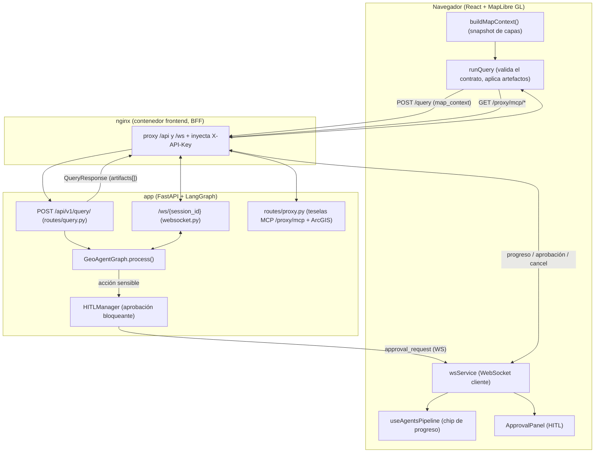
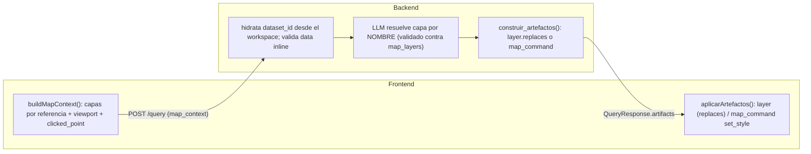
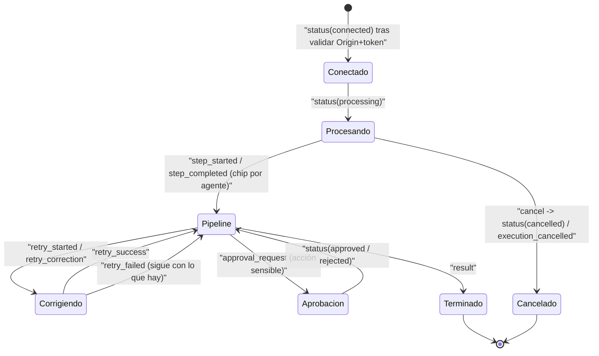
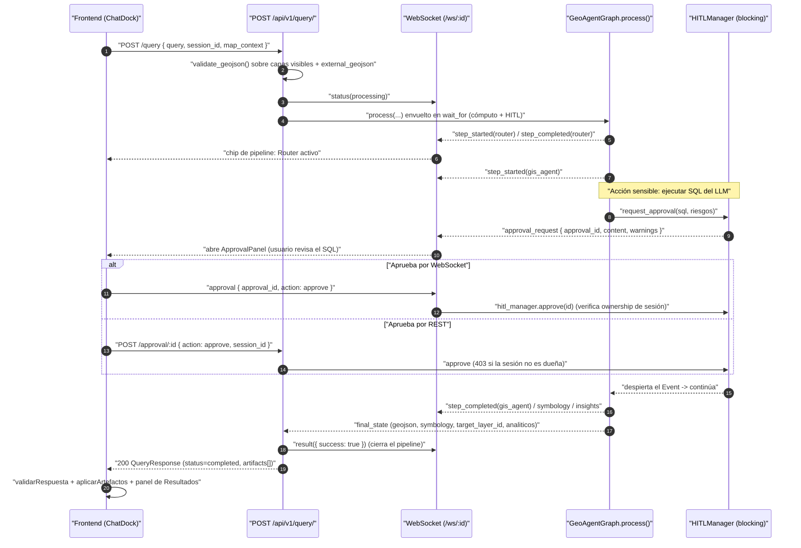
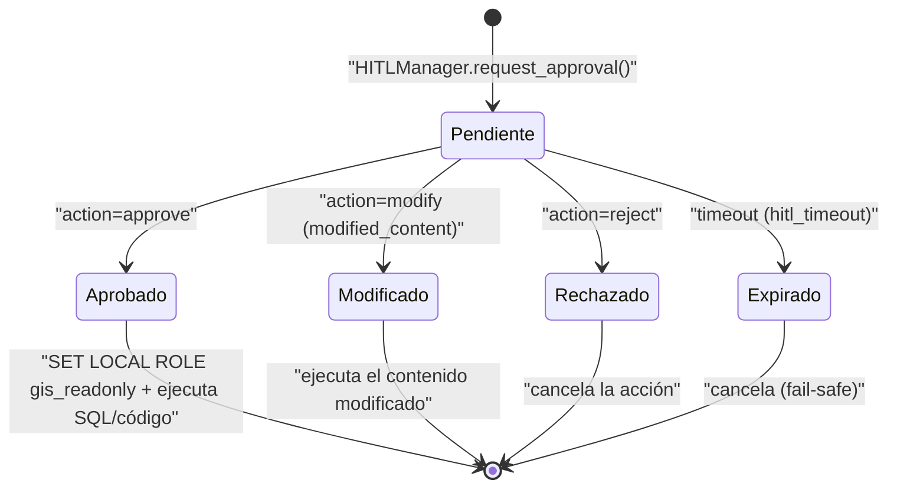

# 6. Conexión back ↔ front

Hay **dos canales** entre el navegador (React + MapLibre GL) y el backend (FastAPI + LangGraph):

1. **HTTP REST** — request/response síncrono. Es el camino principal: **cada consulta de chat viaja por `POST /api/v1/query/`** y regresa completa (o `WAITING_APPROVAL` si necesita HITL).
2. **WebSocket** (`/ws/{session_id}`) — canal en vivo. Transporta **progreso agéntico** (chip de pipeline paso a paso), **solicitudes de aprobación HITL** y **cancelación**. No reemplaza al REST para el resultado final; lo acompaña.

Un detalle clave del despliegue: en producción **nginx actúa de BFF** (Backend-For-Frontend) y **inyecta la `X-API-Key` server-side** en `/api` y `/ws`, así el bundle del navegador nunca lleva la credencial (ver §6.2 y [09-configuracion-y-deploy](09-configuracion-y-deploy.md)).



---

## 6.1 HTTP REST

Todos los endpoints viven bajo `/api/v1/`. El frontend usa `services/api.ts`, que espeja cada endpoint con tipos TypeScript.

### Endpoints (verificados en el código)

| Método | Path | Body / Query | Respuesta |
|--------|------|--------------|-----------|
| `POST` | `/api/v1/query/` | `QueryRequest` (incl. `map_context`) | `QueryResponse` |
| `GET` | `/api/v1/query/{query_id}` | — | **501** (tracking async no implementado) |
| `POST` | `/api/v1/query/{query_id}/cancel` | — | **501** (la cancelación real va por WebSocket) |
| `POST` | `/api/v1/session/` | `{session_id?, preferences?}` | `SessionResponse` |
| `GET` | `/api/v1/session/` | — | `SessionListResponse` |
| `GET` | `/api/v1/session/{id}` | — | `SessionResponse` |
| `PATCH` | `/api/v1/session/{id}/preferences` | `PreferencesUpdateRequest` | `SessionResponse` |
| `DELETE` | `/api/v1/session/{id}` | — | `204 No Content` |
| `POST` | `/api/v1/session/{id}/reset` | — | `SessionResponse` |
| `GET` | `/api/v1/session/{id}/history?limit=` | — | `[Message]` |
| `POST` | `/api/v1/approval/{id}` | `ApprovalRequest` (`action`, `session_id`, …) | `ApprovalResultResponse` |
| `GET` | `/api/v1/approval/pending?session_id=` | — | `[ApprovalStatusResponse]` |
| `GET` | `/api/v1/approval/{id}?session_id=` | — | `ApprovalStatusResponse` |
| `GET` | `/api/v1/approval/history/{session_id}` | — | `[ApprovalStatusResponse]` |
| `POST` | `/api/v1/discovery/search` | `{query, hints?}` | `DiscoverySearchResponse` |
| `POST` | `/api/v1/discovery/load` | `{item, layer_id?, limit?, session_id?}` | `DiscoveryLoadResponse` |
| `GET` | `/api/v1/discovery/regions` | — | `{active, regions: [...]}` |
| `GET` | `/api/v1/discovery/health` | — | `{status}` |
| `GET` | `/api/v1/metadata/entities` | — | `EntitiesResponse` |
| `GET` | `/api/v1/metadata/entities/{name}` | — | detalle de entidad |
| `GET` | `/api/v1/metadata/categories` | — | `[{value, name}]` |
| `GET` | `/api/v1/metadata/search?q=` | — | `[{name, ...}]` |
| `GET` | `/api/v1/metadata/tables` | — | árbol de schema (`{schemas, ..., connected}`) |
| `GET` | `/api/v1/connections` | — | `{servers: [...]}` (estado de cada servidor MCP y sus tools, incluidas las deshabilitadas y por qué) |
| `GET` | `/api/v1/connections/tools` | — | `{tools: [...]}` (tools habilitadas con su `input_schema`) |
| `POST` | `/api/v1/connections/{server}/tools/{tool}/run` | `{session_id, arguments, map_context?}` | `{success, message, facts, results}` (`results` con la forma de `/query`: `geojson`, `data`, `visualization`, `external_imagery`, `layer_ref`, `tiles`). Tools de riesgo `write` → 403 |
| `POST` | `/api/v1/connections/{server}/tools/{tool}/approve` | — | `{ok, server, tool}` (re-aprueba una tool deshabilitada por *pinning*) |
| `GET` | `/api/v1/proxy/imagery?service=&endpoint=&bbox=` | — | PNG (tesela ArcGIS reemitida) |
| `GET` | `/api/v1/proxy/imagery-identify?service=&...` | — | JSON (`/identify` ArcGIS) |
| `GET` | `/api/v1/proxy/mcp/{server_id}/{path}` | query de la tesela | PNG/MVT (tesela de un servidor MCP, p. ej. `/proxy/mcp/imagery/tiles/...`) |
| `GET` | `/api/v1/tiles/{schema}/{table}/{z}/{x}/{y}.pbf` | — | MVT vectorial de PostGIS |
| `GET` | `/health` | — | `HealthResponse` |

> El detalle de Discovery (search/load/regions) está en [07-discovery](07-discovery.md); el de los servicios MCP (connections/run/proxy de teselas) en [08-flujos](08-flujos.md) y en [01-arquitectura §1.5](01-arquitectura.md).

---

## 6.2 Autenticación

Auth **single-tenant** por API key (`src/geo_copilot/api/auth.py`). Todos los routers declaran `dependencies=[Depends(require_api_key)]` a nivel de `APIRouter`, así la protección es uniforme (no endpoint por endpoint).

| Canal | Cómo viaja la key |
|-------|-------------------|
| REST | Header `X-API-Key: <value>` |
| WebSocket | Query param `?token=<value>` **o** header `x-api-key` (el que inyecta nginx) — validado **antes de `accept()`**; falla → cierre con código **4403** |

Tres estados de configuración (`_configured_key`):
- `api_key = None` → **auth deshabilitada** (solo dev; el proxy de Vite corre sin key).
- `api_key` no vacía → **auth activa** (comparación en tiempo constante con `hmac.compare_digest`).
- `api_key = ""` (vacía, mal configurada) → **fail-closed**: no se salta la auth en silencio, ninguna petición pasa.

Dos guardas de arranque abortan el proceso si el entorno no es de desarrollo: sin API key válida (`enforce_production_auth`) o con `debug=True` (`enforce_production_debug`, para no filtrar trazas ni la estructura de la BD).

En el WebSocket, además del token, se valida el `Origin` contra `cors_origins` (salvo modo CORS abierto).

---

## 6.3 Contrato de `/query`

Es el corazón de la conexión. **El frontend adjunta `map_context`** (§6.4) para que el agente razone sobre lo que el usuario ve; **el backend devuelve `artifacts[]`**: lo que produjo el turno, tipado por un contrato único.

> **F4.** El contrato lo define el backend (`platform/contracts/`, Pydantic *strict*) y de sus JSON Schema salen los tipos TS del frontend y su validación zod (`npm run gen:contracts`; `--check` falla si divergen). Ya no existen `results` ni `visualizations`: todo es un artefacto.

### QueryRequest (frontend → backend)

```typescript
// Pydantic: api/models.py::QueryRequest
interface QueryRequest {
  query: string;                 // 1..2000 chars
  session_id: string | null;
  parameters?: Record<string, any>;
  map_context?: MapContext | null;   // §6.4 — capas, feature seleccionada, viewport
  session_region?: string | null;    // 'colombia' | 'global' | null (default del despliegue)
}
```

### QueryResponse (backend → frontend)

```typescript
// Pydantic: platform/contracts/respuesta.py::QueryResponse (tipos TS generados)
interface QueryResponse {
  contract_version: string;
  query_id: string;
  session_id: string;
  status: 'pending' | 'processing' | 'waiting_approval' | 'completed' | 'failed';
  intent?: string | null;
  message?: string | null;
  requires_approval: boolean;
  pending_approval_id?: string | null;   // presente si status == 'waiting_approval'
  artifacts: Artifact[];                 // en el orden en que se muestran
  sql?: string | null;                   // pestaña SQL del turno
  correction?: CorrectionInfo | null;
  reasoning_trace?: TraceEntry[] | null; // traza sanitizada de decisiones
  created_at: string;                    // ISO con zona horaria
}
```

Los artefactos (`platform/contracts/artifacts.py`, unión discriminada por `kind`):

| `kind` | Qué lleva | Dónde va en el cliente |
|--------|-----------|------------------------|
| `layer` | `layer: LayerRef` (id, nombre, `storage`, `style`, `provenance`, bbox, nº de features) + `inline` (GeoJSON ≤ tope) o `tiles` (MVT) + `replaces` | Al mapa. `replaces` = re-estilo EN SU SITIO de esa capa (FRT-04) |
| `table` | `columns`, `preview` (recortado), `total_rows`, `rows_ref` | Panel de Resultados; el título dice «N de M filas» si es un recorte |
| `chart` | `spec: {chart_type, x_key, y_key, title}` + `data` | Panel de Resultados (siempre acompañado de su tabla) |
| `stats` | `items: [{label, value, unit}]` | Panel de Resultados |
| `report` | `markdown`, `cites` | Panel, como **texto plano** (nunca HTML) |
| `services` | tarjetas de Discovery | Chat (selección por número, §6.8) |
| `map_command` | `{op, layer_id, args, reason}` (hoy `set_style`) | Al mapa: re-estila la capa que ya está, sin datos nuevos |

`LayerRef.storage` dice cómo se dibuja: `geojson-inline`, `workspace-table` (MVT desde el workspace de la sesión), `raster-tiles` (XYZ vía `/proxy/mcp`), `arcgis-image`, `wms`, `remote-ref`.

**Cómo se construyen** (`platform/artefactos.py::construir_artefactos`): la capa sale del `geojson` del turno (no del `external_geojson`, que también lleva la capa activa reinyectada y la duplicaría); un re-estilo sin datos nuevos es un `map_command`; cada resultado analítico del turno (`analiticos`, varios en un turno ReAct) da su gráfico y su tabla, en orden.

**Cómo se decide `status`** (`routes/query.py`):
- `requires_approval && pending_approval_id` → `waiting_approval`
- éxito → `completed`
- fallo → `failed`

### Validaciones server-side

- `query.length` ≤ 2000 (validado por Pydantic).
- **Toda respuesta** se valida en el cliente contra el contrato (`validarRespuesta`); fuera de contrato → error visible con el motivo, sin tocar el mapa.
- **Todo GeoJSON entrante** (capas de `map_context` con `data`, o `external_geojson` de sesión) pasa por `validate_geojson()`: tipo válido y ≤ `settings.max_geojson_features` (default 10 000). Es la misma protección DoS en REST y WebSocket (`handle_query`).
- **Timeouts desacoplados**: `compute_process_timeout()` separa el reloj de **cómputo** (`total_execution_timeout`, 120 s) del de **espera humana** (`hitl_timeout`). Cuando HITL está activo, el `wait_for` que envuelve `process()` es la **suma**, para que una aprobación lenta no cancele la request antes de que la persona responda.
- **SSRF**: toda URL externa (Discovery/proxy) pasa por `URLValidator`.
- **SQL**: el GISAgent nunca concatena strings a la BD; usa rol de solo lectura (`gis_readonly`) + validador (ver [04-backend](04-backend.md)).

---

## 6.4 `map_context`: las capas por referencia

`map_context` es un **snapshot ligero** que el frontend arma en cada request (`utils/mapContext.ts::buildMapContext`). Desde F4 (S4.4) las capas viajan **por referencia**: todas (también raster y MVT, antes invisibles al agente) con su tipo, su `dataset_id`, su URL o su procedencia. La geometría solo viaja inline para capas vectoriales que no están en el workspace, dentro de un presupuesto de **8 MB** (la activa primero). En la práctica el contexto pesa < 5 KB (hay un test).

```typescript
// utils/mapContext.ts  ↔  api/models.py::MapContext
interface MapContext {
  layers: Array<{
    id: string; name: string; source: string;
    kind: string;                // renderer: vector-geojson | vector-mvt | raster-xyz | arcgis-image | wms
    geometry_type: string | null; feature_count: number; fields: string[];
    visible: boolean; is_active: boolean;
    dataset_id?: string;         // con él NO viaja data: el backend lee el workspace
    data?: GeoJSONFeatureCollection;  // solo vectoriales fuera del workspace (presupuesto 8 MB)
    url?: string;                // plantilla de teselas / servicio (raster)
    origin?: { capability: string; arguments?: object };  // qué tool la produjo
    legend?: { field?; min?; max? };                        // p. ej. rango del NDVI
    bbox?: [number, number, number, number];
  }>;
  selected_feature: { layer_id: string | null; properties: Record<string, unknown> } | null;
  viewport: { bbox: [number,number,number,number] | null; zoom: number | null; crs: string } | null;
  clicked_point: { lon: number; lat: number } | null;   // el «aquí» del usuario
  active_visualization: { type: string; query_id?: string; fields?: string[] } | null;
  basemap: string | null;
}
```

**Qué hace el backend con esto** (`routes/query.py`):
1. Hidrata las capas con `dataset_id` leyendo el **workspace de la sesión** (una capa grande manda una muestra para la simbología).
2. **Valida** el `data` que venga inline como cualquier GeoJSON (tope de features).
3. Arma `map_layers: {id → {data, name}}` — es del **turno**, no se persiste.
4. Si hay una capa `is_active` con datos, la inyecta como fuente externa (buffer/área/centroide operan sobre lo que el usuario ve **ahora**).
5. Las referencias geo de las tools MCP (`activa`, `viewport`, `punto`, `[id]`, `ds_…`) se resuelven contra esto: el LLM **nunca** escribe geometría a mano. `punto` es el `clicked_point`. Las herramientas de workspace (`ws_*`) aceptan las mismas referencias.

**La selección (FH.2).** Cada capa puede llevar `seleccion: {ids | where, count, origin}`.
El backend la convierte en una capa más con id **`seleccion`**: aparece en «CAPAS EN
EL MAPA» y en «DATASETS DEL WORKSPACE» con la misma forma que las demás, y
cualquier herramienta que pida una capa o un dataset la acepta (en memoria se
filtra el GeoJSON; en el workspace se materializa con un SELECT parametrizado:
el campo se valida contra los del dataset y el valor va como parámetro). Si una
`ws_*` opera sobre la capa ENTERA teniendo el usuario elementos seleccionados en
ella, la observación lo dice (`seleccion_en_el_mapa`): el agente narra el alcance
o repite sobre `seleccion`. Qué significa «¿cuánto suman?» lo decide el LLM.

**Los dibujos (FH.3).** Un dibujo es un dataset del workspace (`provider: sketch`,
procedencia `user.sketch`): el agente lo ve «DIBUJADA por el usuario» en CAPAS EN
EL MAPA y en DATASETS DEL WORKSPACE, y el registro dice «el USUARIO dibujó «Área 1»».
Endpoints: `POST /workspace/{sid}/sketches` (1–50 elementos, ≤ 20 000 vértices; las
propiedades del cliente no entran) y `PATCH /workspace/{sid}/datasets/{ds}` (nombre
de cualquier dataset de la sesión; vértices solo de un dibujo, por fid). Como área
de interés vale su [id], su `ds_…` o su nombre exacto (si es único).

**Menciones y alcance (FH.4).** `map_context.menciones` (lo elegido con `@`),
`alcance_seleccion` (el chip de la selección estaba a la vista y no se quitó) y
`seleccion_excluida` (se quitó: cuál era). El formateador los muestra resueltos a su
capa exacta; qué hacer con ellos lo decide el LLM. El seguimiento (`follow_up`) solo
escribe texto: si su LLM juzga que la respuesta exige medir, el nodo pasa el turno al
bucle ReAct con esa lectura (`interpretacion_previa`).

**Filtros de capa (FH.5).** `layers[].filtro` (+ `filtro_count`): como una *definition
query*, la capa filtrada ES su subconjunto. En `/query` los datos en memoria se filtran; una
herramienta del workspace que recibe esa capa (por [id], `ds_…` o `activa`) recibe el
subconjunto materializado (una vez por turno, SQL parametrizado: campo validado, valor
como parámetro, `platform/seleccion.py::dataset_efectivo`). El SQL generator ve la tabla
con la nota «en el mapa está FILTRADA: …». El agente filtra con `map_command set_filter`.
Endpoints de la tabla: `GET …/datasets/{ds}/filas?offset&limit&orden&desc&filtro&ids` y
`GET …/datasets/{ds}/estadistica?campo&filtro`.

**Simbología a mano (FH.6).** El resumen de estilo de cada capa (`layers[].style`) lleva
tipo, campo, método, clases, rampa y `pinned`. El formateador lo muestra («…(método quantile,
rampa viridis); el USUARIO FIJÓ A MANO: color_scheme='viridis'») y el nodo de simbología se
lo pasa al diseñador (`estilo_actual`), que decide qué conservar.

**Enlaces al mapa y procedencia (FH.7).** Los tres LLM que escriben la respuesta (bucle ReAct,
narrador, seguimiento) reciben `INSTRUCCION_REFERENCIAS` (`core/formatters.py`) y citan con
valores o ids que vieron; una capa pequeña (≤ 8 elementos, completa) llega con sus atributos e
`id` del mapa (`react_tools._filas_tabulares`), y filtrar conserva esa identidad
(`seleccion.filtrar_capa`). La procedencia de un dataset (`Provenance`, contrato 1.5.0) lleva
`edits` con lo que lo modificó en su sitio (p. ej. `core.add_measure`).

**Acciones contextuales y sugerencias (FH.8).** `GET /api/v1/acciones?geometria=` lista las
capacidades del registro aplicables a ese tipo de geometría (`platform/acciones.py`, sale de
`Capability.geo_inputs`); `POST /api/v1/acciones/{tool}/run` la ejecuta como el agente (misma
forma que `results` de /query). La respuesta de /query trae `suggestions` (0–3, las propone el
LLM tras cada respuesta completada; contrato 1.6.0).

**Pedir en el mapa (FH.9).** `request_map_input` (herramienta terminal del bucle) cierra el turno
con un `MapCommand.request_input`; la respuesta del usuario llega en el turno siguiente como
`map_context.respuesta_mapa` (contrato 1.7.0) y el formateador la presenta como hecho. En
hybrid, un `clarify` del router pasa por el bucle, que decide si resolverlo con el mapa, pedirlo
en el mapa o preguntar con texto.

**Vistas, cortina y tiempo (FH.10).** `map_command` acepta `save_view`, `compare` (por [id],
nombre o un raster de este turno), `end_compare` y `set_time`; el `map_context` trae `vistas`,
`comparacion`, `serie_tiempo` y la `fecha` de cada capa. Los rasters de un turno viajan todos
(`imagery_previas` + `external_imagery`) con `LayerRef.time` (fecha de la escena, con zona).

**Proyectos (FH.11).** `GET/POST /api/v1/proyectos` y `POST /api/v1/proyectos/{id}/abrir`
(`ws_meta.proyectos`). Abrir devuelve el estado y deja lista la sesión de conversación con el
mismo id (reconstruida con su historial si ya no existía): el agente recuerda.

**El viaje de vuelta (FRT-04).** El LLM (router o tool) puede resolver una capa objetivo **por nombre**; el código lo valida contra `map_layers` (un id alucinado se ignora). En un turno ReAct que **trae una capa nueva**, el objetivo que el router resolvió antes deja de ser el defecto de los pasos siguientes (V5 F4). El cliente recibe la decisión como artefacto: una capa con `replaces` (datos nuevos, misma capa) o un `map_command` `set_style` (solo estilo).



---

## 6.5 WebSocket

URL: `ws://host/ws/{session_id}` (`wss://` bajo HTTPS). El cliente (`services/websocket.ts`) se conecta al **mismo host** que la página; nginx (o el proxy de Vite en dev) reenvía a `/ws/*` e inyecta la key. Reconexión con backoff exponencial (hasta 5 intentos), también cuando el servidor cierra limpio (p. ej. al reiniciarse); solo no reconecta si el cierre lo pidió el propio cliente.

Cada mensaje del servidor viaja con el sobre `{ type, data, timestamp }`.

### Mensajes cliente → servidor

Validados con Pydantic (`extra="ignore"`); el sobre es `{ type, data }`.

```typescript
type ClientMessage =
  | { type: 'query';    data: { query: string; external_geojson?: GeoJSON; /* ... */ } }
  | { type: 'approval'; data: { approval_id: string; action: 'approve'|'reject'|'modify'; modified_content?: string; reason?: string } }
  | { type: 'cancel';   data: { query_id?: string } }
  | { type: 'ping';     data?: {} };
```

> En la práctica el frontend envía las **consultas por REST** (`POST /query`) y usa el WebSocket sobre todo para **recibir** progreso/aprobaciones y para **cancelar**. La ruta `query` por WS existe y funciona (paridad de validación de GeoJSON), pero no es la que dispara `ChatDock`.

### Mensajes servidor → cliente (enum real `WSMessageType`)

| `type` | `data` (campos principales) | Uso |
|--------|-----------------------------|-----|
| `status` | `{status, ...}` — `connected` / `processing` / `cancelled` / `approved` / `rejected` / `no_active_task` | Estado general del canal / handshake |
| `progress` | `{step, progress, details}` | Progreso porcentual (callback opcional) |
| `step_started` / `step_completed` | por-agente: `{agent, description, status}` · por-plan: `{step_index, total_steps, action, status, result}` | Alimenta el **chip de pipeline** (`useAgentsPipeline`) en CADA consulta, no solo las complejas |
| `approval_request` | `{approval_id, content_type, content, warnings, risk_level}` | Abre el `ApprovalPanel` (HITL) |
| `result` | dict del resultado (o `{success}`) | Cierra el pipeline / entrega resultado por WS |
| `retry_started` / `retry_correction` / `retry_success` / `retry_failed` | `{agent, attempt, max_attempts, error, ...}` | Auto-corrección visible (reintentos SQL/código) |
| `plan_created` | `{plan, total_steps, reasoning}` | Plan multi-paso generado (planner) |
| `execution_cancelled` | `{partial_results, completed_steps, total_steps, message}` | Cancelación con resultados parciales |
| `error` | `{error}` (mensaje **sanitizado**) | Error legible; nunca stack traces |
| `pong` | `{}` / `{ping: 'keep-alive'}` | Respuesta a `ping` / keep-alive por timeout |



---

## 6.6 Diagrama de secuencia: una consulta con HITL

Muestra el reparto real: **REST** entrega el resultado final; **WebSocket** transporta progreso y la aprobación humana (modo `blocking`, ver [04-backend](04-backend.md)).



> **Ownership de sesión (SEC-3 / anti-IDOR).** Tanto el POST `/approval/{id}` como el `approval` por WS exigen que la aprobación pertenezca a la sesión que la originó. Si no coincide, REST responde **403** y WS envía un `error`. Los `GET` de aprobación devuelven **404** ante mismatch (no confirman existencia a terceros). Estados posibles de una aprobación:



---

## 6.7 Proxy de teselas (servidores MCP y ArcGIS)

El navegador **nunca** habla directo con un servidor MCP (imagery-mcp u otro) ni con servidores ArcGIS externos: todo pasa por `routes/proxy.py`, que reemite server-side (donde CORS no aplica) e **inyecta la credencial** — la clave del MCP jamás llega al cliente.

| Proxy | Reemite hacia | Protección |
|-------|---------------|------------|
| `/proxy/mcp/{server_id}/{path}` | el servidor MCP registrado con ese `id` (p. ej. `imagery` → `/tiles/`, `/tiles-diff/`, `/tiles-rgb/`) | Solo los prefijos de `tiles.prefixes` del YAML; ruta y query validadas (también decodificadas); credencial del servidor inyectada; solo respuestas de tipo imagen/MVT y de tamaño acotado |
| `/proxy/imagery?service=&bbox=` | ImageServer/MapServer ArcGIS | allowlist anti-SSRF + **IP-pinning** (cierra DNS rebinding), params `/exportImage` fijados server-side |
| `/proxy/imagery-identify?service=&...` | `/identify` ArcGIS | allowlist de params, `f=json` forzado |

El frontend consume estas teselas como fuentes raster XYZ en MapLibre (`{z}/{x}/{y}`). Las teselas **vectoriales** de PostGIS van por otra ruta (`/api/v1/tiles/{schema}/{table}/{z}/{x}/{y}.pbf`, MVT on-the-fly con `ST_AsMVT`).

---

## 6.8 Patrón "selección por número" (chat)

Cuando el DataAgent encuentra varios servicios externos, devuelve `found_services` (lista de 1-10). El frontend los renderiza como cards en el chat. El usuario puede **hacer click** (envía la query `"3"`) o **escribir** (`"carga el 3"`). En el siguiente turno el RouterAgent lo detecta como `intent=select_service` y el DataAgent fetchea el elegido.

`found_services` se guarda en `session.variables.found_services` y sobrevive entre turnos. Para no duplicar cards, solo se re-envían si el turno ejecutó una **búsqueda nueva** (`new_search_executed`).

## 6.9 Patrón "plan pausado"

Si una consulta compuesta necesita una decisión del usuario (p.ej. la cadena "busca X, cárgalo y píntalo"), la ejecución multi-paso —hoy nativa en el grafo, con los nodos `step_router`/`step_finalizer` (ver [03-orquestador](03-orquestador.md))— pausa el plan y guarda `pending_operations` en la sesión. El responder explica qué falta decidir. Cuando el usuario contesta (o carga un servicio desde el panel de Discovery con su `session_id`), el siguiente turno reconstruye una query compuesta (`"carga el 2, buffer 500m, color rojo"`) y **reanuda** el plan.

## 6.10 Cancelación

- **Por WebSocket** (mecanismo real): `{ type: 'cancel' }` → `connection_manager.cancel_task(session_id)` → `asyncio.Task.cancel()` sobre la tarea de la query en vuelo. El backend registra cada query como una `asyncio.Task` por sesión (`active_tasks`), así el cancel **realmente detiene** el cómputo (antes solo notificaba sin parar nada). Responde `status(cancelled)` o `status(no_active_task)`.
- **Por REST** (`POST /query/{id}/cancel`): devuelve **501** honestamente (el wiring API→state para levantar el flag `cancelled` del grafo no está implementado).
- **Aborto de la petición HTTP**: `queryApi.process(data, signal)` acepta un `AbortSignal`, así el botón "Detener" del cliente también corta la request REST en curso.

---

## 6.11 LayerSymbology — formato que renderiza el mapa

El `SymbologyAgent` (ver [02-agentes](02-agentes.md)) emite un config rico que MapLibre renderiza data-driven, no solo color plano.

```typescript
type SymbologyType =
  | 'single' | 'single_symbol'   // un color para todos
  | 'unique_values'              // color por valor categórico
  | 'graduated_colors'           // coropleto numérico
  | 'graduated_symbols'          // tamaño de marker por valor (solo puntos)
  | 'heatmap' | 'cluster';       // densidad / agrupación de puntos

interface ClassBreak {
  min_value?: number | null;
  max_value?: number | null;
  label: string;
  color: string;                 // hex
  count?: number;
}

interface LayerSymbology {
  layer_title?: string;
  symbology_type?: SymbologyType;
  fill?: { color: string; opacity?: number };
  stroke?: { color: string; width?: number; opacity?: number };
  marker?: { color: string; size?: number };
  classification_field?: string | null;
  classification_method?:
    | 'equal_interval' | 'quantile' | 'natural_breaks'   // Jenks
    | 'std_deviation' | 'manual' | 'unique_values' | null;
  class_breaks?: ClassBreak[];
  num_classes?: number;
  symbol_size_min?: number; symbol_size_max?: number;    // graduated_symbols
  heatmap_radius?: number; heatmap_intensity_field?: string | null;
  reasoning?: string;
}
```

**Render** (`MapLibreMap.tsx` + `lib/maplibreSymbology.ts`): expresiones puras `['match', ...]` para `unique_values` (compara como número si todos los labels son numéricos) y `['case', ...]` de intervalos semiabiertos para `graduated_colors`/`graduated_symbols`; `heatmap`/`cluster` degradan geometrías no-puntuales a centroides. El z-order es fijo: basemap → imagery raster → GeoJSON vectorial → labels.

## 6.12 Gráficos y tablas

Desde F4 viajan como artefactos `chart` y `table` (§6.3), no como `visualizations[]`. El gráfico lleva su `spec` (`chart_type`, `x_key`, `y_key`, `title`) y sus filas; con cada gráfico va también la tabla de sus cifras. `Chart.tsx` solo convierte a número las medidas (Y): la categoría X queda como texto (un código `004503009001` conserva sus ceros).

---

## 6.13 Manejo y sanitización de errores

Los errores 4xx/5xx siguen el shape de FastAPI:

```json
{ "detail": "Mensaje legible para el usuario (sin stack trace)" }
```

Un middleware asigna un **`request_id`** por request y lo devuelve en la **cabecera de respuesta `X-Request-ID`** (no en el body), también presente en los logs del servidor para correlación.

`sanitize_error_for_client(exc)` mapea la excepción **por su tipo** a un mensaje seguro (nunca expone paths, nombres de tablas/columnas, ni configuración):

| Tipo de excepción | Mensaje al cliente |
|-------------------|--------------------|
| `ConnectionError` | "Error de conexión con el servidor" |
| `TimeoutError` / `asyncio.TimeoutError` | "La operación tardó demasiado tiempo" |
| `ValidationError` | "Los datos proporcionados no son válidos" |
| `JSONDecodeError` | "Error al procesar el mensaje" |
| `ValueError` | "Valor no válido proporcionado" |
| `KeyError` | "Datos incompletos en la solicitud" |
| `WebSocketDisconnect` | "Conexión cerrada" |
| desconocido | "Error interno del servidor" |

El mismo sanitizador se usa en REST y en el WebSocket (`error`), de modo que un fallo interno nunca filtra detalles al cliente por ningún canal.

---

## Siguiente: [07-discovery](07-discovery.md)
