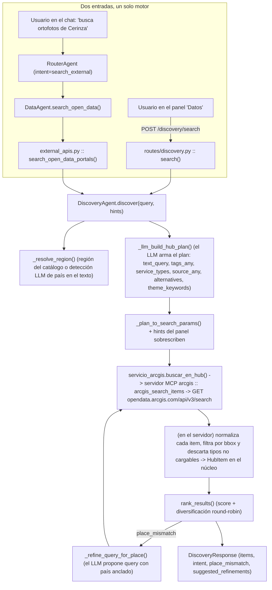
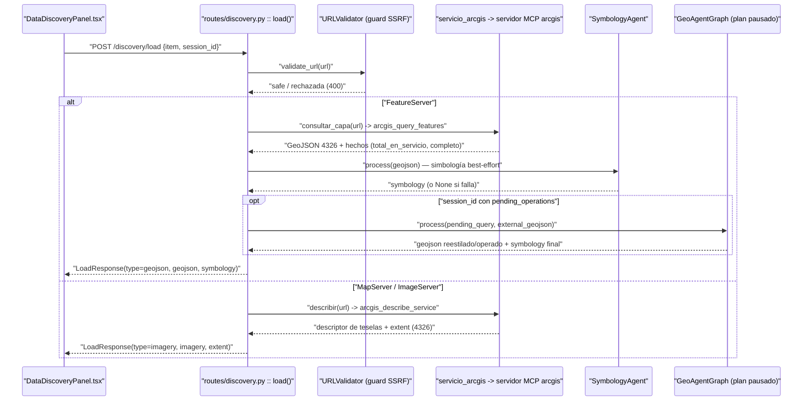
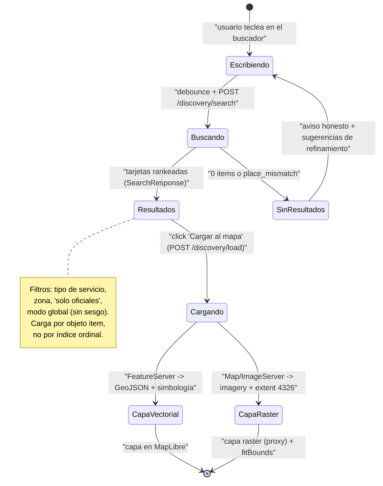

# 7. Sistema de Discovery

El módulo de **Discovery** responde a una pregunta muy concreta: *"¿qué datasets externos existen para lo que el usuario pide?"*. En vez de obligar al usuario a conocer URLs, IDs de capa o portales, busca en **ArcGIS Hub Open Data** (`https://opendata.arcgis.com/api/v3/search`, formato JSON:API) y devuelve tarjetas de resultados listas para cargar al mapa.

El motor vive en `src/geo_copilot/agents/data_agent/discovery.py` (`DiscoveryAgent`). Desde la tarea **T5.2** el núcleo **ya no habla con ArcGIS directamente**: la llamada HTTP al Hub y a los servicios la hace un **servidor MCP aparte**, y en el núcleo queda solo lo que usa el conocimiento de la región:

- **Servidor MCP `arcgis`** (`services/arcgis_mcp/`, servicio `arcgis-mcp` del compose, registrado en `config/mcp_servers.yaml`) — tres tools:
  - `arcgis_search_items`: busca en el Hub, normaliza cada item y filtra por bbox.
  - `arcgis_describe_service`: describe una capa, un servicio o un ImageServer (campos, geometría, cuántos elementos, extensión **reproyectada a EPSG:4326** y, si es imagen, el descriptor para el mapa).
  - `arcgis_query_features`: trae los elementos de una capa con el filtro **empujado al servicio** (`where`, `bbox`, `out_fields`), en EPSG:4326.
- `agents/data_agent/servicio_arcgis.py` — la **fachada** del núcleo: `buscar_en_hub()`, `describir()` y `consultar_capa()` llaman al servidor con `McpHub.llamar_directo("arcgis", ...)`. Si el servidor falla lanza `ArcGISNoDisponible` (un fallo se dice; no se convierte en "no hay resultados").
- `agents/data_agent/hub_items.py` — `HubItem` y el **orden** para el usuario (`rank_results`, `count_place_matches`, `bbox_intersecta`).
- `agents/data_agent/catalogo_regiones.py` — el catálogo multi-región tipado, cargado desde `config/discovery_catalog.yaml`.

> **El LLM no ve las tools de ArcGIS.** En `config/mcp_servers.yaml` el servidor
> `arcgis` declara `tools: { agent: [] }`: sus tools solo las usa el propio núcleo.
> El LLM sigue buscando y cargando con `search_external` / `load_external`, que
> conservan su control de procedencia de URLs.

> **Principio de diseño (agentic, sin fallbacks):** el LLM construye el **plan
> completo de búsqueda** (texto, tags, tipos de servicio, fuentes, y hasta 3
> queries alternativas de respaldo) viendo el catálogo regional como contexto.
> Sin LLM, `DiscoveryAgent.discover()` **falla con `RuntimeError` explícito** —
> no hay modo heurístico offline, porque las heurísticas deterministas inducían
> sesgo regional y servían resultados equivocados "con confianza". El código
> solo aporta hechos verificables (scoring numérico, intersección de bbox,
> matching por substring/regex); el LLM decide *qué* buscar.

---

## 7.1 Dos entradas al mismo motor

Hay dos formas de llegar a Discovery, y **ambas terminan en el mismo `DiscoveryAgent`**:

| Entrada | Ruta de código | Cuándo |
|---|---|---|
| **REST (panel UI)** | `api/routes/discovery.py` → `POST /discovery/search` | El usuario escribe en el buscador del panel "Datos" (`DataDiscoveryPanel.tsx`). |
| **Agéntica (chat)** | `DataAgent.search_open_data()` → `tools/external_apis.py::search_open_data_portals()` | El router clásico detecta `intent="search_external"`, o el bucle ReAct llama la tool `search_external`. |

Todos los endpoints REST cuelgan bajo `require_api_key`. La superficie completa es:

- `POST /api/v1/discovery/search` — buscar datasets (devuelve tarjetas rankeadas).
- `POST /api/v1/discovery/load` — preparar un item para el mapa (GeoJSON o imagery).
- `GET  /api/v1/discovery/regions` — listar regiones/zonas/entidades del catálogo (puebla el selector de país del panel).
- `GET  /api/v1/discovery/health` — smoke test.



---

## 7.2 El catálogo multi-región (YAML)

`config/discovery_catalog.yaml` es la **única fuente de verdad** sobre qué entidades, publicadores y zonas conoce el sistema. No hay datos hardcodeados en el Python: `catalogo_regiones.py::_load_raw_catalog()` carga el YAML una vez al importar y **falla fuerte** (error) si el archivo no existe o no define `regions`.

Estructura por región:

```yaml
default_region: colombia

regions:
  colombia:
    label: Colombia
    country_bbox: [-81.85, -4.23, -66.85, 13.41]

    entities:
      IGAC:
        aliases: [igac, codazzi, instituto geográfico]
        owners:  [IGAC.Comunicaciones, igac_oit]                # cuentas Hub
        sources: [Instituto Geográfico Agustín Codazzi]          # campo 'source' del item
        tags:    [IGAC, Instituto Geográfico Agustín Codazzi, Codazzi]
      DANE:
        aliases: [dane]
        owners:  [DANE_Colombia]
        sources: [Departamento Administrativo Nacional de Estadística]
        tags:    [DANE, Censo, Censo 2018]
      # … IDEAM, MADS, UNGRD, Parques, ANLA, SGC, DPS, Policía

    publishers:                                                  # fuentes sin entidad propia
      - Esri Colombia
      - Infraestructura de Datos Espaciales Cundinamarca IDEC
      # …

    zones:
      bogota:
        label: Bogotá
        bbox: [-74.22, 4.47, -73.99, 4.83]
        aliases: [bogota, bogotá, "bogotá d.c."]
        tags: [bogota, bogotá, colombia]
      # … medellin, cali, cundinamarca, …

  global:            # pseudo-región vacía: desactiva el sesgo regional
    label: Global
    entities: {}
    publishers: []
    zones: {}
```

`catalogo_regiones.py` (antes `hub_catalog.py`) expone lo derivado del YAML: `REGIONS`, `get_active_region()` (default `colombia`, sobrescribible por `settings.discovery_default_region`), `get_region()`, `find_entity_by_alias()`, `find_zone_by_alias()`, `all_official_owners()`, y los diccionarios `OFFICIAL_OWNERS_CO` / `OFFICIAL_SOURCES_CO` que consume el ranker. El catálogo es conocimiento **del núcleo**: el servidor MCP de ArcGIS no decide qué es "oficial".

**Cómo extender (cero cambios de código):**

- Nueva entidad → bajo `regions.colombia.entities`.
- Nuevo país → bloque `regions.peru: {...}`.
- Nueva zona → bajo `regions.<X>.zones`.

---

## 7.3 Resolución de región (`_resolve_region`)

Antes de armar el plan, el agente decide **qué región del catálogo** usar para detectar entidades/zonas y aplicar (o no) el sesgo geográfico:

- `hints.global_mode=True` → `"global"` (sin sesgo).
- `hints.region="global"` → `"global"`.
- `hints.region="X"` presente en el catálogo → `X`.
- `hints.region="X"` **no** presente en el catálogo → `"global"` (**kill-switch F2.2**: el usuario pidió explícitamente una región sin catálogo; búsqueda neutral. **Nunca** colapsa a la región por defecto — eso anclaría en silencio una consulta de Perú/México al catálogo colombiano).
- `hints.region=None` (sin especificar) → si el texto de la query nombra otro país, se detecta vía LLM (`_extract_region_from_query`); si no, se usa `get_active_region()` (default configurado, no hardcode).

---

## 7.4 El plan agéntico del LLM

`_llm_build_hub_plan(query, region)` (prompt `_HUB_PLAN_SYSTEM`) pide al LLM un **JSON con el plan completo** de búsqueda:

```json
{
  "primary": {
    "text_query": "Cerinza",
    "tags_any": null,
    "service_types": ["Image Service"],
    "source_any": ["Instituto Geográfico Agustín Codazzi"],
    "modified_after": null
  },
  "place_focus": "Cerinza",
  "intent_label": "imagery_focused",
  "theme_keywords": ["ortofoto", "imagen aérea"],
  "alternatives": [
    {"text_query": "Cerinza Boyacá",
     "source_any": ["Instituto Geográfico Agustín Codazzi"],
     "service_types": ["Image Service"],
     "reason": "añadir depto al match"},
    {"text_query": "Boyacá Colombia ortofoto",
     "service_types": ["Image Service"],
     "reason": "subir a depto si el municipio no tiene"}
  ],
  "reasoning": "IGAC publica orto<id><muni>; q sin la palabra 'ortofoto' para no romper el fuzzy."
}
```

**Contexto que ve el LLM** (`_catalog_context_for_llm`): la región activa (Colombia por defecto) con anclaje geográfico obligatorio, la lista de entidades oficiales con sus aliases y ejemplos de `sources`, y las zonas conocidas del catálogo.

**Reglas empíricas que el prompt enseña** (tema → fuente recomendada):

| Tema del usuario | `source_any` recomendado |
|---|---|
| ortofoto, imagen aérea, satelital, raster, MDT | **IGAC** |
| catastro, predios, lotes, cartografía básica | **IGAC** |
| manzana censal, censo, indicadores demográficos | **DANE** |
| hidrología, meteorología, caudal, río | **IDEAM + Esri Colombia** (relay) |
| amenaza sísmica/volcánica, gestión del riesgo | **UNGRD** |
| geología, minería, hidrogeología | **SGC** |
| ambiente, ecosistemas | **MADS** |
| parques, áreas protegidas | **Parques** |
| licencias ambientales | **ANLA** |

**Regla contraintuitiva clave:**

> **NO añadas la palabra "ortofoto" al `text_query` cuando uses `source=IGAC`
> para un municipio.** Los archivos del IGAC se llaman `orto<id><municipio>`
> (ej. `orto15162cerinza`, `orto25473mosquera`) — la palabra completa
> "ortofoto" NO aparece en el nombre. `q="Cerinza"` con `source=IGAC` los
> encuentra; `q="Cerinza ortofoto"` los pierde.

`_plan_to_search_params()` traduce el plan a los parámetros de `arcgis_search_items`. Los **hints explícitos del panel UI** (service_types, owners, tags_any, bbox, only_official_co) **sobrescriben** lo que decidió el LLM.

### Modo offline: no existe

`DiscoveryAgent.discover()` requiere LLM. Sin LLM (o con JSON malformado) lanza `RuntimeError` en vez de servir resultados sesgados desde una heurística. Este es el mismo principio "agentic, no fallbacks" que rige todo el sistema (ver [02-agentes](02-agentes.md)).

---

## 7.5 Búsqueda en Hub (servidor MCP `arcgis`)

El núcleo llama `servicio_arcgis.buscar_en_hub(text_query, tags_all, tags_any, owner_any, source_any, service_types, modified_after, bbox, max_results, ...)`, que invoca la tool `arcgis_search_items` del servidor MCP (`services/arcgis_mcp/arcgis_mcp/hub.py::buscar`). El servidor arma la URL contra `https://opendata.arcgis.com/api/v3/search` y pagina hasta `max_results`. Reglas críticas verificadas en vivo:

- **`filter[extent]` no se envía**: Hub lo ignora. El bbox se aplica **en el servidor** sobre el `extent` de cada item (`bbox_intersecta`), rechazando extents globales/continentales y áreas desproporcionadas frente al bbox pedido.
- **`page[size]` se capa a 20** (`HUB_PAGE_SIZE_MAX`, límite de la API); se pagina internamente.
- Cada item se normaliza (`normalizar`) con **id estable** (hash de `serverURL#layerId`) y `service_type` inferido de la URL + el `type` crudo; el núcleo lo convierte a `HubItem`.
- Solo se conservan tipos **cargables** (`Feature Service`, `Feature Layer`, `Map Service`, `Image Service`); se descartan "Web Map", "Dashboard", "Web Mapping Application", etc.
- **Sin ningún filtro no se consulta** (el Hub devolvería el catálogo mundial): el núcleo no llama y el servidor responde con `BusquedaInvalida`.
- Si una página del Hub falla, el servidor lo dice en `avisos` (una lista corta no significa "no hay más"); el núcleo los guarda en `debug.avisos_hub`.
- **`only_official_co=True`** (chip "Oficial CO" del panel) se expande **en el núcleo** a `owner_any = all_official_owners()` **antes** del guard "todos los filtros vacíos", para que el chip funcione por sí solo. El servidor no sabe qué es "oficial".
- Si la búsqueda **primaria** devuelve 0 items, se prueban las `alternatives` del plan en orden.
- En el chat se pide un lote de 50 al Hub, se ordena y se muestran los 10 primeros (pedir solo 10 dejaba fuera lo pertinente que el Hub listaba más abajo).

---

## 7.6 Ranking (`hub_items.py :: rank_results`)

El orden se hace **en el núcleo** (usa el catálogo de la región), no en el servidor MCP. Cada item recibe un **score compuesto** (`_score`), pensado para que el resultado más útil suba, no solo el que Hub matchea por fuzzy:

```
Lugar pedido (_place_match_bonus, si hay place_focus):
  +8.0  el título contiene el lugar
  +4.0  los tags lo contienen
  +3.0  la descripción lo contiene

Tema pedido (_theme_match_bonus, sobre theme_keywords del plan):
  +5.0  el título contiene un término temático
  +2.0  la descripción o los tags lo contienen

Región (solo si hay region_bbox activo):
  -4.0  el extent del item cae FUERA de la región (o es global)
  -2.0  el item NO trae extent (sin metadato geográfico)

Autoridad institucional (catálogo activo):
  +5.0  owner ∈ OFFICIAL_OWNERS_CO
  +3.0  source ∈ OFFICIAL_SOURCES_CO

Tipo de servicio:
  +2.5  FeatureServer (consultable, atributos + simbología nativa)
  +2.0  ImageServer (raster, escaso)
  +1.0  MapServer (abundante, se mantiene neutro)
  -5.0  Web Map / Web Mapping Application / Dashboard (no cargable)

Otros:
  +hasta 2.0  recencia (modificado hace < 1 año, decae linealmente)
  +1.0        tiene service_url útil
```

El bonus por **tema** (`_theme_match_bonus`) fue clave para dejar de rankear genéricos de país arriba: sin él, "hospitales" devolvía "Carnavales Colombia" / "Colombia Country" porque el ranker premiaba el lugar pero no el tema. Los términos cortos (<4 chars, ej. `sgc`, `pnn`, `mdt`, `rio`) exigen **palabra completa** para no casar fragmentos ("rio" dentro de "prioridad").

Tras ordenar por score, `_diversify_by_type()` hace **round-robin Feature→Image→Map** en los primeros 12 items, para que el usuario no vea 12 MapServers seguidos.

---

## 7.7 Loop de refinamiento (place_mismatch)

Después del ranking, si el usuario nombró un lugar específico (`place_focus`) pero **ningún** item del top lo menciona (`count_place_matches == 0`), el agente:

1. Marca `place_mismatch=True`.
2. Llama `_refine_query_for_place(query, place, sample_items, region)`: el LLM ve los títulos engañosos + el lugar pedido + el contexto regional y propone **una** query refinada (país anclado).
3. Reintenta la búsqueda en el Hub (vía el servidor MCP) una vez.
4. Si el retry trae items que **sí** mencionan el lugar → los prefiere.
5. Si tampoco encuentra → mantiene `place_mismatch=True` y el chat avisa **honestamente**: *"No encontré datasets específicos de Zipaquirá. Los resultados son de otras zonas…"*.

Antes, este agente devolvía 10 ortofotos de Medellín cuando pedías Zipaquirá, sin avisar. Ahora avisa en vez de engañar.

---

## 7.8 Socrata y archivos descargables: retirados (T5.2)

El conector de Socrata (`datos.gov.co`, con su redirección a ArcGIS) y la descarga de archivos por URL (SHP/GeoJSON/GPKG/KML) **se borraron del núcleo en T5.2**: no estaban en ningún camino vivo de producción. Hoy Discovery solo busca en **ArcGIS Hub** a través del servidor MCP. Los formatos de archivo volverán con el servidor de DuckDB/archivos (tarea **T5.6**).

---

## 7.9 Carga al mapa (`POST /discovery/load`)

Cuando el usuario hace click en "Cargar al mapa" de una tarjeta, `load()` recibe el `HubItemModel` (más `layer_id`/`limit`/`session_id` opcionales), construye la URL final (`_build_layer_url`, capa `/0` por defecto para Feature/MapServer) y **la pasa por el guard SSRF** `URLValidator.validate_url` (bloquea esquemas no-http(s), puertos no estándar e IPs privadas/metadata; sin allowlist de dominio porque Hub sirve hosts diversos). El servidor MCP aplica **su propia guarda SSRF** (`services/arcgis_mcp/arcgis_mcp/red.py`): bloquea redes internas y puertos raros y **fija la IP resuelta** (anti DNS rebinding); `ARCGIS_ALLOWED_DOMAINS` (opcional) restringe a dominios. Según el `service_type`:

- **FeatureServer** → `servicio_arcgis.consultar_capa()` → tool `arcgis_query_features`: el servidor pagina **de forma estable por OID** respetando el `maxRecordCount` del servicio, pide `geometryPrecision=7`, convierte esriJSON → GeoJSON (multipolígonos reales) en EPSG:4326 y devuelve los **hechos** `total_en_servicio`, `traidos`, `completo` y `aviso` (una muestra nunca se presenta como el total). La capa pasa al workspace de la sesión y el `SymbologyAgent` genera simbología best-effort (si falla, la capa cae al color por defecto del store). Devuelve `type="geojson"` con `total_available`.
- **MapServer / ImageServer** → `servicio_arcgis.describir()` → tool `arcgis_describe_service`, que devuelve `extent_4326` y el descriptor `imagen` que monta el mapa. Devuelve `type="imagery"`.

Si el servidor MCP no está o falla, `/search` responde **503** y `/load` **502** con el motivo (`ArcGISNoDisponible`).

**Reproyección de extent a EPSG:4326** — el extent crudo puede venir en MAGNA-SIRGAS (EPSG:6257), Web Mercator (3857) o cualquier SRID local colombiano. Sin reproyectar, el `flyTo` del mapa aterrizaba en Nigeria/el océano. La reproyección la hace el servidor MCP (`rest.py::extent_4326`); si no hay, `load()` usa el `item.extent` del Hub **solo** si está en rango lon/lat válido (`_extent_del_hub`), y si nada cuadra devuelve `None` (mejor sin `flyTo` que un `flyTo` a Asia).

### Reanudar un plan pausado (cadena "busca X, cárgalo, píntalo")

Si el `load` viene de una cadena como *"busca predios, cárgalos y píntalos de rojo"*, el plan se pausó en el paso de búsqueda y dejó las operaciones siguientes (el pintado) en `pending_operations` de la sesión. Al cargar la tarjeta, `load()` (solo si hay `session_id` con sesión **existente**) resuelve por **identidad** (la URL del item, no un ordinal contra `found_services` que podría ser de otra búsqueda) y despacha esas operaciones **por el grafo** (`agent_graph.process`) sobre la capa recién cargada; luego limpia `pending_operations` y `found_services`.



En el frontend (**MapLibre GL**, único motor — Cesium fue retirado al 100%, ver [05-frontend](05-frontend.md)): las respuestas `type="geojson"` se añaden como capa vectorial con la simbología recibida; las `type="imagery"` (MapServer/ImageServer) se montan como capa raster ArcGIS vía el proxy `/api/v1/proxy/imagery` (anti-SSRF/CORS), y el `extent` reproyectado alimenta el `fitBounds`.

---

## 7.10 Cómo se manifiesta en el chat

Cuando el usuario escribe *"busca ortofotos de Cerinza"*:

1. **RouterAgent** (LLM) detecta `intent=search_external`.
2. **DataAgent** llama `search_open_data_portals(query)` → `DiscoveryAgent.discover()`.
3. `_llm_build_hub_plan` produce el plan (text_query `"Cerinza"`, `source=IGAC`, service_types `Image Service`, place_focus `"Cerinza"`).
4. El servidor MCP (`arcgis_search_items`) devuelve `orto15162cerinza` + `Modelo Digital Terreno Boyacá`.
5. `rank_results` sube los que mencionan "Cerinza" en el título.
6. `place_mismatch=False` (los items sí mencionan Cerinza).
7. El chat muestra las tarjetas.
8. El usuario escribe "1" → RouterAgent `intent=select_service` → el nodo `data_agent` (`orchestrator/nodes/data_agent.py`) describe el ImageServer con el servidor MCP (`servicio_arcgis.describir`) → el frontend lo añade como capa raster con el extent reproyectado. Si fuera un FeatureServer, el nodo trae la capa con `servicio_arcgis.consultar_capa` y, si no vino completa, el mensaje lo dice ("MUESTRA: el servicio tiene N").

---

## 7.11 Cómo se manifiesta en el panel

`DataDiscoveryPanel.tsx` es la UI del tab "Datos":

- Busca con **debounce** + `requestSeqRef` (anti-race: descarta respuestas fuera de orden).
- Filtros por **tipo de servicio** (chips `FeatureServer` / `MapServer` / `ImageServer`), **zona**, y **"solo oficiales"** (`officialOnly`).
- Modo **global** (🌐): desactiva el sesgo regional (`global_mode`); los chips de zona dejan de añadir tags/Colombia y el plan se arma sin anclaje de país.
- El selector de país/zona se puebla desde `GET /discovery/regions`.
- Al cargar un item, resuelve por el **objeto item completo, no por índice ordinal** (fix de un bug histórico donde un click cargaba el servicio equivocado tras reordenarse los resultados) y pasa `sessionId` para que el backend reanude un plan pausado.



---

## 7.12 El scraper legado de ArcGIS: retirado (T5.2)

Antes había un segundo "discovery" paralelo: un scraper de servidores ArcGIS (`arcgis_discovery.py` + `config/arcgis_servers.yaml`, con catálogo JSON en disco) que no era el camino canónico. **Se borró en T5.2** junto con el resto de conectores del núcleo. Hoy hay un solo camino: `DiscoveryAgent` → servidor MCP `arcgis` → ArcGIS Hub.

---

## 7.13 Testing

- `tests/test_arcgis_mcp.py` — el servidor MCP de ArcGIS: tools de búsqueda, descripción y consulta (paginación por OID, extent a 4326, multipolígonos, guarda SSRF).
- `tests/test_hub_search.py` — normalización y parámetros del Hub (en el servidor) y ranking (`rank_results`, en el núcleo).
- `tests/test_data_agent_via_mcp.py` — el nodo `data_agent` y la búsqueda por chat usan el servidor MCP (fachada `servicio_arcgis`).
- `tests/test_mcp_hub.py` — `McpHub.llamar_directo` y `tools.agent` (qué tools ve el LLM).
- `tests/test_discovery_agent.py` — DiscoveryAgent sin LLM falla con `RuntimeError`; `_plan_to_search_params` traduce el plan LLM → parámetros de búsqueda; los hints del panel sobrescriben el plan; `_catalog_context_for_llm` expone entidades + zonas; smoke con LLM mockeado; JSON malformado → `RuntimeError` (sin fallback silencioso).
- `tests/test_discovery_ssrf.py` — el guard SSRF de `/discovery/load` rechaza IPs privadas/metadata y esquemas no-http(s).
- `tests/test_route_discovery.py` — contrato de los endpoints REST (incluido el 503/502 cuando el servidor MCP no responde).
- `frontend/e2e/discovery.spec.ts` — flujo del panel (Playwright mockeado).

Estos tests corren en la suite determinista por defecto (los marcados `llm`/`integration` quedan aparte). Ver [11-como-probar-todo](11-como-probar-todo.md).

---

## Archivos clave

| Ruta | Rol |
|---|---|
| `src/geo_copilot/agents/data_agent/discovery.py` | `DiscoveryAgent`, `DiscoveryHints`, `DiscoveryResponse`, `_resolve_region`, `_llm_build_hub_plan`. |
| `src/geo_copilot/agents/data_agent/servicio_arcgis.py` | Fachada al servidor MCP: `buscar_en_hub`, `describir`, `consultar_capa`, `ArcGISNoDisponible`. |
| `src/geo_copilot/agents/data_agent/hub_items.py` | `HubItem`, `rank_results`, `_score`, `count_place_matches`, `bbox_intersecta`. |
| `src/geo_copilot/agents/data_agent/catalogo_regiones.py` | `REGIONS`, `get_active_region`, `all_official_owners`, carga de `config/discovery_catalog.yaml`. |
| `config/discovery_catalog.yaml` | Catálogo de entidades/zonas por región. |
| `src/geo_copilot/api/routes/discovery.py` | `search()`, `load()`, `regions()`, `health()`. |
| `src/geo_copilot/agents/data_agent/tools/external_apis.py` | `search_open_data_portals` (puente agéntico). |
| `src/geo_copilot/orchestrator/nodes/data_agent.py` | Búsqueda y carga por chat (`_handle_external_search`, `_handle_external_url`, `_build_imagery_state`). |
| `src/geo_copilot/platform/mcp/hub.py` | `McpHub.llamar_directo` (el núcleo usa un servidor MCP como backend). |
| `config/mcp_servers.yaml` | Registro del servidor `arcgis` (`tools: { allow: ["arcgis_*"], agent: [] }`). |
| `services/arcgis_mcp/arcgis_mcp/server.py` | Servidor MCP: `arcgis_search_items`, `arcgis_describe_service`, `arcgis_query_features`. |
| `services/arcgis_mcp/arcgis_mcp/hub.py` | Búsqueda en el Hub: `buscar`, `normalizar`, `parametros`, `bbox_intersecta`. |
| `services/arcgis_mcp/arcgis_mcp/rest.py` | Servicios REST: `describir`, `consultar` (paginación por OID), `extent_4326`, esriJSON → GeoJSON. |
| `services/arcgis_mcp/arcgis_mcp/red.py` | Guarda SSRF con IP fijada (`ip_validada`, `cliente`). |
| `frontend/src/components/DataDiscoveryPanel.tsx` | UI del panel de Discovery. |

## Siguiente: [08-flujos](08-flujos.md)
