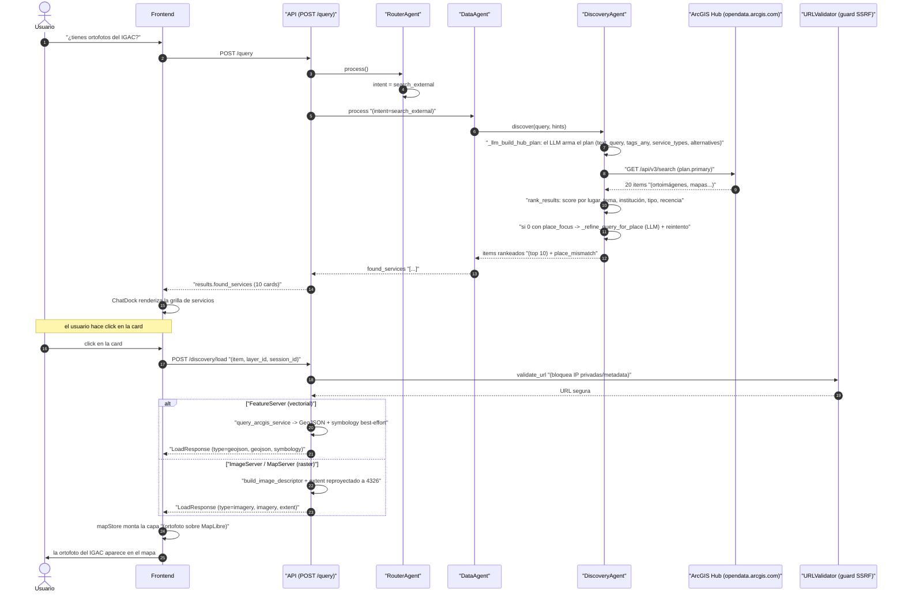
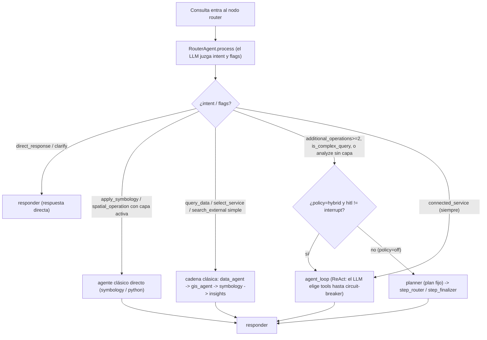
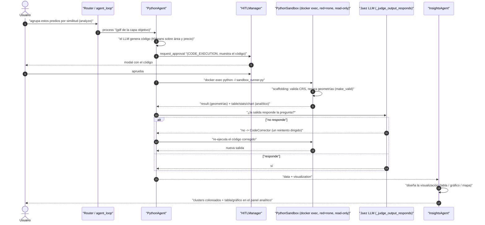
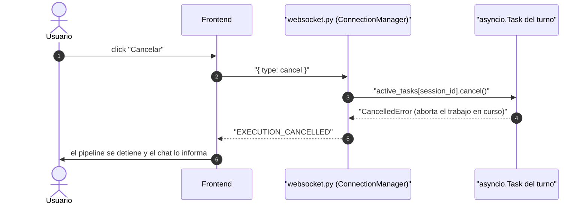
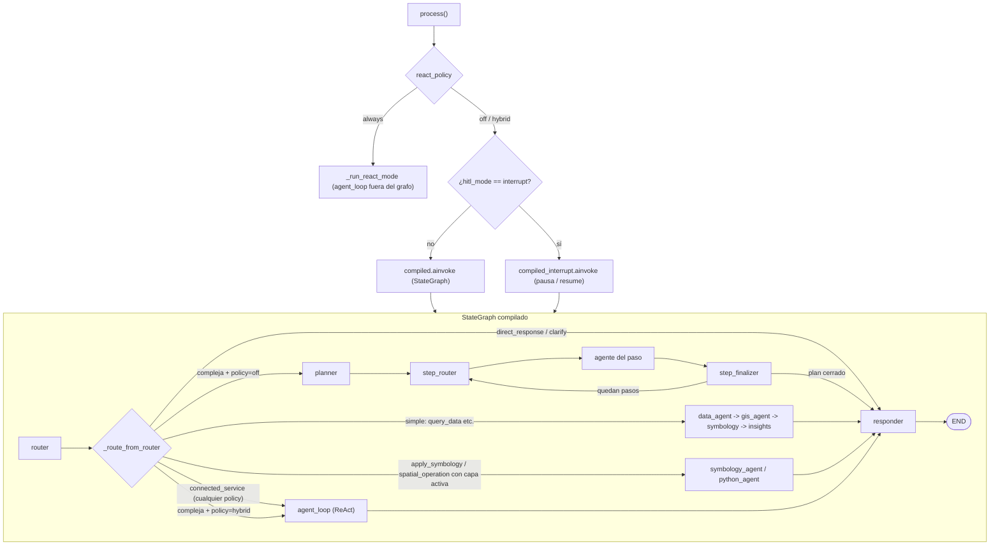

# 8. Flujos end-to-end

> **Estado actual (2026-07-26).** Este documento es el más visual del set:
> cuenta *qué pasa, paso a paso*, cuando escribes algo en el chat. Todos los
> flujos reflejan el sistema real de hoy:
> - **Seis agentes**, cada uno delega TODA decisión semántica al LLM
>   (validada contra el esquema): `router_agent`, `data_agent`,
>   `gis_agent` (NL→SQL PostGIS), `python_agent` (sandbox GeoPandas +
>   análisis/ML), `symbology_agent`, `insights_agent`.
> - **Tres caminos de orquestación** conviven en el mismo grafo LangGraph y
>   se eligen *en tiempo de ejecución* según la consulta (`react_policy`,
>   por defecto **`hybrid`**): (a) router clásico por intent, (b) bucle
>   **ReAct** `agent_loop` con tool-calling nativo, (c) planner multi-paso.
> - **Router estructurado:** el LLM emite `intent` con *structured output*
>   forzado (no "responde solo JSON"); sin heurísticas de keywords.
> - **FRT-04:** "colorea LOS LOTES" opera sobre la **capa nombrada**
>   (`target_layer_id`), no sobre la última cargada.
> - **Imagery** vive en un **microservicio MCP aparte** (Sentinel-2 STAC→COG):
>   NDVI, cambio entre fechas, zonal por feature e **imagen en color**. El
>   núcleo lo consume por el **MCP Hub** genérico, como un servidor MCP más
>   (intent `connected_service`).
> - **Frontend solo MapLibre GL** (Cesium retirado al 100 %).
> - **HITL:** las acciones sensibles (SQL, código, llamadas externas) piden
>   aprobación humana antes de ejecutarse.

Cada flujo se presenta como **diagrama de secuencia** (quién le habla a quién,
en qué orden) más una explicación de "lo que el usuario vive". El resto de
combinaciones son variaciones de estos ocho.

Para el mapa completo de decisiones de orquestación ver
[03-orquestador](03-orquestador.md); para el detalle de cada agente,
[02-agentes](02-agentes.md).

---

## 8.1 Flujo A — Chat NL→SQL con HITL (datos internos PostGIS)

**Pregunta:** *"¿Cuántas parcelas hay en Bogotá con uso comercial?"*

Es el camino clásico: consulta simple → nodo router → cadena de agentes.
El punto sensible es la ejecución de SQL generado por el LLM, que pasa por
aprobación humana y por un rol Postgres de solo lectura.

```mermaid
sequenceDiagram
    autonumber
    actor User as Usuario
    participant UI as "Frontend (MapLibre)"
    participant REST as "API (POST /query)"
    participant WS as "WebSocket (progreso)"
    participant Router as "RouterAgent"
    participant Data as "DataAgent"
    participant GIS as "GISAgent"
    participant HITL as "HITLManager (blocking)"
    participant DB as "PostGIS (rol gis_readonly)"
    participant Sym as "SymbologyAgent"
    participant Ins as "InsightsAgent"

    User->>UI: escribe la pregunta en el ChatDock
    UI->>REST: POST /query "(query, session_id, map_context)"
    REST->>REST: valida GeoJSON externo "(validate_geojson)"
    REST->>Router: process(query, contexto)
    Router-->>WS: agent_step "(router, iniciado)"

    Router->>Router: structured_call "route" -> intent = query_data
    Note over Router: valida intent contra whitelist; sin heurística de keywords
    Router-->>WS: agent_step "(router, completado)"

    REST->>Data: process "(intent=query_data)"
    Data->>Data: busca la entidad en el semantic layer "(catastro.parcelas)"
    Data-->>WS: agent_step "(data_agent, completado)"

    REST->>GIS: process "(query, entidad)"
    GIS->>GIS: SQLGenerator.generate "(el LLM ve el esquema + hints A2A)"
    GIS->>GIS: SQLValidator "(sin DROP/DELETE; LIMIT capeado)"

    GIS->>HITL: request_approval "(SQL, riesgos)"
    HITL-->>WS: APPROVAL_REQUEST
    WS-->>UI: modal con el SQL y sus riesgos
    User->>UI: click "Aprobar"
    UI->>REST: POST /approval/{id} "(approve)"
    REST->>HITL: respond(approved)
    HITL-->>GIS: despierta "(el Event se libera)"

    GIS->>DB: "SET LOCAL statement_timeout; SET LOCAL ROLE gis_readonly; SELECT (READ ONLY)"
    DB-->>GIS: 247 filas + geometría
    GIS-->>WS: agent_step "(gis_agent, completado)"

    REST->>Sym: process "(geojson)"
    Sym->>Sym: structured_call "design_symbology" -> paleta cualitativa por uso
    REST->>Ins: process "(geojson + symbology + query)"
    Ins->>Ins: diseña mapa + narrativa "(Encontré 247 parcelas...)"

    REST-->>UI: "QueryResponse (status=COMPLETED, geojson, symbology)"
    UI->>UI: mapStore.addLayer "(247 features, coloreadas por uso)"
    UI->>User: muestra el mapa + la narrativa en el chat
```

**Lo que el usuario vive:**

- Escribe la pregunta y ve el pipeline avanzar paso a paso (router → data → gis).
- Aparece un modal: *"Voy a ejecutar este SQL. ¿Apruebas?"*. Lo aprueba.
- El SQL se ejecuta en una transacción **de solo lectura**, con `statement_timeout`
  y bajo el rol Postgres `gis_readonly` (no puede escribir aunque quisiera).
- El pipeline sigue (symbology → insights) y el mapa muestra las 247 parcelas
  coloreadas por uso, con una explicación en el chat.

> **Si el SQL falla** (p. ej. un typo de columna), entra el flujo de
> auto-corrección — ver [§8.7](#87-flujo-g--auto-corrección-de-sql).

---

## 8.2 Flujo B — Discovery → carga de un servicio externo

**Pregunta:** *"¿Tienes ortofotos del IGAC?"*

El descubrimiento va contra **ArcGIS Hub Open Data**. El LLM arma el *plan de
búsqueda completo* (texto, tags, tipos de servicio, alternativas); el código
solo aporta hechos (ranking numérico, intersección de bbox). Ver
[07-discovery](07-discovery.md).



**Variante por el panel** (`DataDiscoveryPanel`):

- Mismo motor backend, pero el frontend salta el chat y va directo a
  `POST /discovery/search` con *hints* del panel (`service_types`, `tags_any`,
  zona, "solo oficiales"), que **sobrescriben** lo que decidió el LLM.
- Al hacer click en "Cargar al mapa" → `POST /discovery/load`, idéntico al de arriba.
- **Cadena "busca X, cárgalo y píntalo":** si al cargar hay un plan pausado
  en la sesión (`pending_operations`), `load()` reanuda esas operaciones **por
  el grafo** sobre la capa recién cargada (identidad por URL del item, no por
  índice — así un reordenamiento no carga el servicio equivocado).

---

## 8.3 Flujo C — ReAct híbrido: consulta compuesta

**Pregunta:** *"Carga los predios cerca del río y luego coloréalos por estrato"*

Cuando la consulta es **compuesta o compleja** (`additional_operations ≥ 2`,
`is_complex_query`, o `analyze` sin capa activa) y la política es `hybrid`
(por defecto), el router **no** manda al camino clásico: desvía al bucle
**ReAct** `agent_loop`. Ahí el LLM elige herramientas *nativamente* (tool-calling),
un **circuit breaker** acota el bucle, y cada tool **reusa los mismos nodos**
de agente por debajo (hereda gratis HITL, auto-corrección y el juez de
resultados vacíos).

Primero, cómo se decide el camino:



Y el bucle ReAct en sí:

```mermaid
sequenceDiagram
    autonumber
    actor User as Usuario
    participant AL as "agent_loop.run"
    participant LLM as "LLMClient.chat (tools=)"
    participant CB as "CircuitBreaker (max 8 tool-calls)"
    participant RT as "react_tools.dispatch_tool"
    participant N as "Nodo reusado (gis / python / symbology / data)"

    User->>AL: consulta compuesta + map_context
    loop hasta "answer" o breaker disparado
        AL->>LLM: mensajes + esquema de tools
        LLM-->>AL: "tool_call (nombre, args) o texto final"
        alt "la tool no es answer"
            AL->>CB: record_tool_call
            AL->>RT: dispatch_tool "(query_database / spatial_operation / analyze_layer / apply_symbology / servidor__tool MCP ...)"
            RT->>N: reusa el nodo existente "(HITL, retry y juez incluidos)"
            N-->>RT: "delta de estado (geojson, data, symbology...)"
            RT-->>AL: "ToolOutcome (observación + delta)"
            AL->>AL: "working.update(delta); trace.record (DecisionTrace)"
        else "la tool es answer"
            AL->>AL: "juez composicional (opcional): ¿respuesta prematura?"
            AL-->>User: final_response + decision_trace
        end
    end
    AL-->>User: "si el breaker dispara sin answer -> mensaje honesto de límite"
```

**Lo que el usuario vive:**

- Escribe una orden con varios pasos en una sola frase.
- El sistema razona en varias iteraciones: primero consulta los predios, luego
  los re-estila — cada paso puede pedir aprobación HITL igual que en el flujo simple.
- El chat puede mostrar la *traza de decisión* (`decision_trace`) de por qué
  hizo cada cosa.

> **Por qué "híbrido":** tras un benchmark de 32 tareas con LLM real (93.3 % en
> ambos modos), se decidió que solo las consultas compuestas paguen el costo
> del bucle; las simples siguen por el router clásico, más barato.

---

## 8.4 Flujo D — Servicio MCP conectado: NDVI e imagen en color

**Preguntas:** *"NDVI de los lotes entre marzo y junio"* · *"muéstrame estos
predios en imagen a color"*

El análisis de imagery **no vive en el backend**: es un microservicio MCP
aparte (`imagery-mcp`, Sentinel-2 STAC→COG) con su propia autenticación,
scopes y rate-limit. Desde la Fase 3 el backend no tiene código propio de
imagery: lo ve como **un servidor más del MCP Hub** (`config/mcp_servers.yaml`,
`id: imagery`). El router ve el resumen "SERVICIOS MCP CONECTADOS" y elige el
intent `connected_service`, que va **siempre** al bucle ReAct; allí el LLM
escoge la tool (`imagery__imagery_ndvi`, `imagery__imagery_composite`, …).
Las **teselas** viajan al navegador por el **proxy genérico**
`/api/v1/proxy/mcp/{server}/…` (la credencial del MCP nunca llega al cliente).
Ver [imagery](../../services/imagery_mcp/), [01-arquitectura §1.5](01-arquitectura.md)
y [06-conexion-back-front](06-conexion-back-front.md).

```mermaid
sequenceDiagram
    autonumber
    actor User as Usuario
    participant R as "Router -> agent_loop"
    participant H as "MCP Hub (platform/mcp/hub.py)"
    participant M as "imagery-mcp (AuthMiddleware + FastMCP)"
    participant E as "engine.py (run_ndvi / run_composite)"
    participant S as "STAC (Planetary Computer / Earth Search) -> COG"
    participant P as "api/routes/proxy.py (/proxy/mcp/...)"
    participant T as "tiles.py (TilePool)"
    participant F as "Frontend MapLibre"

    User->>R: "NDVI de los lotes / imagen en color"
    R->>R: "intent=connected_service -> el LLM elige imagery__imagery_ndvi"
    R->>H: "tool call (aoi='activa' o id de capa o 'viewport', fechas)"
    H->>H: "resuelve la referencia -> geometría real; HITL según riesgo"
    H->>M: "tools/call imagery_ndvi (MCP streamable HTTP + Bearer)"
    M->>M: "AuthMiddleware: 401 / 429 / 403 fail-closed por TOOL_SCOPES"
    M->>E: "run_ndvi(...) / run_composite(...)"
    E->>S: "busca escena + firma COG + lee ventana AOI (red/nir/scl)"
    S-->>E: "bandas COG (lectura ventaneada, retry)"
    E-->>M: "stats + teselas (ruta, rescale, bounds)"
    M-->>H: "GeoResult {artifacts: raster_tiles + stats, facts}"
    H-->>R: "capa external_imagery (XYZ vía /proxy/mcp/imagery/...) + tabla + facts"
    R-->>F: "final_response + capa de teselas"

    F->>P: "GET /proxy/mcp/imagery/tiles/{scene}/{z}/{x}/{y}.png"
    P->>M: "GET /tiles/... (prefijo permitido, Bearer inyectado server-side)"
    M->>T: "render_tile(scene, z, x, y, rescale)"
    T->>T: "¿cache (memoria/disco)? si no: rio-tiler + stretch p2-p98 + máscara SCL"
    T-->>M: PNG 256px
    M-->>P: PNG
    P-->>F: "PNG (Cache-Control)"
    F->>F: renderiza la tesela XYZ sobre MapLibre
```

**Lo que el usuario vive:**

- Pide un índice de vegetación o una imagen a color de una zona/capa.
- El backend elige la escena Sentinel-2 adecuada y devuelve las métricas
  (`mean/min/max/std`) y una capa de teselas; el LLM narra con los `facts`.
- El mapa se pinta con NDVI (rampa de vegetación) o con la composición RGB
  elegida (`true_color / false_color / agriculture / swir`); la leyenda usa el
  rango **efectivo** de las teselas (parseado de `?rescale`).
- Si pide "repítelo con otra fecha", el bucle ReAct tiene los últimos turnos
  de la conversación y reconstruye el pedido.

**Operaciones disponibles** (`imagery_search_scenes`, `imagery_ndvi`,
`imagery_change`, `imagery_zonal_stats`, `imagery_composite`). La **misma**
capacidad del hub atiende el chat y el panel manual (`McpToolsPanel` →
`POST /api/v1/connections/{server}/tools/{tool}/run`), así ambos producen
resultados idénticos.

> **Seguridad del hub:** si la descripción o el esquema de una tool cambian,
> queda deshabilitada hasta re-aprobarla (`POST /api/v1/connections/{server}/tools/{tool}/approve`);
> tras la salida de un servidor `untrusted`, usar otro servidor en el mismo
> turno pide aprobación humana. Del lado de imagery, toda tool nueva debe
> declararse en `TOOL_SCOPES` (`services/imagery_mcp/imagery_mcp/auth.py`) o
> el servicio la deniega con 403. Cualquier otro servidor sigue este mismo
> flujo: ver [12-como-enchufar-un-mcp](12-como-enchufar-un-mcp.md).

---

## 8.5 Flujo E — Análisis (intent `analyze`, sandbox con estadística/ML)

**Pregunta:** *"Agrupa estos predios por similitud de área y precio"*

El intent `analyze` enciende el **motor analítico**: el `python_agent` genera
código Python (estadística / ML con `sklearn`/`statsmodels`) que corre en el
sandbox aislado contra un GeoDataFrame `gdf`. La salida viaja por el **canal
analítico** (`data` / `visualization`): tabla, estadísticas y/o gráfico —
independiente de la salida geométrica.



**Lo que el usuario vive:**

- Pide un análisis (clustering, correlación, regresión, distribución, vecino
  más cercano) sobre una capa cargada.
- Aprueba el código que se va a ejecutar (HITL).
- El sandbox corre **sin red, en solo-lectura, con capacidades mínimas** (vía
  `docker exec` mediado por el `docker-socket-proxy` en despliegue).
- Recibe el resultado en dos canales: la capa reestilada en el mapa **y** una
  tabla/estadística/gráfico en el panel analítico.
- Si la primera salida no responde bien la pregunta, el sistema se
  **auto-verifica** y reintenta una vez (juez LLM → `CodeCorrector`), de forma
  transparente.

---

## 8.6 Flujo F — FRT-04: colorea la capa NOMBRADA

**Pregunta:** *"colorea LOS LOTES de rojo"* (con varias capas en el mapa)

Antes, "colorea los lotes" pintaba **la última capa añadida**. Ahora el LLM
resuelve *qué capa* nombró el usuario (`target_layer_id`), el backend lo valida
contra las capas del turno (`map_layers`) y el frontend re-estila **esa** capa,
no la activa.

```mermaid
sequenceDiagram
    autonumber
    actor User as Usuario
    participant CD as "ChatDock.tsx"
    participant MC as "buildMapContext()"
    participant REST as "API (POST /query)"
    participant Router as "RouterAgent"
    participant Sym as "SymbologyAgent"
    participant RT as "pickRestyleTarget()"
    participant MS as "mapStore"
    participant ML as "MapLibreMap"

    User->>CD: "colorea los lotes de rojo"
    CD->>MC: "buildMapContext() (metadatos por capa + activa + viewport)"
    MC-->>CD: "map_layers[] (lotes, rios, manzanas...)"
    CD->>REST: "POST /query (query, session_id, map_context)"
    REST->>Router: process()
    Router->>Router: "structured_call route -> intent=apply_symbology + target_layer_id='lotes'"
    Note over Router: valida target_layer_id contra map_layers; si alucina un id, se ignora
    Router->>Sym: "process (capa objetivo)"
    Sym->>Sym: "design_symbology -> relleno rojo"
    REST-->>CD: "results (symbology, geojson, target_layer_id='lotes')"
    CD->>RT: "pickRestyleTarget(layers, target_layer_id)"
    RT-->>CD: "la capa 'lotes' (NO la activa)"
    CD->>MS: "removeLayer(id) + addLayer(data, symbology)"
    Note over CD,MS: MapLibre no re-renderiza un id existente -> el restyle es drop+re-add controlado
    MS-->>ML: nuevo estado de layers[]
    ML->>ML: "syncLayers() reconstruye source + paint"
    ML->>User: solo los LOTES quedan en rojo
```

**Detalle clave:** el mecanismo está cableado en **los tres caminos** de
orquestación (`_map_final_state`, `_run_react_mode`, `step_finalizer`) — la API
prioriza `target_layer_id` resuelto por el LLM sobre la capa activa reportada
por el mapa. Si el backend no manda `target_layer_id` (o ya no existe), el
frontend cae al comportamiento legado ("la última capa añadida").

> El oráculo de test `window.__mapTestState.layers[]` publica un `LayerProbe`
> por capa (`id/name/featureCount/color`), pensado para que un test E2E afirme
> **qué capa concreta** cambió sin depender del nombre generado por el LLM.

---

## 8.7 Flujo G — Auto-corrección de SQL

El SQL siempre lo genera el LLM (no hay templates). Cuando la BD lo rechaza,
un corrector LLM ve el error y propone una versión arreglada, con un tope de
reintentos.

```mermaid
sequenceDiagram
    autonumber
    participant GIS as "GISAgent"
    participant Gen as "SQLGenerator (LLM)"
    participant Corr as "SQLCorrector (LLM)"
    participant DB as "PostGIS"

    GIS->>Gen: generate "(query NL + esquema)"
    Gen-->>GIS: SQL v1
    GIS->>DB: ejecuta v1
    DB-->>GIS: "ERROR: column municpio does not exist (typo)"
    GIS->>Corr: "corregir(error, SQL actual)"
    Corr->>Corr: el LLM ve el error + el SQL y arregla el typo
    Corr-->>GIS: "SQL v2 (municipio bien escrito)"
    GIS->>DB: ejecuta v2
    DB-->>GIS: "OK, 247 filas"
    Note over GIS: retry_count = 1; correction_info se llena
```

El responder marca `correction_info.corrections_applied = 1` y el frontend
muestra un chip en el chat: **"Auto-corregido (1 corrección)"**. El WebSocket
emite eventos `RETRY_STARTED` / `CORRECTION` / `SUCCESS` para el pipeline visual.

---

## 8.8 Flujo H — Cancelación

El usuario puede cancelar una consulta en curso. La cancelación es **real**:
el `ConnectionManager` guarda la `asyncio.Task` por sesión y la aborta (no es
un simple aviso, como en versiones viejas).



---

## 8.9 Los tres caminos de orquestación (vista de conjunto)

Todos los flujos anteriores atraviesan uno de tres caminos, elegido en tiempo
de ejecución. Este es el mapa global (detalle completo en
[03-orquestador](03-orquestador.md)):



Los tres caminos convergen en el **mismo contrato de respuesta**
(`_map_final_state` / `_run_react_mode` / `step_finalizer`), que preservan
`target_layer_id` (FRT-04) y el canal analítico (`data` / `visualization`) —
cualquier cambio de contrato debe tocar los tres o el sistema diverge.

---

## 8.10 Tabla resumen de intents

El router elige un `intent` de esta lista cerrada (11 valores, validados contra
whitelist). Estos son los principales y a dónde llevan:

| Intent del router | Camino / nodo | Cuándo se usa |
|-------------------|---------------|----------------|
| `direct_response` | responder (sin agente) | Saludo, capacidades, pregunta general |
| `clarify` | responder (pregunta al usuario) | Consulta ambigua: pide precisión antes de actuar |
| `query_data` | data_agent → gis_agent (NL→SQL) | Consultar/contar/agregar datos de la BD PostGIS |
| `search_external` | data_agent (Discovery/Hub) | "Busca datos / ortofotos de X" |
| `select_service` | data_agent (carga el servicio elegido) | El usuario escribió un número de la lista |
| `load_external` | data_agent (fetch por URL) | El usuario pegó una URL completa |
| `spatial_operation` | python_agent (sandbox GeoPandas) | Buffer / intersección / centroide sobre capa cargada |
| `analyze` | python_agent (estadística / ML) | Clustering, correlación, regresión, distribución |
| `apply_symbology` | symbology_agent | Cambiar color / clasificación / estilo de una capa |
| `follow_up` | insights_agent | "Explícame el resultado anterior" (usa contexto en memoria) |
| `connected_service` | agent_loop (ReAct) → tool de un servidor MCP vía MCP Hub | Lo resuelve una herramienta de un servicio conectado (p. ej. NDVI / cambio / zonal / imagen en color de imagery-mcp) |

> **Sin intent `complex_query`.** La complejidad no es un intent: el router
> marca `is_complex_query` / `additional_operations` y `_route_from_router`
> decide **en tiempo de ejecución** si la consulta va al `agent_loop` (ReAct,
> política `hybrid`) o al `planner` (política `off`). Ver [§8.3](#83-flujo-c--react-híbrido-consulta-compuesta)
> y [§8.9](#89-los-tres-caminos-de-orquestación-vista-de-conjunto).

---

## Siguiente: [09-configuracion-y-deploy](09-configuracion-y-deploy.md)
