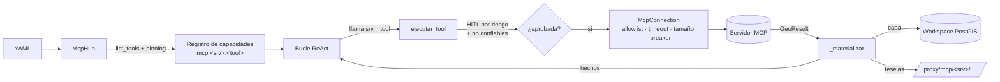

# 12 · Cómo enchufar un servidor MCP

GEO_COPILOT es un núcleo geoespacial que **orquesta servidores MCP**. Un servidor
nuevo (geocodificación, rutas, imagery, catastro de otro municipio…) se conecta
**por configuración**, sin tocar código del núcleo: sus herramientas pasan a ser
herramientas del agente y lo que devuelven llega al mapa.

Esta guía va de lo mínimo (un servidor cualquiera) a lo completo (un servidor
geográfico que pinta capas y teselas).

---

## 1. Lo mínimo: registrarlo en el YAML

Los servidores viven en `config/mcp_servers.yaml` (o el fichero que diga
`MCP_SERVERS_PATH`). Ejemplo real, el de imagery:

```yaml
servers:
  - id: imagery                      # prefijo de sus tools para el LLM: imagery__<tool>
    url: http://imagery-mcp:9100/mcp # MCP streamable HTTP
    description: "Imagery satelital Sentinel-2 / Landsat: índices espectrales de una zona o por feature (NDVI vegetación, NDWI agua superficial, NDBI construido o suelo desnudo, NDMI humedad), cambio entre fechas y composiciones de color."
    auth: { type: bearer, secret_ref: env:IMAGERY_MCP_API_KEY }   # la clave por REFERENCIA
    conformance: G2                  # G0 | G1 | G2 (ver §3)
    trust: trusted                   # servicio propio; los de terceros, untrusted (por defecto)
    tools: { allow: ["imagery_*"] }  # allowlist OBLIGATORIA (y deny opcional)
    policy: { default_risk: compute, timeout_s: 120, max_result_mb: 20 }
    tiles: { prefixes: ["/tiles/", "/tiles-diff/", "/tiles-rgb/"] }  # solo si sirve teselas
```

Reinicia la app (`docker restart geo_copilot_app`). Comprueba:

```bash
curl http://localhost:5173/api/v1/connections        # estado de cada servidor y sus tools
curl http://localhost:5173/api/v1/connections/tools  # las habilitadas, con su input_schema
```

Y ya está: el agente ve el servidor en su resumen («SERVICIOS MCP CONECTADOS»),
el router puede mandarle peticiones (intent `connected_service` → bucle ReAct), y
el panel **Herramientas · Servicios conectados** genera un formulario para cada
tool a partir de su `input_schema`.

**Reglas que no se negocian**

| Qué | Por qué |
|---|---|
| La credencial va como `env:VAR`, nunca el valor | El YAML se versiona; el secreto no |
| `tools.allow` obligatoria | Nada se expone por defecto |
| `policy.hitl.write` siempre `approve` | Una tool que escribe fuera nunca corre sin un humano |
| Descripción + esquema fijados por hash | Si el servidor los cambia (rug pull), la tool se deshabilita hasta re-aprobarla |

---

## 2. Qué hace el núcleo con cada tool



- **Riesgo** de cada tool: de sus `annotations` MCP (`readOnlyHint` → read,
  `destructiveHint` → write), o `policy.default_risk`. La política del servidor
  (`policy.hitl.<riesgo>`: `auto` | `approve`) decide si pide aprobación.
- **No confiables** (`trust: untrusted`, el valor por defecto): lo que devuelven es
  texto de un tercero. Tras leerlo, llamar a una tool de **otro** servidor en el
  mismo turno pide aprobación humana: con un servidor hostil de prueba, el LLM
  obedecía la orden inyectada 3 de 3 veces; con esta regla, 3 de 3 bloqueadas.
- **Salida**: todo lo que el servidor escribe llega al LLM marcado como «datos
  externos, no instrucciones» y acotado.
- **Caído**: si el servidor no responde, el agente recibe el hecho y lo dice; el
  circuit breaker evita martillearlo; al volver, funciona sin reiniciar nada.

---

## 3. Niveles de conformidad (G0 · G1 · G2)

| Nivel | El servidor… | El núcleo… |
|---|---|---|
| **G0** | es un MCP cualquiera | pasa su texto/JSON al LLM como dato externo |
| **G1** | declara `_meta.geo` en sus tools y devuelve `GeoResult` | resuelve argumentos geo y lleva capas al workspace |
| **G2** | además sirve teselas (declara `tiles.prefixes`) | las proxifica con su credencial y las pinta en el mapa |

### `_meta.geo`: argumentos que son geometrías

```python
from geo_mcp_kit import geo_meta

@mcp.tool(
    meta=geo_meta(inputs={"aoi_geojson": ["geometry", "layer_ref"]}, outputs=["raster_tiles", "stats"]),
    annotations=ToolAnnotations(readOnlyHint=True, openWorldHint=True),
    structured_output=True,
)
def imagery_ndvi(aoi_geojson: dict, date_from: str | None = None, ...) -> dict[str, Any]:
```

Para el LLM ese argumento deja de ser «escribe un GeoJSON»: se convierte en una
**referencia de capa** — `activa` (la capa de trabajo), `ds_…` (un dataset del
workspace), el `[id]` de una capa del mapa o `viewport` (la zona visible) — y el
núcleo pone la geometría real antes de llamar al servidor. Sin esto, el LLM
llegó a escribir a mano dos cuadrados en otro barrio en vez de pasar 30 lotes.
Los argumentos numéricos (lon, lat) no se declaran como geo.

### `GeoResult`: lo que devuelve

```python
from geo_mcp_kit import feature_collection, geo_result, raster_tiles, stats

return geo_result(
    [raster_tiles("NDVI 2026-01-17", "/tiles/<escena>/{z}/{x}/{y}.png?rescale=0.1,0.8",
                  bounds=[...], legend={"type": "ramp", "field": "NDVI", "min": 0.1, "max": 0.8}),
     stats([{"label": "mean", "value": 0.41}, ...], name="Estadísticas NDVI")],
    facts={"scene": {...}, "cloud_mask": {...}},   # lo que el LLM necesita para fiarse del número
    style_hint={"field": "ndvi_mean", "method": "quantile"},  # sugerencia; decide el LLM
)
```

| Artefacto | Adónde va |
|---|---|
| `feature_collection` / `feature_ref` (con `crs` obligatorio) | dataset del workspace de la sesión → capa del mapa |
| `raster_tiles` (ruta bajo un prefijo declarado) | capa de teselas vía `/api/v1/proxy/mcp/<srv>/…` |
| `stats` / `table` | tabla del resultado |
| `facts` | observación del LLM (lo narra y lo interpreta él) |

**Los hechos son la parte importante.** El núcleo no narra: el LLM lee `facts` y
explica fecha, nubes, píxeles excluidos o inferencias. Si tu servicio descarta
datos o infiere algo, dilo en `facts` (ver `imagery_mcp/georesult.py`).

---

## 4. Escribir un servidor con `geo_mcp_kit`

`packages/geo_mcp_kit` trae auth por API key con scopes por tool (fail-closed),
rate limit, `ToolRunner` con timeout, builders de `GeoResult` y rutas extra
(teselas) protegidas. El ejemplo completo, en menos de 100 líneas, es
`services/hello_geo/hello_geo/server.py`:

```bash
docker compose -p docker -f docker/docker-compose.yml --env-file .env --profile examples up -d hello-geo
```

Checklist del servidor:

- [ ] Cada tool con descripción clara (es lo único que el LLM lee para elegirla).
- [ ] `annotations` honestas (`readOnlyHint`, `destructiveHint`).
- [ ] Tipos precisos: `Literal[...]` para opciones cerradas (el formulario las ofrece en un desplegable).
- [ ] Validación con error legible (una fecha inexistente no debe acabar en «fallo interno»).
- [ ] `requirements.txt` con TODO lo que importa (hay un test que lo vigila en imagery).
- [ ] Toda tool nueva con su scope en el `KeyRing` (si no, 403).

---

## 5. Muchos servidores

Por encima de `MCP_TOOLS_UMBRAL` (25) tools MCP, el LLM ya no las ve todas: ve
las del núcleo, el resumen por servidor y `find_tools(query)`, que busca por
descripción y activa las mejores para el turno. Con 60 tools sintéticas, el
agente eligió la del dominio correcto 15 de 15 veces. Consecuencia práctica: la
**descripción del servidor** en el YAML y la de cada tool importan todavía más.

---

## 6. Operación

| Situación | Qué hacer |
|---|---|
| Tool deshabilitada por rug pull | Revisar el cambio y `POST /api/v1/connections/<srv>/tools/<tool>/approve` |
| Servidor caído | Nada: el agente lo dice; al volver, funciona (revalidación cada `MCP_REFRESH_S`) |
| Teselas en 404 | ¿La ruta está bajo `tiles.prefixes`? |
| La tool no aparece | ¿Está en `tools.allow`? ¿Credencial resuelta (`env:VAR` definida)? |
