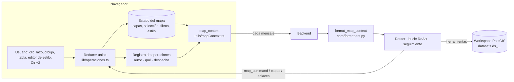

# 13 · Interacción híbrida mapa ↔ chat

En GEO_COPILOT el mapa y el chat son **dos entradas al mismo estado**. Lo que el
usuario hace a mano (seleccionar, dibujar, filtrar, estilizar, deshacer) el agente
lo ve; lo que hace el agente, el usuario lo ve, lo puede deshacer y lo puede
preguntar («¿cómo se hizo?»). Y el usuario puede hablarle al agente del mapa como
le hablaría a un colega: «estos», «aquí», «lo que dibujé», «la capa roja».

Esta guía explica cómo funciona por dentro y qué reglas hay que respetar al añadir
un gesto o una herramienta nueva.

---

## 1. La idea en un dibujo

- **Un solo reducer** (`frontend/src/lib/operaciones.ts`) aplica TODAS las
  operaciones sobre las capas, las haga el usuario o el agente (`map_command`).
  Cada una queda en el **registro** con su autor y su inversa: Ctrl+Z deshace lo del
  agente igual que lo del usuario.
- **Una sola vista del mapa para todos los LLM**: `format_map_context` convierte el
  `map_context` en texto (capas con su estilo, filtro y selección; acciones desde la
  última respuesta; punto marcado; vistas; cortina; serie temporal…). Router, bucle
  ReAct, seguimiento y narrador leen lo mismo.
- **Los datos viven en el workspace** (PostGIS, `ws_meta.datasets`): cada capa con
  datos tiene su `ds_…`, y las herramientas exactas (`ws_*`: medir, buffer, unión
  espacial, overlay, conteo por zonas, LISA/Gi*) operan sobre esos datasets.

## 2. Las referencias: cómo el agente nombra lo que el usuario señala

Toda cosa que el usuario pueda señalar tiene que poder **nombrarse** en los
argumentos de las herramientas. Si no tiene nombre, el LLM la aproxima con otra
(la lección del bench de deixis).

| El usuario dice / hace | Referencia | Qué es |
|---|---|---|
| «estos», «los seleccionados», el chip de alcance | `seleccion` | lo seleccionado en el mapa (se materializa por turno) |
| «aquí», clic en el mapa | `punto` | el punto marcado AHORA (se materializa por turno) |
| «en la zona visible» | `viewport` | la extensión de la vista actual |
| «lo que dibujé», «mi polígono» | `dibujo` | lo último que dibujó el usuario (`user.sketch`) |
| «la capa que acabas de traer» | `activa` | la capa en foco del turno |
| «@Vías», «la capa roja» | `[layer-…]` o `ds_…` | una capa concreta del mapa / su dataset |

Las resuelven `_resolver_crudo` (herramientas `ws_*`) y `_geojson_de_referencia`
(hub MCP, para argumentos geo de servidores externos: `aoi_geojson`…), con el
helper común `layer_resolution`.

**Reglas aprendidas (V5 y bench):**

- **Los hechos van donde aplican.** Una pista general junto al mensaje («el chip es
  tu alcance») el modelo la aplicó a todo (bench 68 %); el mismo hecho en la
  observación de la herramienta que usó la capa entera lo corrigió (97,6 %).
- **Lo que el usuario señala va donde el agente busca los datasets**: la selección
  y el punto marcado se listan en el bloque «DATASETS DEL WORKSPACE»; el punto y la
  zona visible de turnos ANTERIORES no se listan (el agente usó un punto viejo).
- **La ausencia también es un hecho, pero va donde aplica**: sin punto marcado,
  «¿qué hay cerca de aquí?» se resolvía con la última capa. Una línea «PUNTO
  MARCADO: ninguno» en TODO contexto lo arreglaba pero degradaba tareas que no
  tenían nada que ver (medido: 5/8 frente a 8/8); el hecho vive en la descripción
  de la referencia `punto` («si el mapa no tiene PUNTO MARCADO, pídelo»).
- **Las palabras pesan**: un «AHORA» en mayúsculas en una instrucción general hizo
  desconfiar al agente de un punto ya respondido. Cada cambio de redacción de un
  prompt compartido se mide con la batería LLM contra el commit anterior.
- **La semántica de cada argumento es un hecho de la herramienta**: `meters` de
  `dwithin` es la distancia al BORDE de B y las distancias se suman (un círculo de
  5 km + `dwithin` 5 km = 10 km).

## 3. Gesto manual ↔ capacidad del agente

Criterio de la fase: **cada gesto manual tiene su equivalente como capacidad del
agente y viceversa**.

| Gesto del usuario | El agente lo hace con | Lo que el otro ve |
|---|---|---|
| Clic / Shift+clic / caja / lazo / filas de la tabla | `map_command select` | chip «N seleccionados», resaltado común |
| Dibujar (punto, línea, polígono, rectángulo, círculo) | `request_map_input draw_area` (le pide al usuario) | el dibujo es un dataset `sketch` |
| Filtro de la capa (panel o tabla) | `map_command set_filter` | la capa filtrada ES su subconjunto para mapa, tabla y herramientas |
| Editor de estilo (tipo, campo, método, clases, rampa) | `apply_symbology` | lo tocado a mano queda **fijado** (📌) y el agente lo respeta |
| Visibilidad, opacidad, orden, etiquetas, encuadre | `map_command` | registro con autor |
| Ctrl+Z / Ctrl+Shift+Z | — | el registro dice qué se deshizo y a qué estado volvió |
| Clic derecho → acción (p. ej. NDVI por feature del MCP) | la misma capacidad | formulario generado del `input_schema` |
| Guardar vista / cortina / control de tiempo | `save_view`, `compare`, `set_time` | los mismos controles |
| Medir (📏 / ▢) | `ws_measure` | medidas geodésicas en el servidor |

Y en sentido contrario, lo que hace el agente llega como **enlaces**:
`[[layer:<capa>|texto]]`, `[[layer:<capa>?campo=valor|texto]]`,
`[[layer:<capa>#id|texto]]`. Pasar el ratón resalta; clic selecciona y encuadra.
Cada capa lleva su procedencia (`LayerRef.provenance`): el panel **«cómo se hizo»**
muestra la operación, los parámetros, el SQL o el código.

## 4. Cuando al agente le falta DÓNDE: pedirlo en el mapa

`request_map_input` (`pick_point`, `draw_area`, `pick_layer`, `pick_features`)
**termina el turno** con una barra sobre el mapa. Cuando el usuario responde, la
consulta ORIGINAL vuelve con `map_context.respuesta_mapa`. Mientras el agente pide
un punto, el clic **solo responde** al pedido (no selecciona lo que hay debajo).

## 5. Estado que sobrevive

- **Recargar la pestaña**: vuelven la sesión, las capas (con su id, estilo,
  filtro, selección, fecha), la conversación (con las capas de cada turno, para
  que `activa` en los enlaces siga apuntando bien) y la cámara.
- **Proyectos** (`ws_meta.proyectos`): guardar/abrir mapa + conversación; al
  abrir, la sesión se reconstruye con su historial y el agente recuerda.
- **Capas del catálogo** (ArcGIS Hub): al cargarlas se materializan en el
  workspace de la sesión y el mapa dibuja esa versión (misma que ven las
  herramientas).

## 6. Cómo se prueba

| Capa | Dónde |
|---|---|
| V1 unitarios / contrato | `frontend/src/lib/*.test.ts`, `tests/test_fh*.py`, `tests/test_capacidades_espaciales.py` |
| V2 E2E determinista (un spec por gesto) | `frontend/e2e/fase-h-*.spec.ts` (`E2E_PORT=3100`) |
| V3 integración real | `frontend/e2e-integration/fase-h-hibrida.spec.ts` (`E2E_REAL_URL=http://localhost:5173`) |
| V4 juicio del LLM | `tests/test_llm_deixis_bench.py` (45 casos, ≥ 90 %), `tests/test_llm_distancia_desde_punto.py`, `tests/test_llm_fh*.py` — siempre en serie y medidos como tasa |
| V5 usuario real | Chrome del usuario; cada cifra contra PostGIS — `docs/validacion/evidencia/fase-h/notas-v5.md` |

## 7. Checklist para añadir un gesto o una herramienta

1. ¿El usuario puede señalar algo nuevo? → dale una **referencia con nombre**
   (tabla del §2), resuélvela en `_resolver_crudo` y en el hub, y lístala donde el
   agente busca los datasets.
2. ¿Cambia el mapa? → una operación del **reducer** con su inversa, y en el
   registro un `args` que diga **qué** cambió (no solo «cambió el estilo»).
3. ¿El agente puede hacerlo? → capacidad o `map_command` equivalente; y al revés.
4. ¿Devuelve una capa? → al **workspace** (`ds_…`) con su **procedencia**.
5. Su descripción dice la **semántica** de cada argumento (unidades, respecto de qué).
6. Casos nuevos en el **bench de deixis**; un spec E2E; y V5 con los números
   contrastados contra la base.
