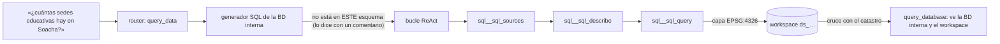

# 14 · Conectar otra base de datos (servidor MCP de SQL)

Cualquier PostgreSQL/PostGIS se conecta como **fuente** del copiloto por configuración, sin tocar
el núcleo. El servidor `postgis-mcp` (sobre `packages/geo_mcp_kit`) publica varias fuentes a la
vez; el agente las describe, las consulta y cruza sus resultados con la base interna y con el
resto del workspace.

## 1. Cómo funciona



- El generador de SQL de la BD interna ve **qué otras fuentes hay conectadas**. Si lo pedido no
  está en su esquema, no lo aproxima con otra tabla: lo dice, y el turno pasa al bucle.
- El bucle ve las herramientas `sql__sql_sources`, `sql__sql_describe` y `sql__sql_query` y
  decide.
- Un resultado con geometría vuelve como capa en EPSG:4326, el hub lo **materializa en el
  workspace** (`ds_…`) y desde ahí se cruza con cualquier otra cosa. Por ejemplo, `query_database`
  ve las tablas de la BD interna **y** los datasets en una sola consulta.

## 2. Qué garantiza el servidor (de su lado)

| Garantía | Cómo |
|---|---|
| Solo lectura | rol de BD de solo lectura **por fuente**, transacción READ ONLY |
| Solo lo publicado | el MISMO validador estructural del núcleo (`packages/geo_sql_guard`, sqlglot) con la lista de tablas de los esquemas publicados; lo demás «no existe» |
| Nada de catálogos del sistema ni escrituras | el validador rechaza DELETE/UPDATE, `pg_authid`, `pg_*`, varias sentencias, funciones fuera de la allowlist (`pg_sleep`…) |
| Tiempo acotado | `statement_timeout` 20 s: «la consulta superó 20 s; acótala» |
| Muestra honesta | tope de filas (máx. 5000); si se alcanza, los hechos dicen «NO es el total» |

## 3. Enchufar una fuente

0. **Un solo camino por dato.** No publiques aquí una BD que el núcleo ya consulta (la BD
   interna va por `query_database`). Con dos caminos al mismo dato, el agente gastaba pasos
   eligiendo y llegó a responder con uno diciendo que era el otro. Por eso la F2 del plan de
   calidad sacó de aquí la fuente «catastro» (`docs/validacion/F2_UN_CAMINO_2026-10-04.md`).
1. **Rol de solo lectura** en esa BD, con permisos **solo** sobre lo que se publica (ejemplo:
   el `lector` de la BD demo de equipamientos).
2. **La fuente en `SQL_SOURCES`** (compose, servicio `postgis-mcp`): `id`, `descripcion`, la
   variable de entorno con su DSN (`dsn_env`) y los `esquemas` que se publican. El DSN es un
   secreto: va en `.env`, nunca en el repo.
3. **Registrar el servidor** en el YAML del hub (`config/mcp_servers*.yaml`, id `sql`):
   `auth` por referencia (`env:POSTGIS_MCP_APP_KEY`), `tools.allow: ["sql_*"]` y
   `default_risk: read`. En la `description` di **qué hay** y que **no es la BD interna**. El
   hub la recorta a 160 caracteres, y es lo que el router lee.
4. **Documentar la BD** con `COMMENT ON TABLE` / `COMMENT ON COLUMN`. El generador de SQL lee
   los comentarios y, para las columnas con pocos valores, los valores que toman (de
   `pg_stats`). Sin eso, «lotes del catastro de Bogotá» se tradujo en un filtro inventado
   (`lotdistrit = 11001`) y la respuesta fue 0 lotes donde había 3.

```bash
docker compose --env-file .env -f docker/docker-compose.yml --profile connectors up -d postgis-demo postgis-mcp
sh docker/migrations/2026-09-27_catastro_comentarios.sh
```

La fuente de referencia `equipamientos` (`postgis-demo`) trae 2000 sedes educativas de
Cundinamarca (IGAC, sin datos de contacto) en `docker/init-demo/`.

## 4. Cómo se prueba

| Capa | Dónde |
|---|---|
| Servidor (sin BD y contra la PostGIS de tests) | `tests/test_postgis_mcp.py` |
| Validador compartido | `tests/test_sql_ast_validator.py` (incluidas las ramas de CASE) |
| Paso del turno de la BD interna al bucle | `tests/test_hitl_cutover.py` |
| Hechos de columnas y tablas en el esquema | `tests/test_esquema_hechos_columnas.py` |
| Buffer que llega al radio pedido | `tests/test_workspace_ops.py` (`-m postgis`) |
| V3 real: dos BD en la misma sesión | `frontend/e2e-integration/fase-5-postgis.spec.ts` |
