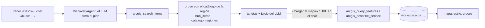

# 15 · El servidor MCP de ArcGIS

Desde F5 (T5.2) el núcleo **no tiene conectores de ArcGIS**. Buscar en ArcGIS Hub, describir un
servicio y traer una capa lo hace el servidor `arcgis-mcp` (`services/arcgis_mcp`, sobre
`packages/geo_mcp_kit`). El copiloto lo usa como backend, y cualquier cliente MCP (Claude
Desktop, otro agente) puede usarlo con su propia clave.

## 1. Las tres herramientas

| Tool | Qué hace | Hechos que devuelve |
|---|---|---|
| `arcgis_search_items` | Busca en el catálogo abierto de ArcGIS Hub con los filtros pedidos (texto, tags, owner, fuente, tipo de servicio). Con `bbox` se quedan solo los items **de** esa zona: el Hub ignora el filtro de extensión, así que se aplica aquí | `items` (título, organización, tipo, URL, extensión…), `encontrados` y `avisos` si una página falló |
| `arcgis_describe_service` | Una capa (`…/FeatureServer/0`), un servicio con varias capas o una imagen (Map/ImageServer) | campos, tipo de geometría, cuántos elementos tiene, extensión **en EPSG:4326** y, si es imagen, el descriptor que el mapa monta |
| `arcgis_query_features` | Los elementos de una capa con el filtro **hecho en el servicio**: `where`, `bbox`, `out_fields`; hasta `max_features` (máx. 200000) | capa EPSG:4326 (hasta 5000 elementos en la respuesta; más, un `feature_ref`: GeoJSON que sirve el propio servidor en `/resultados/…`, 1 h, y que el núcleo baja con su credencial por `recursos.prefixes`) + `total_en_servicio`, `traidos`, `completo` y `aviso` si es una muestra |

Qué garantiza el servidor:

- **Paginación estable**: ordena por el campo OID y respeta el `maxRecordCount` de cada servicio.
  Antes, un servicio con tope 500 se cortaba en silencio en la primera página.
- **Muestra honesta**: si no vino todo, los hechos lo dicen («es una MUESTRA: vinieron 300 de
  5400»), y el panel y el chat lo repiten.
- **Geometría correcta**: los anillos esriJSON se ordenan por orientación, así que un registro
  con varias partes es un MultiPolygon. Antes una isla se dibujaba como un hueco.
- **Tamaño razonable**: pide `geometryPrecision=7` (≈1 cm). Como texto va solo un resumen
  (`geo_mcp_kit.compact_result`) y la capa entera va en `structuredContent`. Antes una capa de
  15 MB viajaba dos veces y ocupaba 64 MB.
- **SSRF del lado del servidor**: las URLs vienen de fuera, así que el servidor bloquea IPs
  internas, puertos raros y esquemas no http(s). Fija la IP resuelta (contra el DNS rebinding) y
  no sigue redirecciones. `ARCGIS_ALLOWED_DOMAINS` (opcional) restringe a una lista de dominios.

## 2. Cómo lo usa el copiloto



- El núcleo llama al servidor con `McpHub.llamar_directo`, con las mismas reglas que una
  llamada del agente: allowlist, pinning (una tool que cambió no se usa), timeout y tope de
  tamaño. El punto único es `agents/data_agent/servicio_arcgis.py`.
- El **orden** de los resultados (qué publicadores son oficiales, qué pertenece a la región, qué
  menciona el lugar o el tema) queda en el núcleo, porque usa su catálogo regional. El
  **plan** de búsqueda lo decide el LLM.
- En `config/mcp_servers.yaml` el servidor va con `tools.agent: []`: el LLM **no** llama estas
  tools directamente. Busca y carga con `search_external` / `load_external`, que exigen que la URL
  venga del usuario o de las tarjetas que se le mostraron (R0.9). Exponer `arcgis_query_features`
  al agente (cargar solo un subconjunto con `where`/`bbox`) es una decisión abierta. Pasa por
  resolver esa misma procedencia.
- Si el servidor no responde, el usuario lo sabe («ArcGIS error: …»). No se convierte en «no hay
  resultados».

## 3. Levantarlo

Está en el stack por defecto (`docker compose up -d`). Necesita en `.env`:

```bash
ARCGIS_MCP_APP_KEY=<openssl rand -hex 24>
ARCGIS_MCP_KEYS=[{"name":"geo-copilot-app","key":"<la misma>","scopes":["arcgis:read"],"rate_limit_per_min":240}]
# opcional
ARCGIS_ALLOWED_DOMAINS=arcgis.com,igac.gov.co
```

## 4. Usarlo desde Claude Desktop (T5.3)

El puerto se publica **solo en la máquina** (`127.0.0.1:9400`). Añade una clave propia para ese
cliente a `ARCGIS_MCP_KEYS` (p. ej. `{"name":"claude-desktop","key":"…","scopes":["arcgis:read"],
"rate_limit_per_min":60}`) y regístralo en `claude_desktop_config.json` con el puente
`mcp-remote`:

```json
{
  "mcpServers": {
    "geo-copilot-arcgis": {
      "command": "npx",
      "args": ["-y", "mcp-remote", "http://127.0.0.1:9400/mcp", "--allow-http",
               "--header", "Authorization:${GEO_ARCGIS_AUTH}"],
      "env": { "GEO_ARCGIS_AUTH": "Bearer <tu clave de claude-desktop>" }
    }
  }
}
```

- **Sin espacios en los argumentos.** En Windows, Claude Desktop lanza `npx` sin escaparlos:
  `"Authorization: Bearer X"` llega partido en tres y el puente se cierra («Server
  disconnected»). Por eso el valor completo («Bearer …») va en la variable de entorno.
- **`--allow-http`**: el servidor es local y no tiene TLS.
- **Versión de Microsoft Store**: lee la configuración de
  `%LOCALAPPDATA%\Packages\Claude_<id>\LocalCache\Roaming\Claude\`, no de `%APPDATA%\Claude`.
- Al abrir, el puente deja abierto un GET /mcp (el canal de eventos). Hasta el arreglo 46a762c,
  eso dejaba cualquier servidor del kit al 100 % de CPU.

Validado con un cliente MCP independiente (el SDK oficial) y la clave `claude-desktop`: ve las
3 tools, busca en el Hub y trae una capa. El texto que lee el modelo es el resumen de hechos, no
la geometría. Sin clave responde 401. Para publicarlo fuera de la máquina hace falta TLS delante.

## 5. Pruebas

| Capa | Dónde |
|---|---|
| Servidor sin red: SSRF, esriJSON→GeoJSON, pushdown, paginación, hechos, describir, Hub | `tests/test_arcgis_mcp.py`, `tests/test_hub_search.py` |
| Núcleo: llamada directa, `tools.agent`, nodo y fachada | `tests/test_mcp_hub.py`, `tests/test_data_agent_via_mcp.py` |
| Endpoints del panel | `tests/test_route_discovery.py` |
| V5 (Chrome, 2026-09-27) | búsqueda por chat → tarjetas → carga de 116 municipios (coropleta); carga por URL de 561 puntos; cruce «puntos por municipio» = conteo independiente con shapely (Guaduas 35, San Juan de Río Seco 26, Caparrapí 26) |
