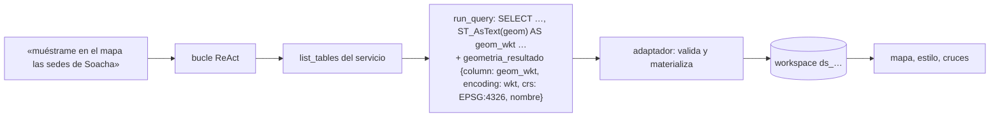

# 16 · Datos tabulares de terceros (Snowflake, BigQuery…) en el mapa

Muchos servicios de datos ya tienen su MCP (el oficial de Snowflake, BigQuery, bases genéricas)
pero no hablan geo: devuelven **filas**. Con el adaptador `tabular_geo` (T5.4) esas filas se
vuelven capas del workspace: se dibujan, se estilizan y se cruzan con cualquier otra fuente.
No hay que escribir código por servicio.

## 1. Cómo funciona



- El servicio devuelve filas (texto JSON o `structuredContent`), sin contrato geo.
- **El LLM declara** qué columna del resultado es la geometría. Lo hace en el argumento
  `geometria_resultado`, que el núcleo añade al esquema de las tools de estos servidores y
  quita antes de llamar al servidor. El LLM escribió la consulta y sabe qué pidió. La
  configuración puede dar una declaración por defecto (`adapter_options.geometry`).
- **El núcleo valida**:
  - que la columna exista;
  - que cada valor se parsee (WKT, WKB, WKB hex, GeoJSON o columnas lat/lon);
  - que, en EPSG:4326, caiga en rango lon/lat. Unas coordenadas en metros declaradas como
    lon/lat se rechazan, porque mandarían el mapa a otro continente.

  Si algo no cuadra, dice qué y con qué columnas, y **no dibuja nada inventado**.
- Si el resultado no trae la columna declarada (un conteo, un agregado), las filas se entregan
  como **tabla** y se avisa por qué no hay mapa.
- «0 filas» llega como hecho, con la pista que aplica: comparar el texto sin distinguir
  mayúsculas o mirar los valores reales. Antes llegaba un `[]` crudo.

## 2. Enchufar un servicio

```yaml
- id: almacen
  url: http://…/mcp
  description: Otra base de datos (NO es la BD interna), consultable ya con este servicio — <qué hay>.
  auth: { type: bearer, secret_ref: env:ALMACEN_MCP_APP_KEY }
  conformance: G0
  adapter: tabular_geo
  tools: { allow: ["list_tables", "run_query"] }
  policy: { default_risk: read, timeout_s: 45 }
```

**La `description`.** La fórmula «Otra base de datos (NO es la BD interna), consultable ya con
este servicio — …» es la que se midió con el router. Con «Almacén de datos corporativo…», las
preguntas del dominio iban a buscar en portales.

**Si el router igual se equivoca.** Una petición de **mapa** («muéstrame en el mapa X») el router
la manda a buscar en portales aunque la descripción sea buena (6/6 con cualquier variante
medida). Por eso, con servicios conectados, la búsqueda en portales pasa primero por el bucle ReAct
(`nodes/data_agent.py`). El bucle ve los servicios **y** la búsqueda en portales, y decide. Cuando
el propio bucle elige buscar en portales, no se le devuelve el turno.

## 3. El servidor de prueba (sin cuenta de Snowflake)

`services/tabular_demo_mcp` (`almacen-demo`, perfil `connectors`) imita la forma del MCP oficial de
Snowflake:
- `list_tables` y `run_query(statement)` devuelven texto JSON, sin nada geo;
- lee la BD de demostración con un rol de solo lectura;
- usa el mismo validador SQL del núcleo (`geo_sql_guard`). Desde T5.4, ese validador admite
  `ST_AsText`/`ST_AsBinary`/`ST_AsEWKT`…, las funciones con que un cliente así lee la geometría.

```bash
docker compose --env-file .env -f docker/docker-compose.yml --profile connectors up -d almacen-demo
```

**Snowflake real.** Queda sin probar (no hay cuenta). Enchufarlo sería lo mismo con su URL y su
credencial. Su SQL devuelve `GEOGRAPHY`/`GEOMETRY`: se pide como texto (`ST_ASWKT` o `ST_ASWKB`)
y se declara la columna.

## 4. Pruebas

| Capa | Dónde |
|---|---|
| Adaptador: filas, validación, tabla sin geometría, 0 filas, nombre de la capa, error con pista | `tests/test_adaptador_tabular.py` (incluye un servidor G0 real en proceso) |
| Paso al bucle antes de portales | `tests/test_data_agent_via_mcp.py` |
| Validador: serializar geometría | `tests/test_sql_ast_validator.py` |
| V3 real (41 sedes / 11 oficiales / 3 lotes a < 200 m, iguales a psql) | `frontend/e2e-integration/fase-5-almacen.spec.ts` — 3/3 tras los ajustes |
