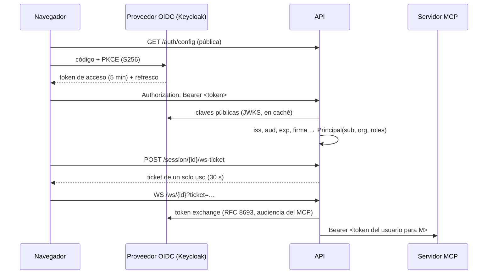

# 18. Identidad, organizaciones y permisos (F6)

Desde la fase 6, GEO Copilot sabe **quién** hace cada cosa. Cada persona entra con la cuenta de su
organización (OIDC). Sus sesiones, mapas y proyectos son suyos. Lo que puede hacer depende de su rol,
y todo queda en un registro que no se puede alterar sin que se note.

## 18.1 Lo que cambia para quien usa la aplicación

| Antes | Ahora |
|---|---|
| Se abría la app y se usaba | Pantalla de entrada → cuenta de la organización (Keycloak, Entra, Google…) |
| Cualquiera con acceso al puerto veía todo | Tus sesiones, tu workspace y tus proyectos **no existen** para los demás (ni para tu organización) |
| Una sola «llave» para todos | Tres roles: **Lectura** (viewer), **Analista** (analyst), **Administración** (admin) |
| Los servidores MCP los definía solo el YAML | Un administrador da de alta los de **su organización** desde el panel de Conexiones |
| — | La **Auditoría** (solo administración) dice quién preguntó, ejecutó y aprobó qué |

Arriba a la derecha se ve quién está conectado, su organización y su rol, y el botón para salir.

### Qué puede hacer cada rol

| Riesgo de la operación | Ejemplos | Lectura | Analista | Administración |
|---|---|:-:|:-:|:-:|
| `read` | consultar la BD, medir, colorear | ✅ | ✅ | ✅ |
| `external_egress` | buscar y cargar capas de catálogos | ✅ | ✅ | ✅ |
| `compute` | buffer, cruces, análisis, NDVI | ❌ | ✅ | ✅ |
| `write` | escribir en un sistema externo (pasa por aprobación) | ❌ | ✅ | ✅ |
| Administrar | conexiones de la organización, re-aprobar tools, auditoría | ❌ | ❌ | ✅ |

La regla se aplica en **un solo sitio** (`capabilities.ejecutar`), por el que pasan el agente, el
menú contextual del mapa y el panel de herramientas. Si alguien pide algo que su rol no permite, el
agente recibe el hecho («requiere el rol analyst; tiene viewer») y se lo explica. Las sugerencias
y el menú contextual ya no le ofrecen lo que se le negaría.

## 18.2 Cómo funciona por dentro



- **El token** lo verifica la API con las claves públicas del emisor (solo algoritmos asimétricos;
  `none` y HS256 se rechazan). La organización sale del claim `org`. Los roles salen de
  `realm_access.roles`. Ambas rutas son configurables.
- **El WebSocket** se abre con un **ticket de un solo uso**: el navegador no puede mandar cabeceras
  en un socket, y el token en la URL acabaría en los logs de nginx.
- **La propiedad** de cada sesión se guarda en PostGIS (`plataforma.sesiones`), no en Redis, para
  que no se pierda si la conversación caduca. La primera petición autenticada que usa un id libre lo
  reclama. Para cualquier otro principal, esa sesión, su workspace, sus teselas, sus aprobaciones y
  su WebSocket devuelven **404**. Se usa 404 y no 403 para no confirmar que existe.
- **Los proyectos** también tienen dueño: la lista muestra solo los tuyos y abrir uno ajeno da 404.

## 18.3 Conexiones de cada organización

Un administrador da de alta un servidor MCP para **su** organización desde el panel de Conexiones
(«Añadir»):

- **Credencial:** se guarda cifrada con un sobre AES-256-GCM. Cada secreto lleva una clave de datos
  propia, envuelta por la clave maestra `SECRETS_KEK`, que no está en la BD. El cifrado va atado a
  su fila: copiado a otra conexión u organización, no se descifra. **Nunca vuelve**: ni en
  respuestas, ni en logs, ni en el panel (solo «credencial»).
- **Red acotada:**
  - Solo `https`, a destinos **públicos**, salvo los hosts que la plataforma permita
    (`MCP_HOSTS_PERMITIDOS`, por ejemplo servicios internos del compose en desarrollo).
  - La conexión se hace a la IP ya validada, con el nombre en Host y SNI, así que un DNS que cambie
    de respuesta no la desvía (anti-rebinding).
- **Aislamiento:** sus herramientas solo existen para esa organización, y no pueden tapar las de
  la plataforma.
- **Pinning:** si la descripción o el esquema de una tool cambia, se deshabilita hasta que un
  administrador la re-apruebe (queda en `plataforma.pins` con quién la aprobó). Las herramientas
  de la **plataforma** (YAML) las re-aprueba solo la organización que la opera (`ORG_PLATAFORMA`).

## 18.4 Identidad hasta los servidores MCP (token exchange)

Un servidor declarado con `auth: {type: token_exchange, audience: <cliente>}` no recibe la clave
compartida, sino un **token del propio usuario** para él. La API se lo pide al proveedor
cambiando el token del usuario. El servidor sabe así quién llama y aplica los scopes de sus roles.
El kit lo hace con `VerificadorJwt`, y la tool lo lee con `llamante()`.

- Lo que hace el sistema sin usuario (descubrir las tools) va con la clave de servicio (`secret_ref`).
- Una persona sin su token en el canal recibe un **error**. Nunca se cae a la clave de servicio:
  eso firmaría su acción como si la hiciera el sistema.
- Ejemplo real: `hello-geo` responde «Te atiendo como el usuario «ana» de la organización «acme»».

## 18.5 Auditoría

`plataforma.auditoria` guarda:

- las consultas;
- cada ejecución de una capacidad: quién, cuál, con qué argumentos resumidos y con qué resultado
  (`ok`, `error` o `denegado`);
- cada solicitud y decisión de aprobación HITL, con quién la tomó;
- el alta y la baja de conexiones;
- las re-aprobaciones.

- **Solo añadir.** La app no tiene UPDATE, DELETE ni TRUNCATE sobre la tabla, y un trigger lo impide
  incluso al dueño del esquema.
- **Encadenada.** Cada fila lleva el hash de la anterior. Si alguien con acceso directo a la BD toca
  una fila (desactivando el trigger), `GET /auditoria/verificar` lo detecta y dice cuál.
- **Resumida.** Los secretos salen como `***`, las geometrías como tipo y tamaño, y los textos
  largos cortados.
- **Si escribir la auditoría falla,** la acción sigue, pero queda un ERROR en el log. Es una decisión
  explícita del piloto (ver `SECURITY.md`).

## 18.6 Puesta en marcha

**Desarrollo** (Keycloak local con dos organizaciones y cuatro usuarios de prueba):

```bash
# .env: KC_DEV_PASSWORD, KC_API_CLIENT_SECRET, KEYCLOAK_ADMIN_PASSWORD, SECRETS_KEK,
#       OIDC_ISSUER=http://localhost:8081/realms/geo  (vacío = sin login)
docker compose -f docker/docker-compose.yml --env-file .env --profile auth up -d keycloak
# BD ya desplegada: el esquema `plataforma` lo pone al día Alembic (el PostGIS de desarrollo
# escucha en 127.0.0.1:5433; ver docs/sistema/09 §9.5). En producción lo hace el servicio `migrar`.
export MIGRACIONES_DATABASE_URL=postgresql://geo_user:<POSTGRES_PASSWORD>@localhost:5433/geo_copilot
python -m geo_copilot.migraciones
docker compose -f docker/docker-compose.yml --env-file .env up -d --force-recreate --no-deps app
```

| Usuario | Organización | Rol |
|---|---|---|
| ana | acme | analyst |
| beto | acme | viewer |
| carla | acme | admin |
| diego | beta | analyst |

**Producción:**

- **Proveedor OIDC:** el de la organización, y en `.env` `OIDC_ISSUER` (la URL pública del `iss`,
  **exactamente** como viene en los tokens, barra final incluida), `OIDC_AUDIENCE` y
  `OIDC_CLIENT_ID` (cliente público con PKCE).
  - **Endpoints por descubrimiento.** `OIDC_JWKS_URL` y `OIDC_TOKEN_URL` son opcionales. Sin ellas,
    la API lee `jwks_uri` y `token_endpoint` de `{OIDC_ISSUER}/.well-known/openid-configuration`
    (se guarda una hora, timeout de 5 s). Nunca se adivina una ruta de un proveedor concreto. Dalas
    explícitas solo si el emisor no es alcanzable desde el contenedor. En desarrollo, el compose
    pone las internas de Keycloak (`OIDC_JWKS_URL_INTERNA` / `OIDC_TOKEN_URL_INTERNA`).
  - **Si el descubrimiento falla** (el documento no responde, no es 200, no trae `jwks_uri` o
    declara otro `issuer`), nadie entra por Bearer y se ve así:
    - el cliente recibe **503** `El proveedor de identidad no está disponible: descubrimiento OIDC: …`
      (la causa) con `Retry-After: 30`. No es un 401: el token no tiene la culpa;
    - el log de la app dice, en cada petición con Bearer, `WARNING [identidad] petición con Bearer
      rechazada con 503: descubrimiento OIDC: …`; y, cuando se intenta leer el documento (como
      mucho cada 30 s mientras falla) o falta el campo, `ERROR [identidad] descubrimiento OIDC: …`.
  - **La plantilla trae `OIDC_JWKS_URL` comentada** (`.env.production.example`). Si tu
    `.env.production` salió de una plantilla anterior con `OIDC_JWKS_URL=__RELLENAR_JWKS__` (o
    cualquier otro `__RELLENAR…__` en una variable OIDC), **borra esa línea**: una URL explícita
    manda sobre el descubrimiento, y el marcador llegaría a la API como URL (401 a todo, sin más
    explicación). `grep -nE '__[A-Z_]+__' .env.production` no debe dar nada.
  - **La audiencia va en el token de ACCESO.** El navegador manda a la API su token de acceso (no
    el ID token), y ese token tiene que ser un JWT firmado con `aud` = `OIDC_AUDIENCE`. Si no casa,
    todo da 401.
  - **Organización y roles por proveedor** (`OIDC_ORG_CLAIM`, `OIDC_ROLES_CLAIM`; ruta con puntos):

    | Proveedor | `OIDC_ISSUER` | `OIDC_AUDIENCE` | Organización | Roles |
    |---|---|---|---|---|
    | Keycloak | `https://<host>/realms/<realm>` | el cliente de la API, añadido con un *audience mapper* (`geo-copilot-api` en el realm de referencia) | `org` (mapper de atributo de usuario) | `realm_access.roles` |
    | Entra ID, tokens v2.0 (`accessTokenAcceptedVersion: 2` en el manifiesto de la API) | `https://login.microsoftonline.com/<tenant>/v2.0` | el Application (client) ID de la API (GUID) | `tid` (el inquilino) | `roles` (roles de aplicación `viewer`/`analyst`/`admin` asignados al usuario) |
    | Entra ID, tokens v1.0 | `https://sts.windows.net/<tenant>/` (con barra) | el Application ID URI (`api://…`) | `tid` | `roles` |
    | Google | — | — | — | — |

    Google no sirve directamente. Sus tokens de acceso no son JWT y no llevan ni organización ni
    roles. Se pone delante un proveedor que federe con Google y emita JWT con esos claims (por
    ejemplo Keycloak con Google como *identity provider*).
    Con Entra v1.0, si su descubrimiento no responde en `sts.windows.net`, define
    `OIDC_JWKS_URL=https://login.microsoftonline.com/<tenant>/discovery/keys`.
  - **Token exchange** hacia servidores MCP con `auth: token_exchange` (18.4). Sigue RFC 8693,
    como lo hace Keycloak. Entra ID no lo implementa (usa *On-Behalf-Of*), así que con Entra esos
    servidores no reciben token de usuario. Los de la plataforma usan clave y no les afecta.
- **Secretos:** `SECRETS_KEK` (32 bytes en base64: `python -c "import os,base64;print(base64.b64encode(os.urandom(32)).decode())"`),
  mejor inyectada desde un KMS o Vault. Para rotarla: la nueva en `SECRETS_KEK` y las anteriores
  en `SECRETS_KEK_ANTERIORES`.
- **TLS:** el certificado de la organización en `docker/certs/tls.crt` + `tls.key`. Sin él, en
  producción el frontend no arranca (el directorio va de solo lectura; ver el runbook 19, paso 3);
  solo en desarrollo genera uno autofirmado y lo avisa.
- **API key:** solo para clientes de servicio (scripts, CI), con `API_KEY_ORG` y `API_KEY_ROLE`.
  El navegador nunca la lleva.

Tests: `tests/test_identidad*.py`, `test_auditoria*.py`, `test_conexiones*.py`,
`test_token_exchange.py`; V2 `e2e/fase-6-auth.spec.ts`; V3 con usuarios reales
`e2e-integration/fase-6-identidad.spec.ts`.
