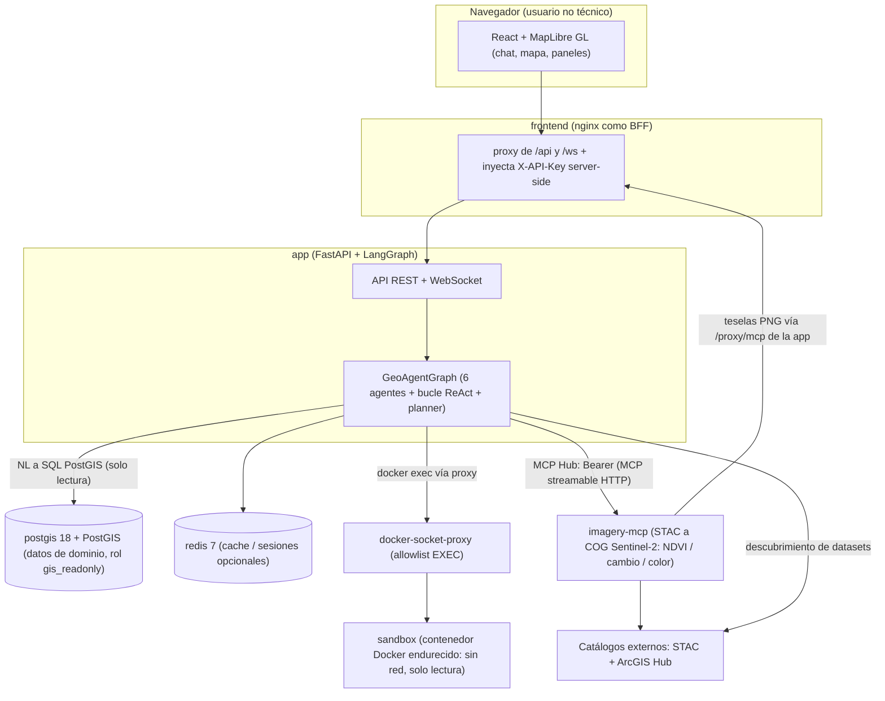
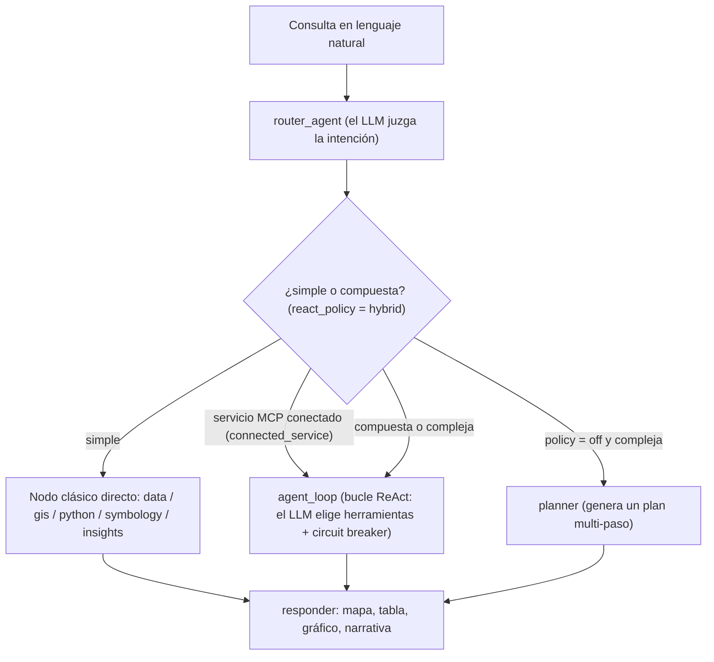
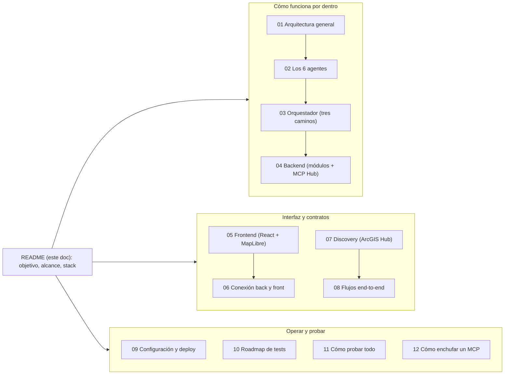

# GEO_COPILOT — Documentación del sistema

> Copiloto geoespacial multiagente en español. Permite a usuarios **no técnicos**
> hacer consultas espaciales en lenguaje natural sobre datos internos (PostGIS) o
> externos (ArcGIS Hub, datos.gov.co, archivos GeoJSON/SHP/KML/GPKG) **e imágenes
> satelitales Sentinel-2** (NDVI, cambio, composites en color), generando mapas,
> gráficos, tablas y narrativas automáticamente.

> ✅ **Auditoría agentic (2026-05-25)**. Los 6 agentes pasaron por 7 sprints
> (A, A.1, B, C, D, D.1, E, F) que eliminaron ~1350 líneas de heurísticas,
> templates SQL hardcoded, mapeos fijos `analysis_type→viz`, umbrales mágicos y
> fallbacks adivinadores. Resultado: **toda decisión semántica la toma el LLM con
> el contexto real**, validada contra el schema para evitar alucinaciones.

> 🧭 **Estado actual (2026-07-26)**. El mapa migró 100 % a **MapLibre GL** (Cesium
> retirado por completo). La orquestación ya no es un único router por intent:
> conviven **tres caminos** en el mismo grafo — router clásico, **bucle ReAct
> (`agent_loop`)** con tool-calling nativo, y planner multi-paso — decididos por
> consulta (`react_policy="hybrid"` por defecto). Se sumó **imagery-mcp**, un
> microservicio aparte de análisis de imágenes satelitales con su propia
> autenticación. El sandbox de Python del despliegue corre en un **contenedor
> Docker endurecido** aislado, no como subprocess dentro de `app`.

> 🔌 **Fase 3 — MCP Hub (2026-09-25)**. El núcleo ya no tiene código propio de
> imagery: un **MCP Hub genérico** (`src/geo_copilot/platform/mcp/`) conecta los
> servidores MCP declarados en `config/mcp_servers.yaml` y convierte sus tools
> en herramientas del agente (`<servidor>__<tool>`). `imagery-mcp` es ahora un
> servidor más; cualquier otro se enchufa **editando el YAML, sin tocar código**
> (ver [12-como-enchufar-un-mcp](12-como-enchufar-un-mcp.md)).

## Índice

| # | Documento | De qué trata |
|---|-----------|-------------|
| 0 | [Objetivo y alcance](#objetivo-y-alcance) | Qué problema resuelve y qué hace concretamente |
| 1 | [Arquitectura general](01-arquitectura.md) | Vista de alto nivel: cómo se conectan las piezas |
| 2 | [Los 6 agentes](02-agentes.md) | Router, Data, GIS, Python, Symbology, Insights — qué hace cada uno |
| 3 | [Orquestador (LangGraph)](03-orquestador.md) | StateGraph, los tres caminos (clásico / ReAct / planner), ciclo de vida de una consulta |
| 4 | [Backend (módulos)](04-backend.md) | API REST + WebSocket, configuración, seguridad, capa semántica, MCP Hub |
| 5 | [Frontend (React + MapLibre)](05-frontend.md) | Componentes, stores Zustand, mapa MapLibre, teselas y panel de herramientas MCP |
| 6 | [Conexión back ↔ front](06-conexion-back-front.md) | Contratos HTTP y mensajes WebSocket |
| 7 | [Sistema de Discovery](07-discovery.md) | Descubrimiento de datasets externos vía ArcGIS Hub |
| 8 | [Flujos end-to-end](08-flujos.md) | Diagramas de secuencia: chat, discovery, HITL, servicios MCP (imagery) |
| 9 | [Configuración y deploy](09-configuracion-y-deploy.md) | Variables de entorno, YAMLs, Docker, secrets |
| 10 | [Roadmap de tests](10-test-roadmap.md) | Plan en 5 fases para cerrar smells y gaps del diagnóstico crítico |
| 11 | [Cómo probar todo](11-como-probar-todo.md) | Guía paso a paso de setup + day-to-day para correr la suite completa |
| 12 | [Cómo enchufar un MCP](12-como-enchufar-un-mcp.md) | Guía para conectar un servidor MCP nuevo al MCP Hub: YAML, credenciales, confianza, HITL, teselas y re-aprobación de tools |
| 13 | [Interacción mapa ↔ chat](13-interaccion-mapa-chat.md) | Estado compartido, referencias («estos», «aquí», «lo que dibujé»), gesto ↔ capacidad, pedir en el mapa, qué sobrevive y cómo se prueba |
| 14 | [Conectar otra base de datos](14-conectores-sql.md) | Servidor MCP de SQL multi-BD: garantías del lado del servidor, cómo enchufar una fuente, documentar la BD para el generador, pruebas |
| 15 | [El servidor MCP de ArcGIS](15-conector-arcgis.md) | Buscar en ArcGIS Hub, describir y traer capas con el filtro en el servicio; cómo lo usa el copiloto; Claude Desktop |
| 16 | [Datos tabulares de terceros en el mapa](16-conector-tabular.md) | Adaptador `tabular_geo` (Snowflake, BigQuery…): el LLM declara la geometría del resultado, el núcleo la valida; servidor de prueba |
| 17 | [Archivos geoespaciales con DuckDB](17-conector-archivos.md) | GeoParquet/FlatGeobuf/CSV leídos donde están y filtrados en el origen; resultados grandes por referencia; cómo llega el turno |
| 18 | [Identidad, organizaciones y permisos](18-identidad-y-organizaciones.md) | Login OIDC, sesiones y proyectos con dueño, roles por riesgo, conexiones por organización con credencial cifrada, token exchange hacia los MCP, auditoría encadenada; puesta en marcha |
| ★ | [Spec imagery-mcp (C3)](../SPEC_C3_IMAGERY_MCP_2026-07-19.md) | Diseño del microservicio de imágenes satelitales (STAC→COG Sentinel-2). Es un **registro de diseño**, no documentación operativa |
| 🗄️ | [Auditoría agentic 2026-05-25](../archive/AUDITORIA_AGENTIC.md) | Release notes de los 7 sprints de refactor agentic — **archivado**, ver [`docs/archive/`](../archive/) |

## Objetivo y alcance

### ¿Qué problema resuelve?

Hacer accesible el análisis geoespacial a usuarios que **no saben SQL ni
programación**. Un urbanista, planeador territorial o analista puede preguntar:

- *"¿Qué predios de Madrid Cundinamarca son rurales?"*
- *"Buscame ortofotos del IGAC"*
- *"Compara la red vial nacional con las áreas protegidas"*
- *"Sácame el NDVI de estos lotes entre marzo y junio"*

…y el sistema:

1. Entiende la intención (router / bucle ReAct)
2. Encuentra los datos (data agent + discovery)
3. Genera la consulta espacial (SQL PostGIS o código Python) **o** usa una herramienta de un servicio MCP conectado (p. ej. imágenes satelitales con imagery-mcp)
4. Pide aprobación humana cuando hace falta (HITL)
5. Devuelve el resultado como mapa, tabla, gráfico o reporte narrado

### Alcance

Lo que **sí** hace:

- **Consultas espaciales sobre PostGIS** generadas por LLM (NL → SQL con validador y corrector automático, ejecutadas en transacción de solo-lectura bajo el rol `gis_readonly`).
- **Operaciones GeoPandas** sobre datos externos (buffer, intersect, union, clip, etc.) ejecutadas en un sandbox aislado.
- **Análisis estadístico / ML** (intent `analyze`): el sandbox corre `sklearn`/`statsmodels` y devuelve tablas, estadísticas y gráficos.
- **Servicios MCP enchufables** vía el **MCP Hub**: cada servidor declarado en `config/mcp_servers.yaml` aporta herramientas al agente y al panel "Herramientas · Servicios conectados", con HITL por riesgo, *pinning* de tools y defensa contra inyección.
- **Análisis de imágenes satelitales Sentinel-2** vía el microservicio **imagery-mcp** (un servidor del MCP Hub): **NDVI**, **cambio entre dos fechas**, **estadística zonal por feature** e **imagen en color** (composites RGB: color real / falso color / agricultura / SWIR), con teselas dinámicas (stretch p2–p98, máscara de nubes SCL, caché en disco).
- **Descubrimiento de datasets** en ArcGIS Hub Open Data global (filtrado por entidad/zona/tipo de servicio).
- **Carga al mapa** de Feature/Map/Image Services de ArcGIS REST con simbología generada automáticamente.
- **Aprobación humana** (HITL) para acciones sensibles: SQL, código, llamadas externas.
- **Visualizaciones** automáticas: MapLibre GL para datos geoespaciales y teselas raster, Recharts para gráficos, tablas paginadas.
- **Consultas compuestas/complejas**: el router las desvía al **bucle ReAct** (`agent_loop`), que encadena varias operaciones eligiendo herramientas dinámicamente; el planner multi-paso cubre el caso sin ReAct.
- **Conversaciones** con historial, retomar contexto, datos previos, y capa objetivo **por nombre** ("colorea los lotes" opera sobre la capa nombrada, no solo la activa — FRT-04).

Lo que **no** hace (todavía):

- Edición de geometrías en el mapa (dibujar/mover/borrar features).
- Exportación a formatos como reporte PDF.
- Multi-usuario con permisos granulares (el sistema es single-tenant, una sola API key).
- Análisis raster arbitrario más allá de las operaciones de imagery-mcp (clasificación supervisada de imágenes, teledetección avanzada).

> ℹ️ **Cambio importante vs. versiones anteriores de este doc**: el análisis
> raster de **NDVI / imágenes satelitales YA NO es una limitación** — lo cubre el
> microservicio `imagery-mcp`, conectado por el MCP Hub (ver [04-backend](04-backend.md) y la
> [spec C3](../SPEC_C3_IMAGERY_MCP_2026-07-19.md)).

### Posibilidades / casos de uso

| Persona | Caso de uso |
|---------|-------------|
| Planificador municipal | "Muéstrame las manzanas catastrales de Bogotá clasificadas por uso de suelo." |
| Analista de riesgo | "¿Qué áreas en Cundinamarca tienen amenaza por remoción en masa y población > 1000 habitantes?" |
| Catastro | "Carga la ortofoto IGAC más reciente de Mosquera y dibuja un buffer de 100 m alrededor del predio X." |
| Agrónomo / ambiental | "Sácame el NDVI de estos lotes y dime cuáles tienen vegetación más sana." |
| Investigador ambiental | "Compara la cobertura vegetal (Sentinel-2) de esta zona entre marzo y junio." |
| Periodista de datos | "Busca datasets sobre violencia o seguridad en el catálogo abierto." |

## Cómo funciona (mapa del sistema)

El producto es un **stack Docker Compose de 7 servicios**. El navegador nunca
habla directo con el backend ni con los servicios internos: `nginx` actúa como
**BFF** (Backend-For-Frontend) e inyecta la `X-API-Key` server-side, de modo que
el secreto nunca vive en el bundle del navegador.

### Los tres caminos de orquestación

Además de los **6 agentes**, el orquestador incorpora un **bucle ReAct** y un
**planner multi-paso**. Qué camino toma cada consulta lo decide el router en
tiempo de ejecución según `react_policy` (por defecto `"hybrid"`):

> Detalle: las consultas **compuestas** (varias operaciones) van al bucle ReAct,
> **no** al nodo router clásico; las simples van directo al agente que
> corresponde. El bucle ReAct **reusa** los mismos nodos de agente por debajo, así
> que hereda gratis HITL, auto-corrección y el juez de resultados. Ver
> [03-orquestador](03-orquestador.md) para el detalle.

## Stack tecnológico

**Backend (`app`)**
- Python 3.11+
- FastAPI (REST) + WebSocket
- LangGraph para orquestación multiagente (6 agentes + bucle ReAct + planner)
- LLM multi-proveedor (OpenAI / Anthropic / Azure / local) vía **structured outputs** (function-calling forzado), no "responde JSON"
- PostgreSQL 18 + PostGIS (imagen `postgis/postgis:18-master`), rol de solo-lectura `gis_readonly` para el SQL del LLM
- Redis 7 (cache + backend opcional de sesiones)
- httpx (llamadas externas) + cliente MCP genérico (streamable HTTP) del **MCP Hub** hacia los servidores MCP
- geopandas + shapely (operaciones geoespaciales en el sandbox)
- scikit-learn / statsmodels (motor de análisis en el sandbox)

**Microservicio `imagery-mcp` (proceso aparte)**
- FastMCP (streamable-HTTP) con `AuthMiddleware` (Bearer + scopes + rate limit)
- rasterio + rio-tiler (lectura ventaneada de COG y teselado dinámico)
- STAC (Planetary Computer / Earth Search) → COG Sentinel-2 L2A

**Frontend (`frontend`)**
- React 18 + TypeScript 5 + Vite 5
- Tailwind CSS
- Zustand (4 stores: `session`, `map`, `ui`, `chat`)
- **MapLibre GL 5** — único motor de mapa (Cesium retirado 100 %)
- Recharts (gráficos)
- @tanstack/react-query (data fetching)
- DOMPurify (sanitización de contenido en popups)

**Infraestructura**
- Docker Compose — **7 servicios**: `postgis`, `redis`, `app`, `frontend` (nginx BFF), `sandbox`, `docker-socket-proxy`, `imagery-mcp`
- nginx como BFF que inyecta `X-API-Key` server-side (la clave nunca llega al navegador)
- Sandbox de Python: en despliegue corre en un **contenedor Docker endurecido** (`network_mode: none`, `read_only`, `cap_drop: ALL`, non-root) alcanzado por `docker exec` a través del `docker-socket-proxy` (allowlist mínima EXEC); `app` **ya no monta el socket crudo** de Docker

## Plataformas soportadas

| Plataforma | Stack completo (Docker) | Sandbox Python |
|------------|:-:|:-:|
| Linux | ✅ | ✅ |
| macOS | ✅ | ✅ |
| Windows + WSL2 | ✅ | ✅ |
| Windows + Docker Desktop | ✅ | ✅ |
| Windows nativo (sin WSL/Docker) | parcial | ❌ |

En el **despliegue por defecto** (`SANDBOX_BACKEND=docker`) el código del
`PythonAgent` corre en el contenedor `sandbox` aislado, alcanzable en cualquier
plataforma con Docker. El backend alternativo (`subprocess`, útil en desarrollo)
usa primitivas POSIX: en **Windows nativo sin Docker** el `PythonAgent` queda
inhabilitado, pero el resto del producto funciona. Ver
[09-configuracion-y-deploy.md §9.4](09-configuracion-y-deploy.md) para detalles.

## Cómo leer esta documentación

- Si eres **nuevo**, empieza por [01-arquitectura](01-arquitectura.md) → [02-agentes](02-agentes.md) → [08-flujos](08-flujos.md).
- Si eres **frontend**, salta a [05-frontend](05-frontend.md) → [06-conexion-back-front](06-conexion-back-front.md).
- Si quieres entender el **orquestador y sus tres caminos**, ve a [03-orquestador](03-orquestador.md).
- Si vas a **operar/deployar**, ve directo a [09-configuracion-y-deploy](09-configuracion-y-deploy.md).
- Si quieres **conectar un servicio MCP nuevo**, ve a [12-como-enchufar-un-mcp](12-como-enchufar-un-mcp.md).
- Si quieres entender **cómo se descubren datasets externos**, ve a [07-discovery](07-discovery.md).
